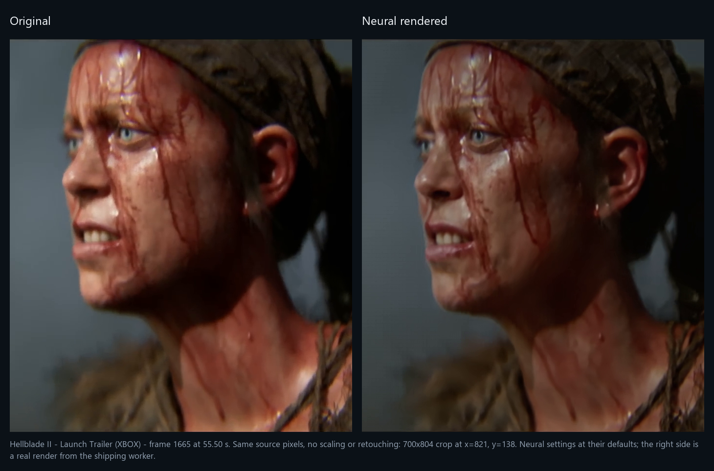
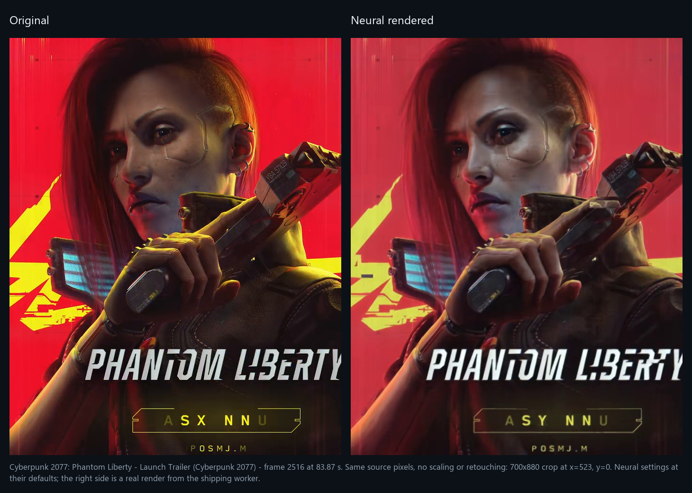
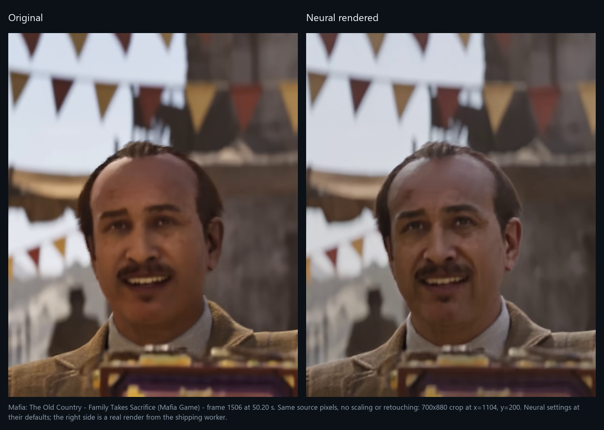

# DLSS 5 Video Player

Run a video, photo or GIF through NVIDIA's DLSS 5 neural renderer, then look at
the result next to the original on the same frame. Windows only. Needs an RTX
card.

[Download](#download) · [First run](#first-run) · [Usage guide](docs/USAGE.md) · [Build it yourself](docs/BUILDING.md) · [Troubleshooting](docs/TROUBLESHOOTING.md)

**[30-second demo](docs/media/neural-comparison-demo.mp4)** from The Witcher IV. A paused
frame with neural rendering off, then on, then playback with it left on. 1080p
H.264, no sound. [How it was captured](docs/media/README.md).

> [!IMPORTANT]
> Community project, not an NVIDIA product. The neural runtime is a modified,
> unsigned community build. Checked on an RTX 4080 SUPER (v0.17.2) and an RTX
> 5090 (v0.17.1). Neural rendering needs NVIDIA driver 610.47 or newer.
> Notices: [THIRD_PARTY.md](THIRD_PARTY.md).

## Download

**v0.21.0** (2026-09-12): [release page](https://github.com/2600th/dlss5-video-player/releases/tag/dlss5-video-player-v0.21.0)

| Package | What is in it | Size |
| --- | --- | --- |
| `dlss5-video-player-v0.21.0-win64.zip` | Player plus the pinned neural runtime. This is the one you want. | 308 MB |
| `DLSSVideoPlayer-v0.21.0-core-win64.zip` | Player only, no neural runtime. | 31 MB |

Both have a `.sha256` beside them on the release page. GitHub's "Source code"
zip does not run: no runtime in it.

## First run

1. Unzip into a **new, empty folder**. Keep `neural-runtime/` next to the exe.
2. Run `DLSSVideoPlayer.exe`.
3. Open a file (`Ctrl+O`), paste a public YouTube link (`Ctrl+L`), or pick
   something from **File > Game trailers**.
4. Press `D`. It buffers for a few seconds, then plays rendered.
5. **Video > Compare** shows before and after as a split, a wipe or a blend.
6. **DLSS > Convert & save** writes the rendered video to a file.

Next time, **File > Recent videos** reopens it with the render already done.

## What it does

- Renders while you watch. Press `D` at any point and playback continues on the
  rendered frames a few seconds later. Turn it off and on again and it picks up
  where it stopped instead of starting over.
- Keeps the original and the render in step. Switching views does not move the
  playhead, and you can pause and step frames on either.
- Remembers the last five videos and their renders. A render is reused only if
  the source, the runtime and the neural settings all still match.
- Exports what you rendered. PNG or JPEG for photos, GIF for animations, MP4 or
  MKV for video. MKV keeps the source audio, subtitles and chapters without
  re-encoding them.
- Optional DLSS Super Resolution on top, 1440p or 2160p, for either view. The
  render itself stays at source resolution.
- Neural settings live at `Ctrl+N`. Change one while paused and that frame is
  re-rendered so you can judge on the picture. Settings are saved with each
  render and are part of its cache identity.
- Encoder settings sit apart from the model settings. **DLSS > Encoder settings**
  picks the NVENC preset and where colour conversion runs, and none of it
  invalidates a cached render.
- Six official game trailers under **File > Game trailers**, each under three
  minutes, for a quick first test.

## What changed

The short version. Every detail is in [CHANGELOG.md](CHANGELOG.md).

**0.21.0** (2026-09-12). YouTube trailers were arriving at the lowest bitrate
YouTube offers. "Auto" asked for exactly 1080p, which on a trailer is the bottom
of the ladder: 3899 kbps, where the same trailer has 7854 at 1440p and 20764 at
2160p. Auto now takes the best rung up to 1440p, so the picture the model has to
work with carries about twice the detail. Separately, some videos are
age-restricted, and without a sign-in YouTube hands out a single 640x360 stream
for them; the player played that silently and rendered it. It now says so on the
status line, and names the sign-in as the reason. Three of the six bundled
trailers are affected.

There is also a new **Neural strength** slider under `Ctrl+E`, 0 to 200 %. It
re-mixes the frame already on screen instead of re-rendering it, so unlike every
model setting it costs nothing: 100 % is the render as it is, below that mixes
back toward the original, above that pushes the model's own change further. And
three ways a finished render could be lost are fixed, including one that threw
away a cache entry after verifying all 2607 of its frames.

**0.20.1** (2026-09-12). Two things a neural session did to itself. Playback
dropped 44 % of its frames - a 1080p30 trailer played 1415 of 2525 - because
the player opened the next two-second segment file on the thread that draws
frames, and opening one runs `ffprobe` as a separate program. On a normal
install, where an antivirus inspects every program that starts, that is 0.7 s
of frozen picture every 2 s; it is 32 ms inside a scanner exclusion, which is
why it never showed up here. Same clip after the fix: 1 dropped frame out of
2839. And turning neural rendering on took 15 s before anything appeared,
most of it spent re-running a probe of the graphics runtime, re-hashing the
same 226 MB three times, and waiting for four seconds of rendered video when
this card produces it 4.8x faster than it plays. It is now under 6 s on the
second and every later run - 9 s on a scanned install - and the first frame
appears after half a second of render instead of two.

**0.20.0** (2026-09-11). Motion vectors now come from the optical flow engine built into
every RTX card since Turing: 960x540 vectors instead of 160x90, and a
thirty-second of a pixel instead of three pixels. The old estimator could not see
a one-pixel pan at all, which is what made slow movement look unstuck from the
picture. Costs about 1.7 ms a frame at 1080p. Sampling jitter is gone - it was
borrowed from how games drive DLSS and does nothing useful to a video, where it
only softened every frame by a different amount. On a still image that cut the
worst-pixel shimmer by more than half. Fullscreen no longer tears. Opening a
YouTube video while a render was running left the picture stuck on one frame
with the old video's seek bar; and turning neural rendering off and on again
re-rendered everything it had already done instead of picking up where it left
off.

**0.19.0** (2026-09-10). The export decodes with NVDEC and sends NV12 down the
pipe instead of BGRA, and NVENC gets its CUDA context at spawn: 7.8 to 4.2 ms
per frame with presents off on an RTX 5070 Ti, and the first-frame stall on each
live segment fell from 126 to 59 ms. New **DLSS > Encoder settings** window, and
the settings windows resize. Most of this came from ctype-lab's PR #6; the GPU
source-conversion default and the forced NVENC split mode were left off, and a
tooltip use-after-free that the second settings window exposed is fixed.

**0.18.0** (2026-09-10). Checks the driver before the neural path runs: below
610.47 the render is refused up front, naming the version to install, instead of
dying in a probe with `0xbad00002`. The render receipt stopped reporting the
carrier session's result as feature 18's, a failed preflight is no longer retried
on every play, and the menu bar shows `↑ Update <version>` when a newer release
exists.

**0.17.2** (2026-09-10). Fixes the render that died at "A frame was not produced
by feature 18" on a 4070 Ti and an RTX PRO 6000: the player was releasing and
rebuilding the DLSS feature 60 presents in, which is exactly when the neural
add-on was being asked to prove it had run. It now builds that feature once and
keeps it. Small sources upscale again instead of being refused, a downloading
source shows how far it has got, a job that goes quiet is stopped instead of
spinning forever, photos can start a render from the toolbar, and one scene
change no longer resets the temporal history six times in twelve frames.

**0.17.1** (2026-09-10). Live playback no longer stops at a segment seam with an
"out of sync" warning, and a stop of any kind now says why in the log.
Re-measured on an RTX 5090: a 1080p30 session costs 8.4 ms per frame, down from
11.9 before the export loop was pipelined.

**0.17.0** (2026-09-10). The export got 2.3x faster and the pixels did not change.
1080p30 on an RTX 4080 SUPER: 48.6 to 110.7 frames per second, and the output
is bit for bit the same as 0.16.0. Guide generation went from 4.6 ms to 1.5 ms
per frame. Most of this came from ctype-lab's PR #5; the parts that broke
things were fixed or left out.

**0.16.0** (2026-09-09). Runs on every RTX generation, 20 through 50, by
switching to the universal 310.8.SF-v2 runtime. Fixed a wedge on the RTX 4080
that killed every 1080p live session two seconds after preroll. The keep-up
forecast now uses your GPU's own measured speed at each source size and warns
before a session it expects to fall behind. `build_windows.bat` fetches the
runtime by itself.

**0.15.0** (2026-09-09). Press `D` while watching instead of rendering the whole
file first. Toggling off and on resumes rather than re-rendering. 4K30 keeps up
on an RTX 5090 (it ran at 0.23x real time before). Two neural controls that the
model provably ignores were removed from the dialog.

**0.14.0** (2026-09-03). Photos and GIFs, with PNG, JPEG, GIF, MP4 and MKV
export. Six game trailers replaced the old example list. Fullscreen hides the
controls until the mouse moves.

**0.13.0** (2026-09-03). Recent-five history with cache reuse. Stream-copy MKV
export with audio, subtitles and chapters. Runtime DLSS upscaling, off by
default. The neural renderer moved into its own helper process.

**0.12.0** (2026-09-01). Public YouTube playback. Separate Neural Rendering,
DLSS Upscaling and Frame Generation controls. The RenoDX neural path, with
pinned runtime hashes and a safe-mode escape hatch.

## Controls

| What | Key |
| --- | --- |
| Open a file / a YouTube URL | `Ctrl+O` / `Ctrl+L` |
| Play or pause | `Space` |
| Neural rendering on or off | `D` |
| Compare views | **Video > Compare**; `[` and `]` move the wipe, `Z` zooms |
| Seek ten seconds / step one frame | `Left` / `Right`; `.` |
| Mark In / Out; clear; go to time | `I` / `O`; `Shift+I`; `Ctrl+G` |
| Render one frame / four seconds / the marked clip | `F` / `Shift+F` / `Ctrl+R` |
| Neural settings | `Ctrl+N` |
| Image adjustments | `Ctrl+E` |
| Volume, mute | Mouse wheel; `M` |
| Fit or fill; fullscreen | `A`; `F11` |
| Stop | `S` |
| Debug views (final, DLSS input, motion, depth) | `1` `2` `3` `4` |
| Re-hook the runtime | `F6` |

Everything you set is kept between launches: volume, view, upscaling, YouTube
quality, image adjustments, neural settings and guide switches.

Defaults on a fresh install: neural rendering on, DLSS upscaling off (1440p
selected when you turn it on), YouTube quality Auto. Frame Generation has no
backend and stays unavailable.

Auto takes the tallest rung up to 1440p, then the highest advertised video
bitrate inside that rung. It used to ask for exactly 1080p, which on YouTube is
the last rung still offered in H.264 and the thinnest one on the page. The same
trailer, as the bundled yt-dlp 2026.08.19 lists it (The Last of Us Part II
Remastered, `Tg1oRHd5zlw`, checked 12 September 2026):

| Rung | Video bitrate | Codec |
| --- | --- | --- |
| 1080p60 | 3899 kbps | avc1.64002a |
| 1440p60 | 7854 kbps | vp9 |
| 2160p60 | 20764 kbps | vp9 |

GTA VI Trailer 2 lists 4604, 9282 and 18971 kbps for the same three rungs.
2160p is still there under **Video > YouTube source quality**, where Auto is
listed as "Auto (up to 1440p, highest bitrate)", and it stays something you ask
for rather than the default: 1440p is roughly twice the bitrate for about 1.8x
the render cost (8.4 to 15.4 ms a frame on an RTX 5090), while 4K costs 42 ms a
frame, 0.78x real time, four times the pixels to hold in VRAM and cache, and
5.3x the bytes to pull down on the trailer above, 4.1x on GTA VI Trailer 2.

More on the cache, settings and export in [USAGE.md](docs/USAGE.md). The
trailer list is in [EXAMPLE_VIDEOS.md](docs/EXAMPLE_VIDEOS.md).

## Screenshots

Real captures on an RTX 5090, v0.13.0 interface. They show the UI, not image
quality; click through for full size.

Same frame, original and neural

Upscaling is off in both. This shows the synchronized toggle, not a claim that
every source gains detail.

[Unscaled face crops from the same frame](docs/screenshots/current/face-comparison.png).

Faces from three more trailers

Same source pixels on both sides, no scaling or retouching, default settings.
The right half of each is a real render from the shipping worker.

The change is subtle and depends on the source. Skin shading and fine texture
move; silhouettes and framing do not. Judge your own footage on its own preview.

Start screen

[Capture details and footage attribution](docs/screenshots/README.md).

## Limits

- Speed. A live 1080p30 session costs about 8.4 ms per frame on an RTX 5090
  (driver 616.64, median of eight 30 s sessions; the same clip cost 11.9 ms
  before the export loop was pipelined in 0.17.0), and 15.4 ms at 1440p30. An
  RTX 4080 SUPER measured 15.3 ms at 1080p30 on 0.16.0 and has not been
  re-measured since. 4K30 depends on the file: a native 40 s 4K30 source ran at
  1.165x real time, while a 6.3 Mbit/s 4K re-encode costs 42 ms per frame, or
  0.78x, and drops nearly every present. The player measures your GPU after the
  first session and warns before one it expects to fall behind.
- Driver. Feature 18 lives in the driver's own NGX core, so an old driver
  refuses the render whatever the card is, with `feature 18 create failed with
  0xbad00002`. Below **610.47** the player says so up front instead of spending
  five seconds in a probe that cannot pass; 616.64 is the driver this project
  has rendered on. See
  [troubleshooting](docs/TROUBLESHOOTING.md#neural-rendering-is-refused-because-the-driver-is-too-old).
- RTX 20 and 30 run the universal runtime without native FP8, so expect them to
  be several times slower. Nobody has rendered on one here yet.
- Depth is estimated from the picture, and so is motion on a card without the
  optical flow engine. Artifacts happen.
- Export copies the cached 8-bit render. Image adjustments and upscaling are not
  baked in, and HDR or lost source precision is not restored.
- Subtitles stay as separate tracks. No in-player subtitle display, no burn-in,
  no queue, no HDR, no resume of an interrupted render across restarts.
- YouTube: public, non-DRM videos only, no login. Availability can change.
  Age-restricted videos are the awkward case: YouTube keeps the full ladder for
  a signed-in session, so an anonymous one can be handed a single legacy
  640x360 format instead, and which of the two you get is not stable between
  calls. Three of the six bundled trailers are age-restricted. When the source
  comes back small the status line names the height and rate that arrived and
  says the video is age-restricted, instead of playing 360p without comment.
  Details in [EXAMPLE_VIDEOS.md](docs/EXAMPLE_VIDEOS.md).
- History is five videos, not a size quota. Big videos take space.
  **Advanced > Clear Neural Cache** frees it.
- The menu bar shows `↑ Update <version>` when a newer release exists;
  **Advanced > Check for updates** asks GitHub on demand. `[Updates] Enabled=0`
  in `DLSSVideoPlayer.ini` turns the daily check off.

## Building and contributing

C++20, Win32, Direct3D 12, FFmpeg, NVIDIA NGX. The neural runtime runs in a
separate helper process; playback upscaling runs in the player.

- [Build and test](docs/BUILDING.md)
- [Architecture](docs/ARCHITECTURE.md), [technical overview](TECHNICAL_OVERVIEW.md)
- [Runtime setup](docs/DLSS5_SETUP.md)
- Hardware records: [2026-09-02](docs/VERIFICATION-2026-09-02.md), [RTX 4080 SUPER](docs/VERIFICATION-2026-09-09-RTX4080.md), [RTX 5090](docs/VERIFICATION-2026-09-09-RTX5090.md), [RTX 5090 on 0.17.0](docs/VERIFICATION-2026-09-10-RTX5090.md)
- [Troubleshooting](docs/TROUBLESHOOTING.md), [issues](https://github.com/2600th/dlss5-video-player/issues)

Bug report: build or commit, GPU, driver, source size and frame rate, steps,
log excerpts. Strip private paths and signed media URLs from logs first.

Pull request: run `ctest` green on a clean checkout of `main` before opening
it. Renderer changes also need the GPU smoke test. Keep the source-resolution
and neural-validation contracts intact.

## Credits and license

Started from [DLSS 5 Video Player by Jessica Natalia Mods](https://gitlab.com/JessicaNataliaMods/dlss-5-video-player/).

Project source is [MIT](LICENSE). Third-party binaries, game footage and
trademarks keep their own terms; see [THIRD_PARTY.md](THIRD_PARTY.md).
