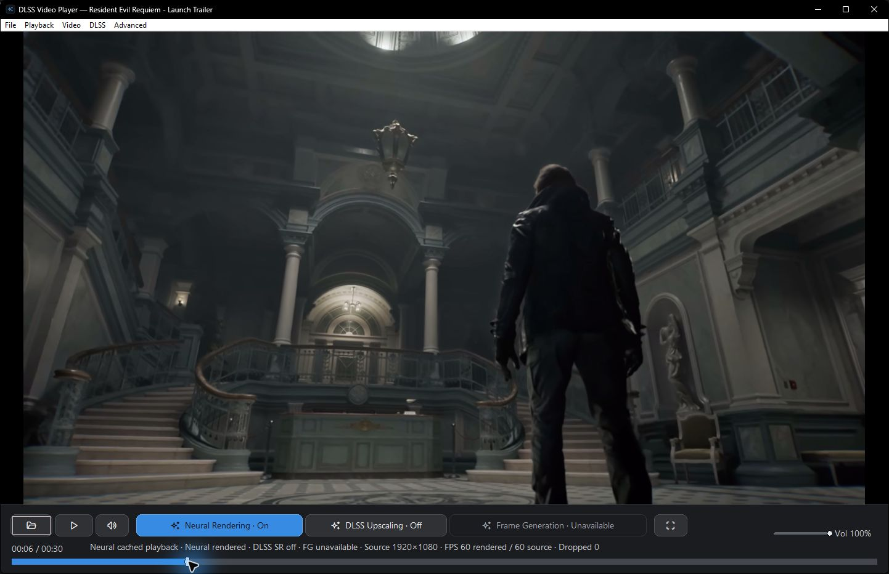
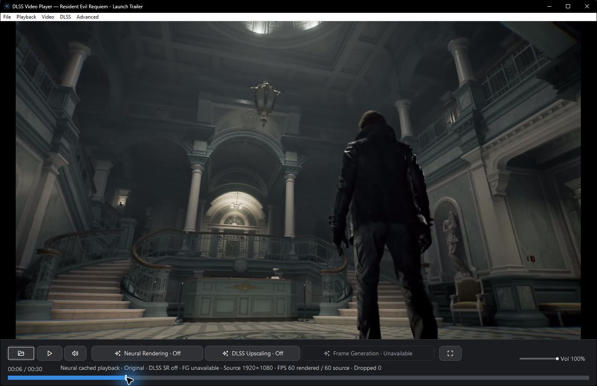
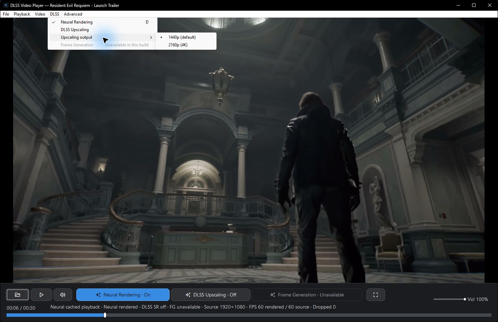
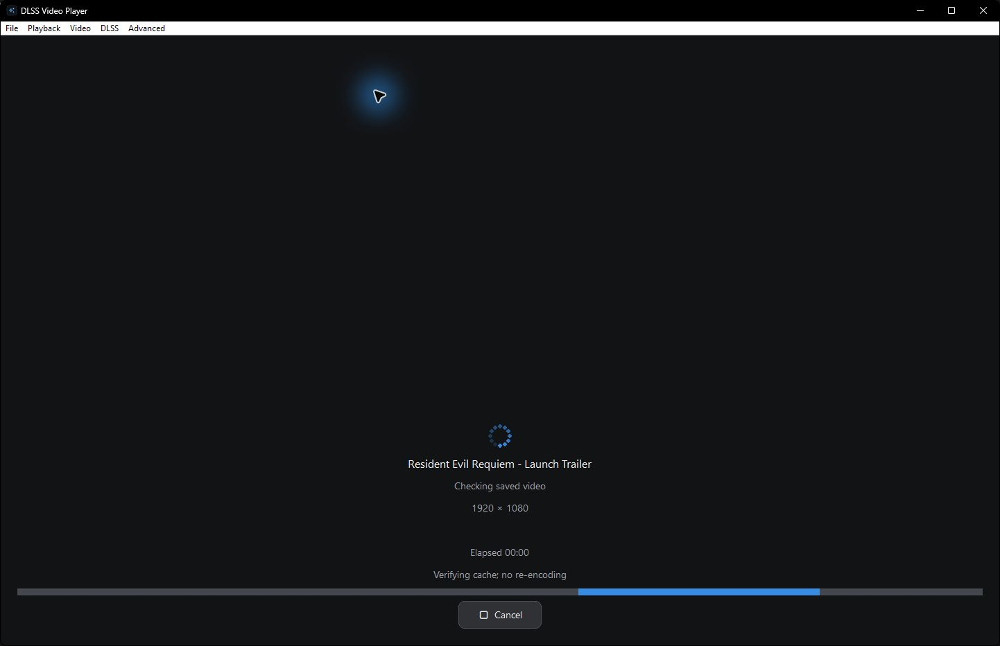
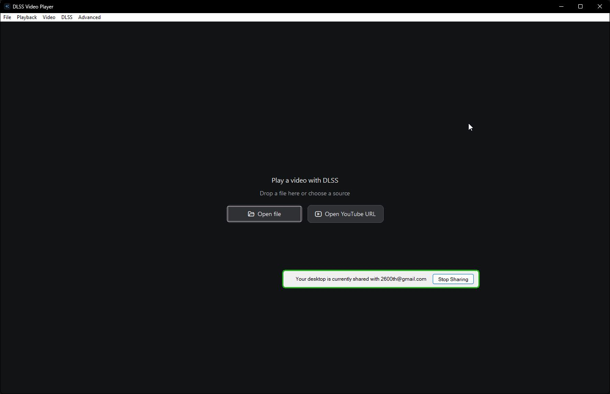

# DLSS 5 Video Player

Experimental neural video rendering and optional runtime DLSS upscaling for
Windows and NVIDIA RTX GPUs. Open a local video or a public YouTube example,
render it once, then play the cached result and switch to the original at the
same timestamp.

[Download the personal Windows build](https://github.com/2600th/dlss5-video-player/releases/tag/personal-v0.12.0.1)
 · [Release source](https://github.com/2600th/dlss5-video-player/tree/personal-v0.12.0.1)
 · [Technical README](TECHNICAL_OVERVIEW.md)
 · [Screenshots](#screenshots)

> [!IMPORTANT]
> This is a **private, personal-use experiment**, not an official NVIDIA DLSS 5
> integration. The bundled neural runtime includes modified/unsigned third-party
> components. Their redistribution permissions remain unresolved; keep the
> package private. Attribution and a testing disclaimer do not replace the
> owners' license terms.

The screenshots and downloadable build describe **personal-v0.12.0.1**.
The application source, tests and documentation are now consolidated on `main`.
The release tag remains an immutable snapshot of the tested personal build.

## What it does

- **Neural rendering before playback.** Prepare and validate a complete video,
  then reuse its cached result on subsequent plays.
- **Original/neural comparison.** Toggle Neural Rendering without changing the
  playback timestamp; pause and seek either view.
- **Independent runtime upscaling.** Optionally apply DLSS Super Resolution to
  the original or neural-rendered view, with 1440p or 2160p output.
- **Local files and YouTube examples.** Open FFmpeg-supported video files or
  public, non-DRM YouTube videos without a login.
- **Visible loading and processing.** Animated source/cache checks, actual
  completed-frame progress, elapsed time and ETA when available.
- **Native Windows controls.** Drag and drop, timeline seeking, audio/volume,
  fullscreen, aspect controls and post-DLSS image adjustments.

| Feature | Default in the personal build |
| --- | --- |
| Neural Rendering | On; playback uses a validated cached result when available |
| DLSS Upscaling | Off; runs at playback time when enabled |
| Upscaling output | 1440p, with 2160p selectable |
| Frame Generation | Unavailable; no FG backend is implemented |
| YouTube source quality | Prefer 1080p; otherwise use the highest available resolution up to 4K |

Manual YouTube quality choices are 1080p, 1440p and 2160p. Lower-resolution
videos can still play through the automatic fallback; 480p and 720p are not
exposed as manual modes. Source quality and upscaling output are separate.

## Screenshots

Actual Windows captures from the personal build on an RTX 5090. These show the
interface and feature states, not a visual-quality benchmark or a promise of
the same performance on other hardware. Click an image to inspect it.

### Original and neural-rendered comparison

Both captures are paused at the same approximately six-second timestamp, with
runtime DLSS Upscaling off.

| Original — Neural Rendering off | Cached neural-rendered view — Neural Rendering on |
| --- | --- |
|  |  |

### Independent feature controls

Neural Rendering, DLSS Upscaling and Frame Generation have separate controls.
The menu exposes 1440p/default and 2160p output while clearly marking Frame
Generation unavailable.

### Loading and cache reuse

The spinner and progress bar animate while the player checks saved video. A
valid cache is reused without re-encoding. This still image captures that
loading state; frame-processing percentages appear during a new neural job.

Start screen: local files and YouTube URLs

Example footage: [Resident Evil Requiem - Launch Trailer](https://www.youtube.com/watch?v=9lrThxCoznw),
from the Resident Evil channel. Game footage, trademarks and third-party
components remain the property of their respective owners. Screenshots document
this player; no endorsement or additional media rights are claimed.

## Get started

1. Open the [personal release](https://github.com/2600th/dlss5-video-player/releases/tag/personal-v0.12.0.1)
   while signed into a GitHub account with access to this private repository.
2. Download `DLSSVideoPlayer-v0.12.0-upscaling-loading-win64.zip` and, optionally,
   its `.sha256` checksum file. GitHub's source-code archives are not runnable
   application packages.
3. Extract the **whole ZIP into a new folder**. Keep `neural-runtime/` and all
   helper files intact; do not extract over an older build.
4. Launch `DLSSVideoPlayer.exe` from File Explorer. Choose a local file, paste a
   public YouTube URL, or select **File > Examples**.
5. Let preparation finish, then use **Neural Rendering** or `D` to compare.
   Enable **DLSS Upscaling** separately if desired.

## Requirements and limitations

- Windows x64, a D3D12-capable NVIDIA RTX GPU and a suitable NVIDIA driver.
- The current personal build was hardware-tested on an **RTX 5090**. RTX 40
  neural compatibility relies on a community modification and was not tested
  for this build; policy recognition alone is not compatibility proof.
- Neural rendering is an offline preparation step, not a claim of real-time
  neural processing. Processing time, memory use and quality vary by source
  and hardware. Runtime upscaling is a separate optional operation.
- The player estimates motion/depth guides from video rather than receiving
  authoritative game-engine data. Results can contain artifacts.
- Private, login-required, paid, age-gated and DRM-protected YouTube content is
  not supported. Public examples may become unavailable.
- The modified neural DLL has an invalid Authenticode signature; some bundled
  components are unsigned. Hash verification checks identity, not safety.
- Project source is MIT-licensed. Third-party binaries and media retain their
  own terms. This is not affiliated with or endorsed by NVIDIA or the other
  upstream projects.

## Developer documentation

- [Build the released source](https://github.com/2600th/dlss5-video-player/blob/personal-v0.12.0.1/docs/BUILDING.md)
- [Architecture](https://github.com/2600th/dlss5-video-player/blob/personal-v0.12.0.1/docs/ARCHITECTURE.md)
- [Experimental neural-runtime setup](https://github.com/2600th/dlss5-video-player/blob/personal-v0.12.0.1/docs/DLSS5_SETUP.md)
- [Troubleshooting](https://github.com/2600th/dlss5-video-player/blob/personal-v0.12.0.1/docs/TROUBLESHOOTING.md)
- [Runtime upscaling verification](https://github.com/2600th/dlss5-video-player/blob/personal-v0.12.0.1/docs/superpowers/plans/2026-09-02-upscaling-verification.md)
- [Loading-feedback verification](https://github.com/2600th/dlss5-video-player/blob/personal-v0.12.0.1/docs/superpowers/plans/2026-09-02-loading-feedback-verification.md)
- [Third-party notices](https://github.com/2600th/dlss5-video-player/blob/personal-v0.12.0.1/THIRD_PARTY.md)

The core stack is C++20, Win32, Direct3D 12, FFmpeg and NVIDIA NGX. An isolated
helper hosts the experimental RenoDX/ReShade neural runtime, keeping playback's
optional DLSS Super Resolution path separate.
