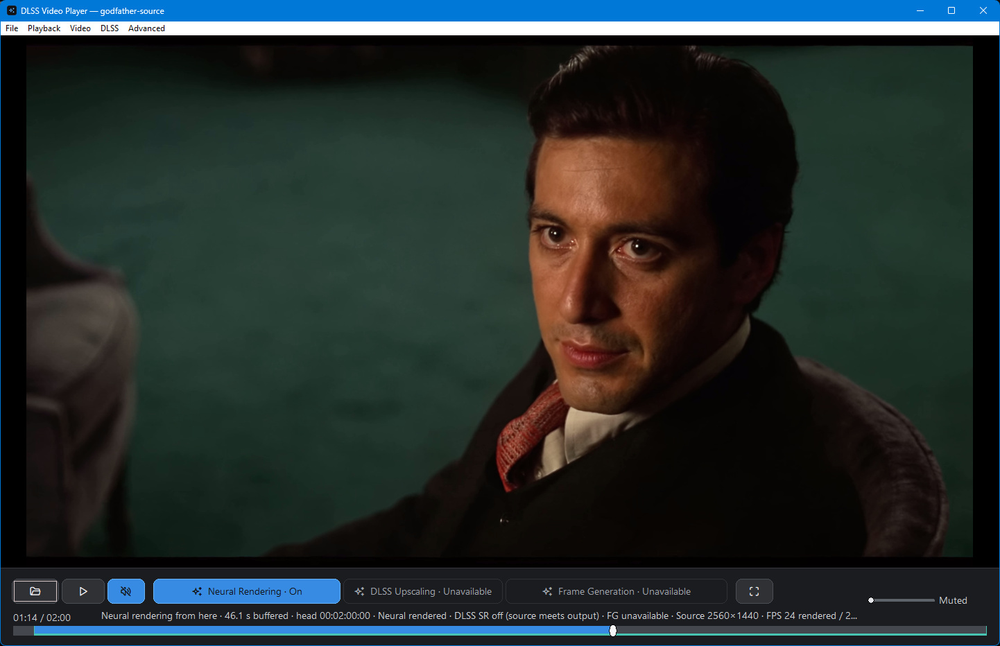
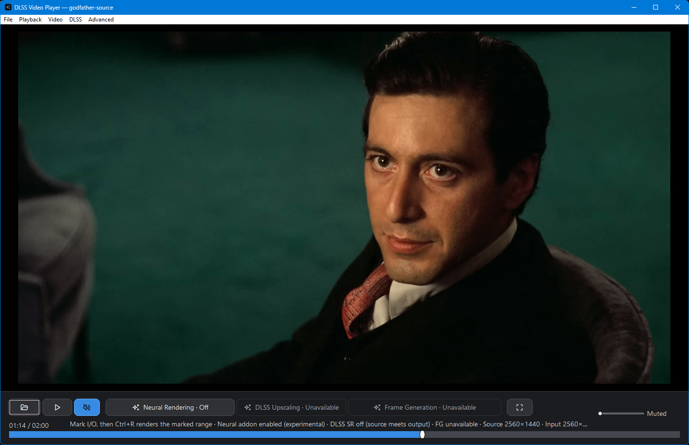

# DLSS 5 Video Player

_Verified against 0.24.0 (918c0b0) on 2026-09-20._

Run a video, photo or GIF through NVIDIA's DLSS 5 neural renderer, then look at
the result next to the original on the same frame. Windows only. Needs an RTX
card.

[Website](https://2600th.github.io/dlss5-video-player/) · [Download](#download) · [First run](#first-run) · [Usage guide](docs/USAGE.md) · [Build it yourself](docs/BUILDING.md) · [Troubleshooting](docs/TROUBLESHOOTING.md)

[](docs/media/neural-comparison-demo.mp4)

That preview plays inline and loops silently. **[Full 22-second video, 1080p
H.264](docs/media/neural-comparison-demo.mp4)** - The Godfather and GTA VI, each
paused and magnified 2x in the player, split down the face with the original on
the left and the render on the right, then playback with the render running
ahead. Live 2560x1440 sessions, recorded as they ran, no sound.
[How it was captured](docs/media/README.md).

> [!IMPORTANT]
> Community project, not an NVIDIA product. The neural runtime is a modified,
> unsigned community build. Checked on an RTX 4080 SUPER (v0.23.0) and an RTX
> 5090 (v0.20.0). Neural rendering needs NVIDIA driver 610.47 or newer.
> Notices: [THIRD_PARTY.md](THIRD_PARTY.md).

## Download

**v0.24.0** (2026-09-20): [release page](https://github.com/2600th/dlss5-video-player/releases/tag/dlss5-video-player-v0.24.0)

| Package | What is in it | Size |
| --- | --- | --- |
| `dlss5-video-player-v0.24.0-win64.zip` | Player plus the pinned neural runtime. This is the one you want. | 312 MB |
| `DLSSVideoPlayer-v0.24.0-core-win64.zip` | Player only, no neural runtime. | 35 MB |

Both have a `.sha256` beside them on the release page. GitHub's "Source code"
zip does not run: no runtime in it.

### Check what you downloaded

The checksum says the file arrived intact. It does not say who built it, so
check both:

```sh
# Intact: the .sha256 sits beside the zip on the release page.
sha256sum -c DLSSVideoPlayer-v0.24.0-core-win64.zip.sha256

# Built here: signed SLSA provenance, verified against this repository.
gh attestation verify DLSSVideoPlayer-v0.24.0-core-win64.zip --repo 2600th/dlss5-video-player
```

Once unpacked, `verify_package.ps1` ships inside the zip and checks the
contents against an exact allowlist, each file's Authenticode state, and the
zip-bomb guards:

```powershell
.\verify_package.ps1 -StageDirectory .
```

> [!NOTE]
> Provenance covers the **core** package today. The complete package is
> assembled on the maintainer's machine, because CI does not fetch the neural
> runtime, so it carries its checksum but not a build attestation. If that
> matters to you, take the core zip and stage the runtime yourself with
> [docs/BUILDING.md](docs/BUILDING.md).

## First run

1. Unzip into a **new, empty folder**. Keep `neural-runtime/` next to the exe.
2. Run `DLSSVideoPlayer.exe`.
3. Open a file (`Ctrl+O`), paste a public YouTube link (`Ctrl+L`), or pick
   something from **File > Game trailers**.
4. Press `D`. It buffers for a few seconds, then plays rendered.
5. **Video > Compare** shows before and after as a split, a wipe or a blend.
6. **DLSS > Convert & export** writes the rendered video to a file.

Next time, **File > Recent videos** reopens it with the render already done.

## What it does

- Renders while you watch. Press `D` and playback continues on rendered frames a
  few seconds later, while the rest fills in behind you, nearest first.
- Seek anywhere, rendered or not. Rendered frames play wherever they sit on the
  timeline; elsewhere the original plays at once and the render moves there.
  Nothing already rendered is thrown away.
- Keeps the original and the render in step. Switching views does not move the
  playhead, and you can pause and step frames on either.
- Keeps every render. One is reused whenever the source, the runtime and the
  settings still match, however long ago you made it. **File > Recent videos**
  lists five, but dropping off that list deletes nothing.
- Converts to a higher frame rate. **DLSS > Generate frames** writes a new file
  at 2x to 5x the original rate, then plays it.
- Exports what you rendered. PNG or JPEG for photos, GIF for animations, MP4 or
  MKV for video. MKV keeps the source audio, subtitles and chapters without
  re-encoding.
- Optional DLSS Super Resolution on either view, at 1080p, 1440p or 2160p -
  taken from your monitor by default, or pinned. On playback the render itself
  stays at source resolution; to bake the larger size into a file, use the
  export below.
- Exports with the stages combined. **DLSS > Convert & export > Export with
  DLSS stages** (`Ctrl+S`) writes one file with Super Resolution, neural
  rendering and frame generation in any combination you tick. They run in
  NVIDIA's order - Super Resolution first, the neural model on the upscaled
  frame, generated frames last - and the panel shows which pass is running,
  how far along it is and roughly how long is left.
- Neural settings at `Ctrl+N`. Change one while paused and that frame is
  re-rendered, so you judge on the picture. They are saved with the render and
  are part of its cache identity.
- Encoder settings at **DLSS > Encoder settings**: the NVENC preset, and where
  colour conversion runs. Only the source conversion invalidates a cached
  render, because only it changes what the model is shown.
- Six official game trailers under **File > Game trailers**, each under three
  minutes, for a quick first test.

## What changed

The short version. Every detail is in [CHANGELOG.md](CHANGELOG.md).

**0.24.0** (2026-09-20). **Frame generation.** **DLSS > Generate frames**
converts a video to a higher frame rate - 2x by default, up to 5x - writes it as
a new file, then plays it from where you were. When it cannot, it says why
instead of greying out: the source, the display, your chosen multiple, or a
stream it needs a local copy of first. It also detects cuts now, so it stops
blending across a shot change.

**Live playback is fixed at high frame rates.** A neural session advances two
frames at once, and the loop meant to drop late ones was throwing away work it
had already paid for. A 1440p59.94 video went from 12 frames a second to all 60.
Where the render genuinely cannot keep up, the player now buffers about once a
minute instead of every few seconds.

Renders survive a sixth video pushing the first out of **Recent videos** - only
**Clear Neural Cache** deletes them. Upscaling picks 1080p, 1440p or 2160p from
your monitor instead of a fixed guess. Conversions encode noticeably faster at
the same quality. And there is a website:
<https://2600th.github.io/dlss5-video-player/>.

**0.23.0** (2026-09-16). A pass over the whole player, fixing what it turned up.
**Save converted video** after a live session used to write only the last
rendered stretch under the film's name; it is offered now only when a single
render covered the whole video. A cancel arriving just after a job finished
cancelled the next one instead.

A graphics device that is lost or stops responding now stops playback, says so,
and rebuilds the renderer once, rather than freezing the picture with the audio
still running. YouTube streams are fetched with certificate verification forced
on. Both executables ship with Control Flow Guard and CET. Releases stay drafts
until the complete package is attached, and every guide carries a line naming
the version it was last read against.

**0.22.0** (2026-09-16). **A session renders the whole video**, not one run
forward from where you pressed `D`. What you are watching is rendered first,
then the rest, nearest first. Seek anywhere: rendered frames play wherever they
sit on the timeline, and where nothing is rendered yet the original plays while
the render moves there. Nothing already rendered is thrown away.

**Colour was wrong in every render before this.** Files carried BT.601 pixels
while declaring no colour space at all, so any player assuming BT.709 - the
usual default for HD - showed them shifted. Renders now state `bt709`/`tv` and
convert to match.

Two causes of stutter are gone: a cache check that hashed 60 MiB of the stream
six times a frame on the drawing thread, and a decode pipe too small to hold a
1440p frame. Seeking during a render takes about a third of a second instead of
one and a half, and tapping the key repeatedly no longer restarts the job each
time. Renders made by earlier versions are remade once, because the cache key
now includes the driver and the model files.


**0.21.2** (2026-09-12). A live session could get stuck on one frame. If the
render's first finished segment began a frame later than the playhead - 12.0662 s
against 12.0329 s - playback refused to join it, the recovery restarted the same
session at the same spot, and it did that until the clip ran out while the render
kept working. Playback now joins at the first rendered frame, and the recovery
gives up after one restart instead of looping. **Video ▸ Compare ▸ Wipe** also
got a divider you can see on bright footage, and a play press made while the
buffer fills now shows on the button.

**0.21.1** (2026-09-12). A fourth way to lose a finished render, and this one was
not the player's arithmetic: publishing a cache entry is a directory rename, and
Windows refuses to rename a directory while any file inside it is open - which is
what an antivirus scanner does to a 186 MB file the second it is written. One
attempt was made, so a render that had verified all 2871 of its frames was
discarded. It now waits the scan out, and a refusal names which step refused
instead of one shared verdict. The README video and screenshots are new too:
GTA VI and The Godfather, live 1440p sessions recorded as they ran.

**0.21.0** (2026-09-12). YouTube trailers were arriving at the lowest bitrate
YouTube offers. "Auto" asked for exactly 1080p, which on a trailer is the bottom
of the ladder: 3899 kbps, where the same trailer has 7854 at 1440p and 20764 at
2160p. Auto now takes the best rung up to 1440p, so the picture the model has to
work with carries about twice the detail. Separately, some videos are
age-restricted, and without a sign-in YouTube hands out a single 640x360 stream
for them; the player played that silently and rendered it. It now says so on the
status line, and names the sign-in as the reason. Three of the six bundled
trailers are affected.

There is also a new **Neural strength** slider under `Ctrl+E`, 0 to 200 %. It
re-mixes the frame already on screen instead of re-rendering it, so unlike every
model setting it costs nothing: 100 % is the render as it is, below that mixes
back toward the original, above that pushes the model's own change further. And
three ways a finished render could be lost are fixed, including one that threw
away a cache entry after verifying all 2607 of its frames.

**0.20.1** (2026-09-12). Two things a neural session did to itself. Playback
dropped 44 % of its frames - a 1080p30 trailer played 1415 of 2525 - because
the player opened the next two-second segment file on the thread that draws
frames, and opening one runs `ffprobe` as a separate program. On a normal
install, where an antivirus inspects every program that starts, that is 0.7 s
of frozen picture every 2 s; it is 32 ms inside a scanner exclusion, which is
why it never showed up here. Same clip after the fix: 1 dropped frame out of
2839. And turning neural rendering on took 15 s before anything appeared,
most of it spent re-running a probe of the graphics runtime, re-hashing the
same 226 MB three times, and waiting for four seconds of rendered video when
this card produces it 4.8x faster than it plays. It is now under 6 s on the
second and every later run - 9 s on a scanned install - and the first frame
appears after half a second of render instead of two.

**0.20.0** (2026-09-11). Motion vectors now come from the optical flow engine built into
every RTX card since Turing: 960x540 vectors instead of 160x90, and a
thirty-second of a pixel instead of three pixels. The old estimator could not see
a one-pixel pan at all, which is what made slow movement look unstuck from the
picture. Costs about 1.7 ms a frame at 1080p. Sampling jitter is gone - it was
borrowed from how games drive DLSS and does nothing useful to a video, where it
only softened every frame by a different amount. On a still image that cut the
worst-pixel shimmer by more than half. Fullscreen no longer tears. Opening a
YouTube video while a render was running left the picture stuck on one frame
with the old video's seek bar; and turning neural rendering off and on again
re-rendered everything it had already done instead of picking up where it left
off.

**0.19.0** (2026-09-10). The export decodes with NVDEC and sends NV12 down the
pipe instead of BGRA, and NVENC gets its CUDA context at spawn: 7.8 to 4.2 ms
per frame with presents off on an RTX 5070 Ti, and the first-frame stall on each
live segment fell from 126 to 59 ms. New **DLSS > Encoder settings** window, and
the settings windows resize. Most of this came from ctype-lab's PR #6; the GPU
source-conversion default and the forced NVENC split mode were left off, and a
tooltip use-after-free that the second settings window exposed is fixed.

**0.18.0** (2026-09-10). Checks the driver before the neural path runs: below
610.47 the render is refused up front, naming the version to install, instead of
dying in a probe with `0xbad00002`. The render receipt stopped reporting the
carrier session's result as feature 18's, a failed preflight is no longer retried
on every play, and the menu bar shows `↑ Update <version>` when a newer release
exists.

**0.17.2** (2026-09-10). Fixes the render that died at "A frame was not produced
by feature 18" on a 4070 Ti and an RTX PRO 6000: the player was releasing and
rebuilding the DLSS feature 60 presents in, which is exactly when the neural
add-on was being asked to prove it had run. It now builds that feature once and
keeps it. Small sources upscale again instead of being refused, a downloading
source shows how far it has got, a job that goes quiet is stopped instead of
spinning forever, photos can start a render from the toolbar, and one scene
change no longer resets the temporal history six times in twelve frames.

**0.17.1** (2026-09-10). Live playback no longer stops at a segment seam with an
"out of sync" warning, and a stop of any kind now says why in the log.
Re-measured on an RTX 5090: a 1080p30 session costs 8.4 ms per frame, down from
11.9 before the export loop was pipelined.

**0.17.0** (2026-09-10). The export got 2.3x faster and the pixels did not change.
1080p30 on an RTX 4080 SUPER: 48.6 to 110.7 frames per second, and the output
is bit for bit the same as 0.16.0. Guide generation went from 4.6 ms to 1.5 ms
per frame. Most of this came from ctype-lab's PR #5; the parts that broke
things were fixed or left out.

**0.16.0** (2026-09-09). Runs on every RTX generation, 20 through 50, by
switching to the universal 310.8.SF-v2 runtime. Fixed a wedge on the RTX 4080
that killed every 1080p live session two seconds after preroll. The keep-up
forecast now uses your GPU's own measured speed at each source size and warns
before a session it expects to fall behind. `build_windows.bat` fetches the
runtime by itself.

**0.15.0** (2026-09-09). Press `D` while watching instead of rendering the whole
file first. Toggling off and on resumes rather than re-rendering. 4K30 keeps up
on an RTX 5090 (it ran at 0.23x real time before). Two neural controls that the
model provably ignores were removed from the dialog.

**0.14.0** (2026-09-03). Photos and GIFs, with PNG, JPEG, GIF, MP4 and MKV
export. Six game trailers replaced the old example list. Fullscreen hides the
controls until the mouse moves.

**0.13.0** (2026-09-03). Recent-five history with cache reuse. Stream-copy MKV
export with audio, subtitles and chapters. Runtime DLSS upscaling, off by
default. The neural renderer moved into its own helper process.

**0.12.0** (2026-09-01). Public YouTube playback. Separate Neural Rendering,
DLSS Upscaling and Frame Generation controls. The RenoDX neural path, with
pinned runtime hashes and a safe-mode escape hatch.

## Controls

| What | Key |
| --- | --- |
| Open a file / a YouTube URL | `Ctrl+O` / `Ctrl+L` |
| Play or pause | `Space` |
| Neural rendering on or off | `D` |
| Compare views | **Video > Compare**; `[` and `]` change the blend, `Z` zooms 2x |
| Seek ten seconds / step one frame | `Left` / `Right`; `.` |
| Mark In / Out; clear; go to time | `I` / `O`; `Shift+I`; `Ctrl+G` |
| Render one frame / four seconds / the marked clip | `F` / `Shift+F` / `Ctrl+R` |
| Generate frames; cancel a conversion | **DLSS > Generate frames**; `Esc` |
| Neural settings | `Ctrl+N` |
| Export with DLSS stages | `Ctrl+S` |
| Image adjustments | `Ctrl+E` |
| Volume, mute | Mouse wheel; `M` |
| Fit or fill; fullscreen | `A`; `F11` |
| Stop | `S` |
| Debug views (final, DLSS input, motion, depth) | `1` `2` `3` `4` |
| Re-hook the runtime | `F6` |

Everything you set is kept between launches: volume, view, upscaling, YouTube
quality, image adjustments, neural settings and guide switches.

Defaults on a fresh install: neural rendering on, DLSS upscaling off, upscaling
output Auto, YouTube quality Auto. Frame generation is an action, not a setting:
nothing is converted until you ask.

**DLSS > Generate frames** raises the frame rate. It is a conversion rather than
a live mode: the player writes a new file, shows the percentage and the time
left while it does, and switches playback to the result at the same position you
were watching. `Esc`, the toolbar pill and **DLSS > Cancel frame generation**
all stop it; nothing is left behind when you do. The converted file is kept with
the player's other converted videos and **DLSS > Show converted file** opens it.

The default doubles the frame rate, and **DLSS > Generated frames** offers 3x,
4x, 5x or "as many as the display allows" if you want more - a conversion is
minutes of GPU work and a file several times the size of the source, so how much
of both to spend is your choice rather than the player's. The pick is kept
between launches.

Whatever you pick, your display decides what is worth producing, and it decides
it on two things. How far the picture moves between one presented frame and the
next - which is what a higher rate fixes - and how evenly the frames land on the
refresh. That second quantity is smaller than it sounds: a frame is held for a
whole number of refreshes, so an uneven cadence is uneven by exactly one refresh
however high the rate goes. So a multiple is taken when it shortens the step
without making the landing less even, a multiple that divides the refresh wins
over a higher one that does not, and the largest admissible multiple at or below
your setting wins the rest.

On a 120 Hz panel 30 fps doubles to 60 at the default and reaches 120 at 4x if
you ask for it; 24 fps film needs 5x to reach exactly 120 with its 3:2 pulldown
gone, so at the default the status line says what it is refusing on - "set to
2x, needs 5x" - rather than pretending the display cannot do it. On a 60 Hz
panel 30 fps doubles to 60, and so does 24 fps film: 48 fps is held for 1 or 2
refreshes where 24 fps is held for 2 or 3, which is the same unevenness the film
was already being shown with, for half the step. An earlier release refused that
case for "trading one uneven cadence for another"; the two cadences are one
refresh apart either way, so it was giving up the halving for nothing.

**Even cadence only**, under DLSS > Generated frames, puts that rule back if you
would rather keep a film's own pacing than a finer one that lands unevenly.
Nothing is then generated unless the rate divides the refresh, and where the
monitor has a mode that would divide it - 24 fps film on a 48, 72 or 120 Hz mode
- the refusal offers to switch your display to it instead of stopping there.

A source already at the refresh, a display too slow to double it, a still image,
a file whose frame rate varies, a display whose refresh Windows does not report,
and a GPU whose runtime admits no generated frames each say so in the status line
before you click, and say it again as a sentence if you do.

A streaming source is converted too, because the pass needs a file: the player
keeps a local copy of the video the way it already does for a render, the status
line says so while it downloads, and Generate frames turns live the moment the
copy lands. A stream whose copy is already in the cache is convertible straight
away.

Watching the neural view converts the neural render instead of the original,
when that render covers the whole video and matches the settings on screen; the
confirmation names which file it will read. Either way the converted file
carries the original's audio, subtitles and chapters by stream copy - the
conversion preserves length exactly, which is what makes a copy correct.

What the ceiling is, and why: four generated frames per source frame - 5x - which is
BELOW what this RTX 5090's runtime admits (it allows five, i.e. 6x), so it is a
real ceiling and not a restatement of the driver's. It is measured, and the
bound is stated: a multiplier is admitted while the worst ratio between adjacent
gaps in the emitted sequence stays under 2.0, because uneven gaps are what a
viewer sees - a constant offset from the ideal never changes and is invisible. On a clip carrying a textured patch that moves
exactly 40 px per source frame, each generated frame's position was read from
its brightness centroid and compared with where the timeline puts it. At 4x the
three intermediates of an interval land at 0.191, 0.474 and 0.707 of the way
across it against an ideal 0.250 / 0.500 / 0.750. Worst adjacent-gap ratio by
multiple: 1.13 at 2x, 1.69 at 3x, 1.71 at 4x, 1.69 at 5x - and 2.70 at 6x, whose
shortest gap of 0.088 is a near-duplicate frame followed by a jump, which is the
artifact a higher rate is meant to remove. 6x is refused for that reason; 20 fps
content on a 120 Hz panel is all it could have served anyway.

An earlier release capped this at 2x on a measurement that was wrong twice over,
and the corrections are worth stating. The probe was a flat white square: a
featureless region has no interior detail for an interpolator to place, so the
generated frame is close to a blend and its centroid is pulled to the midpoint -
the same runs read 0.482 / 0.552 / 0.735 with the square and 0.191 / 0.474 /
0.707 with texture - placement is content-dependent, and flat graphics still
interpolate as a blend today. And the claim that a 4x conversion produced "240 unique
frames" came from hashing a lossy re-encode, where identical inputs hash
differently, so it proved nothing at all. Separately, the pass was handing its
history-establishing evaluate the pair's own frame count instead of 1, which
made the first interval after every reset three copies of the same frame and the
second interval land outside the pair entirely. `tests/FrameGenerationSmoke.cpp`
now measures the phases on every run and rejects both failures.

Measured end to end on an RTX 5090 with a 120 Hz panel: a 90-second 1280x720
30 fps clip converted to 120 fps at 4x in 30 s - 10800 frames from 2700, of
which 8097 were generated, the duration unchanged and the AAC track carried by
copy.

Auto upscaling output takes the largest rung the monitor can scan out - 1080p,
1440p or 2160p - and the source decides whether that rung is an upscale at all:
a 1440p film on a 4K panel goes to 2160p, a 4K film anywhere reports "source
meets output" and stays off, and a 1080p film on a 1080p panel does the same.
The rung is never above the panel, because the surplus is scaled away at
present time while the DLSS evaluate is charged per output pixel. It used to be
a fixed 1440p pick, which both under-shot a 4K panel and asked a 1080p panel
for 78% more pixels than it can show. **DLSS > Upscaling output** still offers
each rung explicitly, and an explicit pick is kept between launches.

YouTube quality Auto takes the tallest rung up to 1440p, then the highest advertised video
bitrate inside that rung. It used to ask for exactly 1080p, which on YouTube is
the last rung still offered in H.264 and the thinnest one on the page. The same
trailer, as the bundled yt-dlp 2026.08.19 lists it (The Last of Us Part II
Remastered, `Tg1oRHd5zlw`, checked 12 September 2026):

| Rung | Video bitrate | Codec |
| --- | --- | --- |
| 1080p60 | 3899 kbps | avc1.64002a |
| 1440p60 | 7854 kbps | vp9 |
| 2160p60 | 20764 kbps | vp9 |

GTA VI Trailer 2 lists 4604, 9282 and 18971 kbps for the same three rungs.
2160p is still there under **Video > YouTube source quality**, where Auto is
listed as "Auto (up to 1440p, highest bitrate)", and it stays something you ask
for rather than the default: 1440p is roughly twice the bitrate for about 1.8x
the render cost (8.4 to 15.4 ms a frame on an RTX 5090), while 4K costs 42 ms a
frame, 0.78x real time, four times the pixels to hold in VRAM and cache, and
5.3x the bytes to pull down on the trailer above, 4.1x on GTA VI Trailer 2.

More on the cache, settings and export in [USAGE.md](docs/USAGE.md). The
trailer list is in [EXAMPLE_VIDEOS.md](docs/EXAMPLE_VIDEOS.md).

## Screenshots

Real captures on an RTX 5090. The player pair below is v0.21.0; the menu and
start-screen shots are older v0.13.0 captures of commands that have not changed.
They show the UI, not image quality; click any image for full size.


### Same frame, original and neural






Both pairs are one paused frame with only the view switched, from live sessions
at 2560x1440. Upscaling is off in all four. This shows the synchronized toggle,
not a claim that every source gains detail.

[Unscaled face crops from the same frame](docs/screenshots/current/face-comparison.png).

### Neural strength dial


`Ctrl+E`, last slider. 0 % is the plain original, 100 % is the model's own
result, 200 % extends the change it made. It re-composes the frame already on
screen, so it costs a present rather than a render.

### Start screen


[Capture details and footage attribution](docs/screenshots/README.md).

## Limits

- Speed. A live 1080p30 session costs about 8.4 ms a frame on an RTX 5090 and
  15.4 ms at 1440p30; an RTX 4080 SUPER measured 15.3 ms at 1080p30. 4K depends
  on the file - a native 4K30 source stays ahead of real time, a heavy 4K
  re-encode does not. The player measures your GPU after the first session and
  warns before one it expects to fall behind.
- Driver. Neural rendering needs **610.47** or newer. Older drivers refuse it
  whatever the card is, and the player says so up front rather than failing
  inside a probe. See
  [troubleshooting](docs/TROUBLESHOOTING.md#neural-rendering-is-refused-because-the-driver-is-too-old).
- RTX 20 and 30 run the universal runtime without native FP8, so expect them to
  be several times slower. Nobody has rendered on one here yet.
- Frame generation is a conversion, not something that happens as you watch: it
  writes a whole new file, which costs time and disk, and it needs a local copy
  of a stream before it can start.
- Depth is estimated from the picture, and so is motion on a card without the
  optical flow engine. Artifacts happen.
- **Save converted video** copies the cached 8-bit render as it is: image
  adjustments and upscaling are not baked in, and HDR or lost source precision
  is not restored. **Export with DLSS stages** is the one that does bake the
  larger size in, by rendering again at that size.
- Super Resolution on its own is not offered in that export. The helper turns
  the neural add-on on for every job it runs, so a render asked for without the
  neural pass comes back with it anyway - measurably so: the two files came out
  byte-for-byte identical. The dialog says as much rather than showing a
  checkbox that changes nothing.
- Subtitles stay as separate tracks. No in-player subtitle display, no burn-in,
  no queue, no HDR, no resume of an interrupted render across restarts.
- YouTube: public, non-DRM videos only, no login, and availability can change.
  Age-restricted videos are the awkward case - an anonymous session can be
  handed a legacy 640x360 stream instead of the full ladder, and three of the
  six bundled trailers are affected. The status line names what actually
  arrived rather than playing 360p without comment. Details in
  [EXAMPLE_VIDEOS.md](docs/EXAMPLE_VIDEOS.md).
- The render cache has no bound - no count, no size quota, and nothing evicted
  automatically. Big videos take space. **Advanced > Clear Neural Cache**
  reports how much it is about to delete and frees it.
- The menu bar shows `↑ Update <version>` when a newer release exists;
  **Advanced > Check for updates** asks GitHub on demand. `[Updates] Enabled=0`
  in `DLSSVideoPlayer.ini` turns the daily check off.

## Building and contributing

C++20, Win32, Direct3D 12, FFmpeg, NVIDIA NGX. The neural runtime runs in a
separate helper process; playback upscaling runs in the player.

- [Build and test](docs/BUILDING.md)
- [Architecture](docs/ARCHITECTURE.md), [technical overview](TECHNICAL_OVERVIEW.md)
- [Runtime setup](docs/DLSS5_SETUP.md)
- Hardware records: [2026-09-02](docs/VERIFICATION-2026-09-02.md), [RTX 4080 SUPER](docs/VERIFICATION-2026-09-09-RTX4080.md), [RTX 5090](docs/VERIFICATION-2026-09-09-RTX5090.md), [RTX 5090 on 0.17.0](docs/VERIFICATION-2026-09-10-RTX5090.md), [RTX 5090 on 0.20.0](docs/VERIFICATION-2026-09-12-RTX5090.md), [RTX 4080 SUPER on 0.21.2+](docs/VERIFICATION-2026-09-14-RTX4080.md), [RTX 4080 SUPER driven player session](docs/VERIFICATION-matrix.md)
- [Troubleshooting](docs/TROUBLESHOOTING.md), [issues](https://github.com/2600th/dlss5-video-player/issues)

Bug report: build or commit, GPU, driver, source size and frame rate, steps,
log excerpts. Strip private paths and signed media URLs from logs first.

Pull request: run `ctest -LE gpu` green on a clean checkout of `main` before
opening it. Renderer changes also need `ctest -L gpu` on an RTX card. Keep the
source-resolution and neural-validation contracts intact.

## Credits and license

Started from [DLSS 5 Video Player by Jessica Natalia Mods](https://gitlab.com/JessicaNataliaMods/dlss-5-video-player/).

Project source is [MIT](LICENSE). Third-party binaries, game footage and
trademarks keep their own terms; see [THIRD_PARTY.md](THIRD_PARTY.md).
