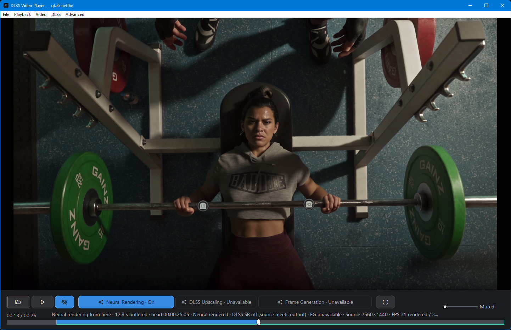
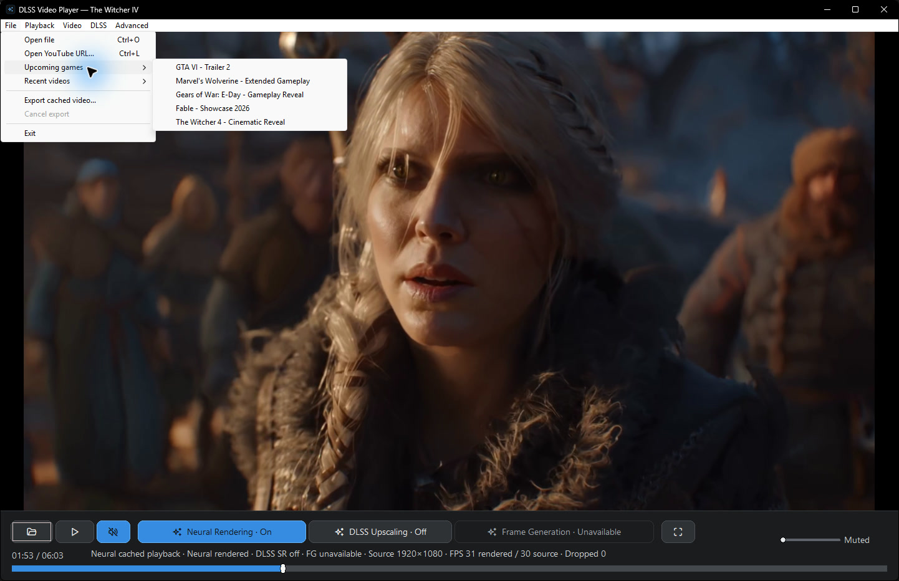
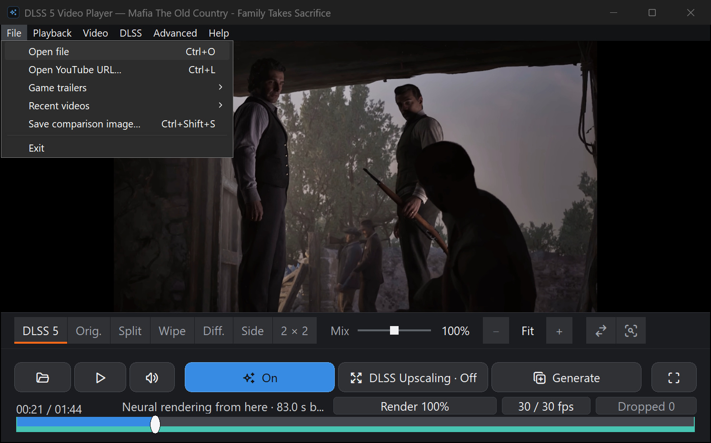
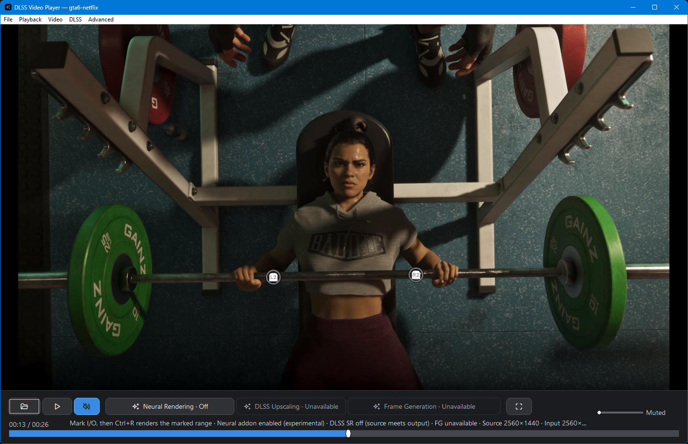
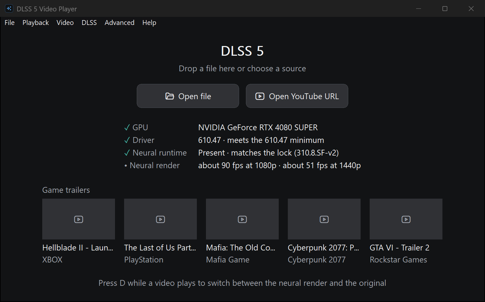

# DLSS 5 Video Player

Render a video once, replay its cached neural result, and compare it with the
original at the same timestamp. A native Windows player for local media and
public YouTube videos, with optional DLSS Super Resolution during playback.

[Get started](#get-started) · [Usage guide](docs/USAGE.md) · [Build from source](docs/BUILDING.md) · [Troubleshooting](docs/TROUBLESHOOTING.md)

**v0.13.0 experimental release.** [Download the Windows build](https://github.com/2600th/dlss5-video-player/releases/tag/dlss5-video-player-v0.13.0)
with recent-video caching, settings snapshots, MKV export and highest-bitrate
YouTube selection. See the [changelog](CHANGELOG.md).

> [!IMPORTANT]
> This is an experimental community project, not an official NVIDIA DLSS 5
> integration. The optional neural runtime uses modified/unsigned third-party
> components. Hardware verification for v0.13.0 used an RTX 5090.
> See [runtime details and notices](THIRD_PARTY.md).

## Why use it?

- **Compare the same moment.** Switch between original and cached neural video
  without changing the playback timestamp.
- **Replay recent videos.** The last five distinct videos persist across
  launches. Acquired YouTube sources and neural renders are reused after validation.
- **Keep experiments consistent.** Neural settings are saved with each render
  and included in its cache identity. A settings change triggers a new render.
- **Take the result with you.** Export a new MKV with the cached video, available
  source audio, compatible subtitles and chapters, without re-encoding.
- **Choose playback upscaling separately.** Apply optional DLSS Super Resolution
  to either view at 1440p or 2160p. The neural cache retains source resolution.
- **Start with a game trailer.** Five official upcoming-game examples are
  available under **File > Upcoming games**.

## Get started

1. Use Windows x64 with a D3D12-capable NVIDIA RTX GPU and a suitable NVIDIA
   driver. The experimental neural layout requires the separately supplied
   runtime described in [setup](docs/DLSS5_SETUP.md).
2. [Build the current source](docs/BUILDING.md), or download the
   [v0.13.0 package](https://github.com/2600th/dlss5-video-player/releases/tag/dlss5-video-player-v0.13.0)
   if you have repository access. GitHub's source ZIP is not a runnable package.
3. Extract a packaged build into a **new folder** and keep all helpers and
   `neural-runtime/` intact. Launch `DLSSVideoPlayer.exe`.
4. Open a local file (`Ctrl+O`), paste a public YouTube URL (`Ctrl+L`), or choose
   **File > Upcoming games**.
5. Let preparation finish. Press `D` to compare neural and original views;
   enable **DLSS Upscaling** separately if desired.
6. Reopen through **File > Recent videos**, or choose **File > Export cached
   video** to save the prepared result.

The publishable core package has fewer capabilities than the complete experimental
layout. Build inputs and package contents are explained in [Building](docs/BUILDING.md).

## Everyday controls

| Action | Control |
| --- | --- |
| Open a local file / YouTube URL | `Ctrl+O` / `Ctrl+L` |
| Play or pause | `Space` |
| Compare original and neural views | `D` |
| Seek / step a paused cached frame | Timeline or `Left` / `Right`; `.` to step |
| Volume / mute | Volume control or mouse wheel; `M` to mute |
| Fit or fill / fullscreen | `A` / `F11` |
| Image adjustments | `Ctrl+E` |
| Replay / export | **File > Recent videos / Export cached video** |

Volume, mute, fit/fill, comparison view, upscaling preference/output, YouTube
quality and image adjustments are saved across launches.

| Setting | Fresh-install default |
| --- | --- |
| Neural Rendering | On; prepare or reuse a validated cache |
| DLSS Upscaling | Off; 1440p output selected, with 2160p available |
| YouTube source quality | Auto: prefer exact 1080p, otherwise highest available up to 4K |
| Frame Generation | Unavailable; no backend is implemented |

Manual YouTube choices are 1080p, 1440p and 2160p. Each selects the highest
advertised video bitrate at that resolution, across available codecs and containers.
Source quality and playback upscaling are separate.
See [cache, settings and export details](docs/USAGE.md).

## Screenshots

Actual Windows captures of the v0.13.0 feature implementation on an RTX 5090.
Images show interface states, not image-quality benchmarks. Open an image to
inspect it at full size.

### Upcoming games

### Recent videos and export

Original view at the same paused timestamp

Runtime upscaling is off in both comparison captures. These document a synchronized
toggle, not a claim that every source gains visible detail.

Start screen

[Capture details and footage attribution](docs/screenshots/README.md).

## Limits to know

- Neural rendering prepares the complete video before playback. Processing time
  and results vary by source and hardware; this is not real-time neural rendering.
- Motion and depth guides are estimated from video. Artifacts are possible;
  RTX 40 neural compatibility has not been hardware-verified for this build.
- Export copies the cached 8-bit video. Playback adjustments and runtime upscaling
  are not baked in; export does not restore HDR or lost source precision.
- Compatible source subtitles remain separate in export. In-player subtitle
  display, burn-in, queues, HDR processing and durable render resume are not included.
- YouTube supports public, non-DRM videos without login. Availability and regional
  access can change. Local playback remains available.
- Recent history is limited to five videos, not a disk-size quota. Large videos
  can consume substantial space; use **Advanced > Clear Neural Cache** when needed.

## Development and help

The stack is C++20, Win32, Direct3D 12, FFmpeg and NVIDIA NGX. An isolated helper
hosts the experimental neural runtime; playback upscaling runs in the player.

- [Build and test](docs/BUILDING.md)
- [Architecture](docs/ARCHITECTURE.md) and [technical overview](TECHNICAL_OVERVIEW.md)
- [Runtime setup](docs/DLSS5_SETUP.md)
- [Verification results](docs/VERIFICATION-2026-09-02.md)
- [Troubleshooting](docs/TROUBLESHOOTING.md) and [report an issue](https://github.com/2600th/dlss5-video-player/issues)
- [Example video sources](docs/EXAMPLE_VIDEOS.md)

For a bug report, include the build/revision, GPU, driver, source dimensions and
frame rate, reproduction steps and relevant log excerpts. Remove private paths
and signed media URLs before sharing logs. Changes should preserve the source
resolution and neural-validation contracts; run CTest and relevant hardware
smoke checks before proposing a renderer change.

Project source is [MIT-licensed](LICENSE). Third-party binaries, game footage and
trademarks retain their own terms; see [third-party notices](THIRD_PARTY.md).
