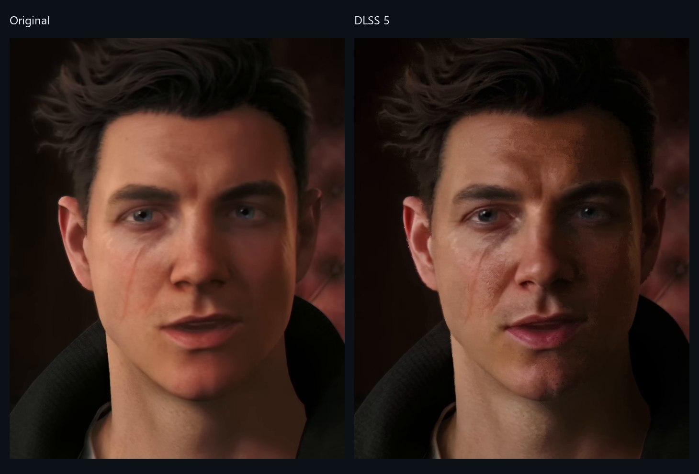
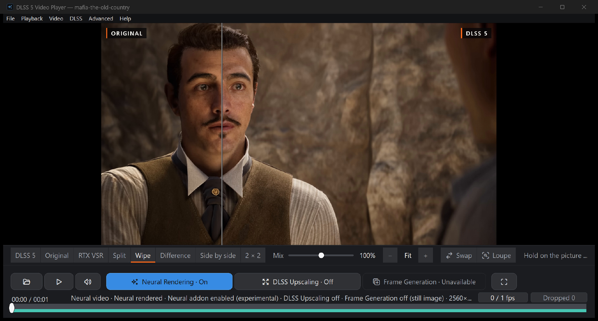
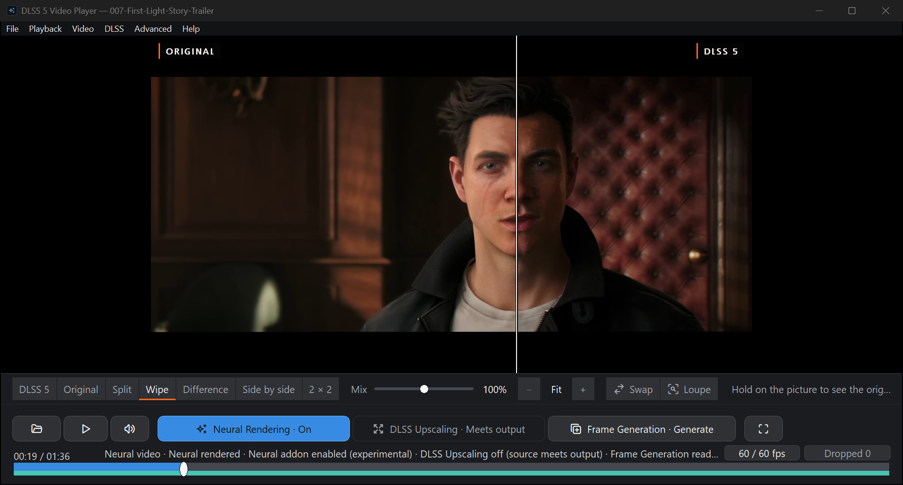
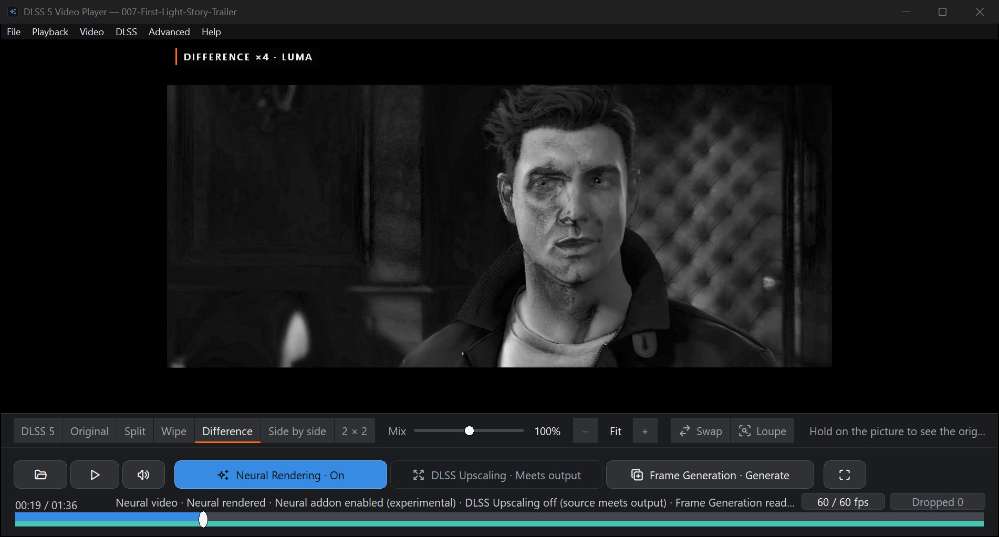
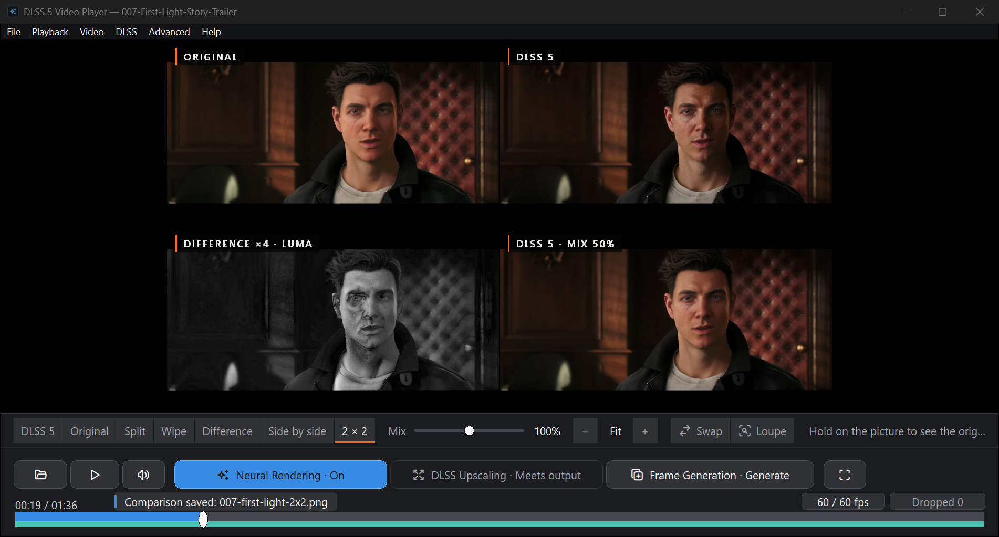
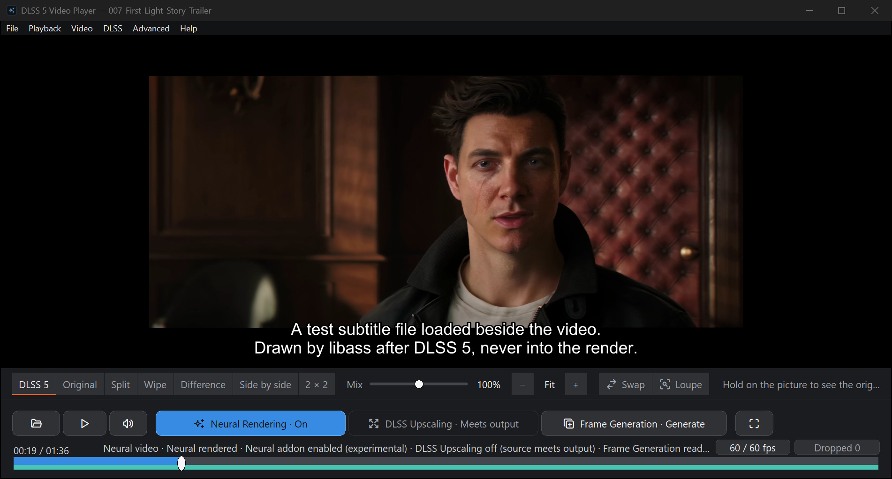
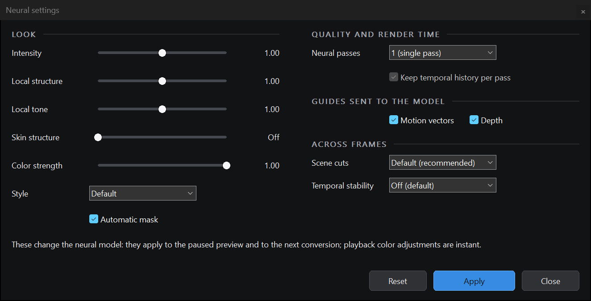

# DLSS 5 Video Player

**Put any video through NVIDIA's DLSS 5 neural renderer, and check every frame
against the original.**

[](docs/media/neural-comparison-demo.mp4)

**[Watch the 25-second video](docs/media/neural-comparison-demo.mp4)** (1080p, no
sound): *007 First Light* and *GTA VI* Trailer 2 rendered at default settings on
an RTX 4080 SUPER, then the Difference, Side by side and loupe views.

A free, open-source player for Windows and RTX cards. Open a video, photo or
GIF and press `D`: within seconds the render plays while the rest of the video
renders behind you, and the original is one key away on the same frame. Other
DLSS 5 tools convert files or filter the desktop live; this one renders the
whole video progressively, keeps every frame, and shows you what the model
changed, and where it didn't help.
[How it compares](docs/RELATED_PROJECTS.md).

[Website](https://2600th.github.io/dlss5-video-player/) · [Download](#download) · [First run](#first-run) · [Usage guide](docs/USAGE.md) · [Troubleshooting](docs/TROUBLESHOOTING.md)



One source frame (left) and the same frame of the player's render (right),
unscaled. [Four more, including one where the model makes the picture worse](docs/media/README.md#comparison-stills).

> [!IMPORTANT]
> Community project, not an NVIDIA product. The neural runtime is a modified,
> unsigned community build. Neural rendering needs an NVIDIA RTX card and driver
> 610.47 or newer. Notices: [THIRD_PARTY.md](THIRD_PARTY.md).

## Download

**v0.26.1** (2026-09-25): [release page](https://github.com/2600th/dlss5-video-player/releases/tag/dlss5-video-player-v0.26.1)

| Package | What is in it | Size |
| --- | --- | --- |
| `dlss5-video-player-v0.26.1-win64.zip` | Player plus the neural runtime and RTX VSR. This is the one you want. | 327 MB |
| `DLSSVideoPlayer-v0.26.1-core-win64.zip` | Player only, no neural runtime or RTX VSR. | 36 MB |

Each zip has a `.sha256` beside it. GitHub's "Source code" zip won't run: it
has no runtime.

### Check what you downloaded

The checksum shows the file arrived intact; the attestation shows this
repository built it.

```sh
sha256sum -c DLSSVideoPlayer-v0.26.1-core-win64.zip.sha256
gh attestation verify DLSSVideoPlayer-v0.26.1-core-win64.zip --repo 2600th/dlss5-video-player
```

Only the core zip has an attestation. CI can't fetch the neural runtime, so the
complete zip is assembled on the maintainer's machine and has a checksum only.
If you would rather not trust that step, take the core zip and add the runtime
yourself: [docs/BUILDING.md](docs/BUILDING.md).

Before the first run, `verify_package.ps1` (in the zip) checks every unpacked
file against the package manifest and shows which binaries are signed. From the
unpacked folder:

```powershell
powershell -NoProfile -ExecutionPolicy Bypass -File .\verify_package.ps1
```

## First run

1. Unzip into a **new, empty folder**. Keep `neural-runtime/` next to the exe.
2. Run `DLSSVideoPlayer.exe`.
3. Open a file (`Ctrl+O`), paste a public YouTube link (`Ctrl+L`), or pick
   something from **File > Game trailers**.
4. Press `D`. It buffers for a few seconds, then plays the render.
5. The compare bar under the picture switches between DLSS 5, Original, Split,
   Wipe, Difference, Side by side and 2 × 2.
6. **DLSS > Convert & export** saves the rendered video to a file.

**File > Recent videos** reopens a video with its render, if the render covers
the whole video. Press `D` at the start to get one.

## What it does

- **Renders while you watch.** Playback moves onto rendered frames a few
  seconds after you press `D`, while the rest of the video fills in behind you,
  nearest first.
- **Seeks anywhere.** Rendered frames play wherever they are; elsewhere the
  original plays while the render catches up.
- **Shows you what the model did.** Split, Wipe, **Difference** (the change,
  amplified), **Side by side** and **2 × 2** views, a Mix slider, zoom to 8x, a
  4x **loupe**, a mask that limits DLSS 5 to part of the frame, and
  press-and-hold for the original. Switching views never moves the playhead.
- **Compares against NVIDIA's own upscaler.** `R` shows RTX Video Super
  Resolution of the original as a view of its own and in the 2 × 2; `Shift+R`
  compares the other views against it. In the complete download, or a build
  made with the RTX Video SDK.
- **Saves the evidence.** **File > Save comparison image** writes exactly what
  the picture shows, with a footer recording the video, frame, view, neural
  settings and runtime.
- **Subtitles and HDR.** SRT, ASS, WebVTT, PGS and VobSub are drawn over the
  render, so the model never warps the text. HDR10 and HLG are tone mapped to
  SDR for the model; on an HDR display the original still shows in HDR.
- **Keeps your renders.** A whole-video render is reused while the source,
  runtime and settings still match, at Standard, High (10-bit) or Lossless
  quality. **Advanced > Render report** shows the flicker, grain and colour
  shift a render added.
- **Works on screenshots and GIFs.** A photo renders once and stays on its
  frame; an animated GIF renders frame by frame, keeping its timing. See
  [Screenshots and GIFs too](#screenshots-and-gifs-too).
- **Saves the result as a file.** MP4 or MKV for a video, GIF for an
  animation, PNG or JPEG for a photo, from the player or the command line. See
  [Save the result](#save-the-result).
- **Tunes the model.** Change a neural setting (`Ctrl+N`) while paused and that
  frame re-renders. **DLSS > Processing scale** runs the model at 75% or 50% of
  the source, for speed. DLSS Super Resolution can upscale playback to 1080p,
  1440p or 2160p; it is off by default (see [Limits](#limits)).
- **Plays like a player.** AC-3, E-AC-3 and DTS passthrough to a receiver, and
  Windows media controls with taskbar thumbnail buttons.
- **Comes with test material.** Seven official game trailers, chosen for faces,
  skin and light, under **File > Game trailers** and on the start screen.

## Screenshots and GIFs too



Open a PNG, JPEG, BMP, TIFF or static WebP and press `D`. It renders once, the
compare views work as they do on a video, and it saves back as a PNG or JPEG
at full size. Above, a *Mafia: The Old Country* trailer frame saved as a
2560x1440 PNG, at default settings: the game's smooth orange skin comes back
with texture, a truer tone and light that falls across the face. From the
command line it took 8 seconds on an RTX 4080 SUPER. Animated GIFs render
frame by frame and keep their timing.

## Save the result

Everything you can watch rendered, you can keep as a file.

| Source | Saved as |
| --- | --- |
| Video, local or YouTube | MKV (default) or MP4. MKV keeps the source audio, subtitles and chapters without re-encoding them. |
| Animated GIF | GIF (default), MP4 or MKV |
| Photo: PNG, JPEG, BMP, TIFF or static WebP | PNG (default) or JPEG, at the source size |

Two ways under **DLSS > Convert & export**, and one from the command line:

- **Save converted video** writes the render you already have, without
  rendering again. It needs a render of the whole video, or of the clip you
  marked and converted with `Ctrl+R`.
- **Export with DLSS stages** (`Ctrl+S`) renders a new file with any of Super
  Resolution, neural rendering and frame generation (2x to 5x the frame rate),
  in NVIDIA's order.
- **From the command line**, the same export without opening the player. This
  writes `clip-dlss.mkv` beside the input:

  ```bat
  start /wait "" DLSSVideoPlayer.exe --render clip.mp4
  ```

  `--out`, `--stages`, `--range` and the rest are in the
  [usage guide](docs/USAGE.md#from-the-command-line).

## What's new in 0.26.1

**0.26.1** (2026-09-25). Fixes from a full audit of 0.26.0.

- **Portrait phone videos** play, render and export upright.
- **Exports keep the subtitles** each format can hold instead of failing.
- **Starts on any PC**, with no Visual C++ Redistributable to install.
- **Safer:** FFmpeg is never run from the video's own folder, and exports refuse
  a runtime that does not match the lock, as live rendering does.

Earlier releases are in [CHANGELOG.md](CHANGELOG.md); 0.26.0 added the compare
views, RTX VSR beside DLSS 5, subtitles, HDR, the render quality ladder and
`--render`.

## Controls

| What | Key |
| --- | --- |
| Open a file / a YouTube URL | `Ctrl+O` / `Ctrl+L` |
| Play or pause | `Space` |
| Neural rendering on or off | `D` |
| Compare views | `C` / `Shift+C` step the mode; `X` swaps sides; `[` and `]` change the Mix |
| RTX VSR view; compare against it | `R`; `Shift+R` |
| Zoom, loupe | `Z` / `Shift+Z` zoom in and out at the pointer; `L` loupe |
| Save the view as a PNG | `Ctrl+Shift+S` |
| Subtitles; earlier, later | `V`; `H`, `J` |
| Every shortcut | `?` or `F1` |
| Seek ten seconds / step one frame | `Left` / `Right`; `.` |
| Mark In / Out; clear; go to time | `I` / `O`; `Shift+I`; `Ctrl+G` |
| Render one frame / four seconds / the marked clip | `F` / `Shift+F` / `Ctrl+R` |
| Generate frames; cancel a conversion | **DLSS > Generate frames**; `Esc` |
| Neural settings | `Ctrl+N` |
| Export with DLSS stages | `Ctrl+S` |
| Image adjustments | `Ctrl+E` |
| Volume, mute | Mouse wheel; `M` |
| Fit or fill; fullscreen | `A`; `F11` |
| Stop | `S` |

Settings persist between launches. A fresh install starts with neural rendering
on, upscaling off, and upscaling output and YouTube quality on **Auto**: the
largest resolution your monitor can show, and the best YouTube stream up to
1440p.

The [usage guide](docs/USAGE.md) covers the rest, including frame generation
and the cache. The trailer list is in [EXAMPLE_VIDEOS.md](docs/EXAMPLE_VIDEOS.md).

## Screenshots

The player on an RTX 4080 SUPER, paused on one frame of *007 First Light*
rendered at default settings. Click any image for full size.







The file that save wrote, footer and all:
[`saved-comparison-2x2.png`](docs/screenshots/current/saved-comparison-2x2.png).






### Start screen


### Neural view on and off


One paused frame with only the view switched, taken with Intensity, Local tone
and Local structure at 2.0 (the default is 1.0). It shows how the toggle works,
not what every source will gain.

[Capture details and footage attribution](docs/screenshots/README.md).

## Limits

- **Speed.** A live session costs about 8.4 ms a frame at 1080p30 and 15.4 ms
  at 1440p30 on an RTX 5090, and 15.3 ms at 1080p30 on an RTX 4080 SUPER. 4K
  depends on the file. After your first session the player knows your GPU and
  warns you before a video it expects to fall behind on.
- **Driver 610.47 or newer.** Older drivers refuse neural rendering on any card,
  and the player tells you up front. See
  [troubleshooting](docs/TROUBLESHOOTING.md#neural-rendering-is-refused-because-the-driver-is-too-old).
- **Tested GPUs.** An RTX 4080 SUPER (on 0.26.1) and an RTX 5090 (on 0.20.0).
  RTX 20 and 30 series cards lack native FP8 and should be several times
  slower; nobody has tested one yet.
- **Depth is estimated from the picture**, and so is motion on cards without
  the optical flow engine. Expect some artifacts.
- **DLSS Super Resolution doesn't beat a plain scaler on video.** Against
  bicubic on six clips, it scored lower on all of them. It is built for games;
  use it for its look, not for detail.
- **Frame generation writes a new file.** It takes time and disk space, and a
  stream has to be copied locally first.
- **Save converted video copies the cached render as it is**: 8-bit at the
  default Standard quality, 10-bit at High or Lossless, without adjustments,
  upscaling or HDR. Use **Export with DLSS stages** to bake in a larger size.
- **Not supported:** burning subtitles into an export, a render queue, or
  resuming an interrupted render after a restart.
- **YouTube:** public, non-DRM videos only, no login. Age-restricted videos can
  arrive as a 640x360 stream, and the status line tells you when that happens.
- **Disk space.** The cache keeps renders until the drive falls below 20 GB
  free, then deletes the least recently used first. **Advanced > Clear Neural
  Cache** shows how much it will free before it does.
- **Partial renders aren't joined.** A session started partway into a video
  leaves separate renders of the parts it covered, so reopening that video
  renders it again.
- **Network use.** Besides YouTube links, the player checks GitHub once a day
  for a new release (the menu bar then shows `↑ Update <version>`), and the
  start screen fetches the trailers' thumbnails from `i.ytimg.com`, again only
  when a cached one is a month old. `[Updates] Enabled=0` and
  `[Start] ThumbnailFetch=0` in `DLSSVideoPlayer.ini` turn these off.

## Building and contributing

C++20, Win32, Direct3D 12, FFmpeg and NVIDIA NGX.

- [Build and test](docs/BUILDING.md), [runtime setup](docs/DLSS5_SETUP.md)
- [Architecture](docs/ARCHITECTURE.md), [technical overview](TECHNICAL_OVERVIEW.md)
- Hardware test records: the `VERIFICATION-*.md` files in [docs](docs/)
- [Contributing](CONTRIBUTING.md): the checks a pull request must pass

**Reporting a bug:** open an [issue](https://github.com/2600th/dlss5-video-player/issues)
with the version, GPU, driver, the video's size and frame rate, steps to
reproduce, and log excerpts. Remove private paths and signed media URLs from
logs first.

## Credits and license

Started from [DLSS 5 Video Player by Jessica Natalia Mods](https://gitlab.com/JessicaNataliaMods/dlss-5-video-player/).

Project source is [MIT](LICENSE). Third-party binaries, game footage and
trademarks keep their own terms; see [THIRD_PARTY.md](THIRD_PARTY.md).
