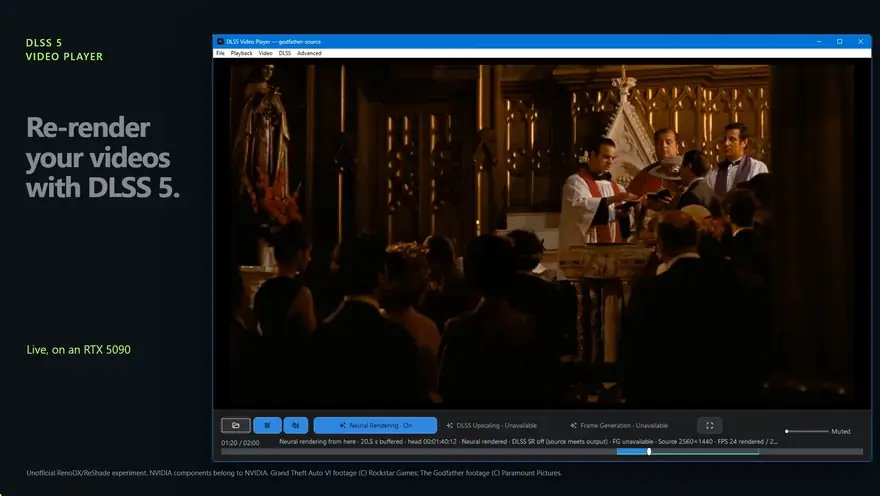
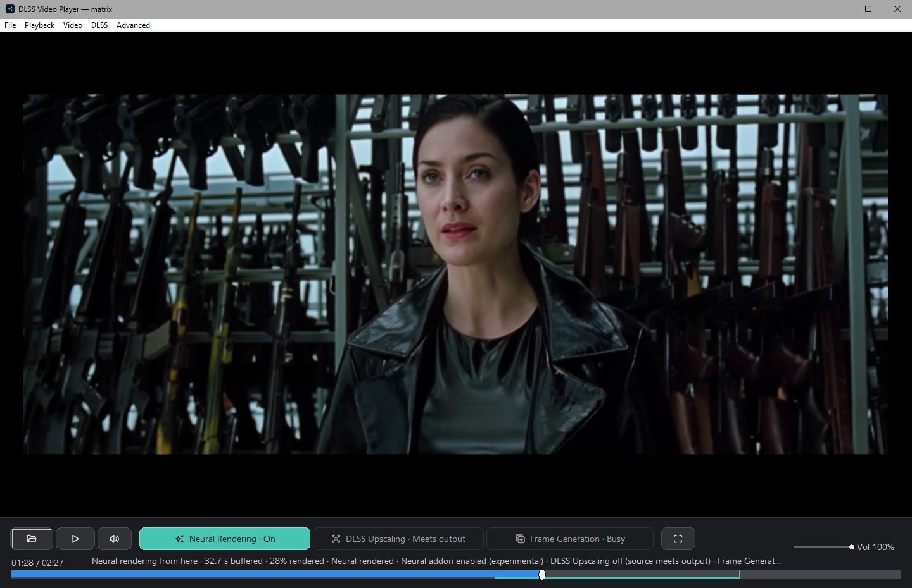
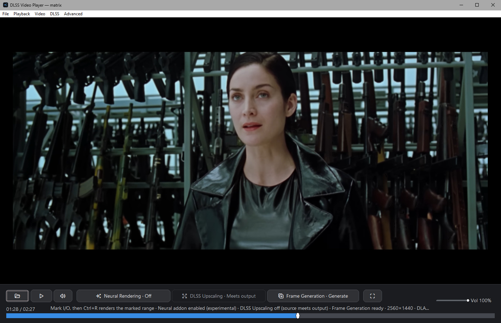
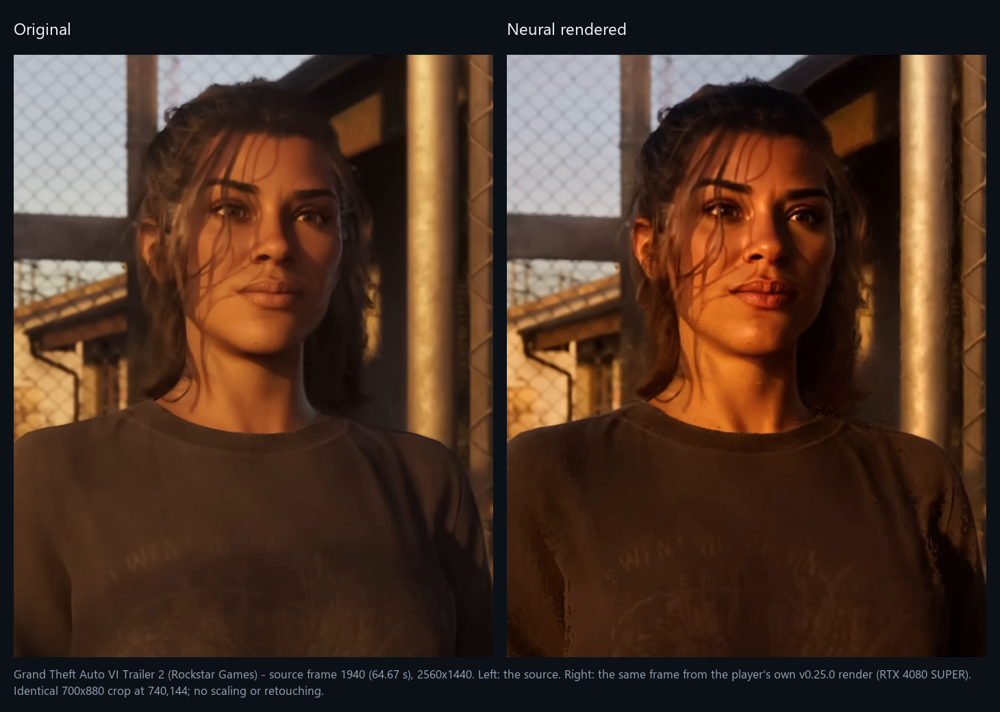
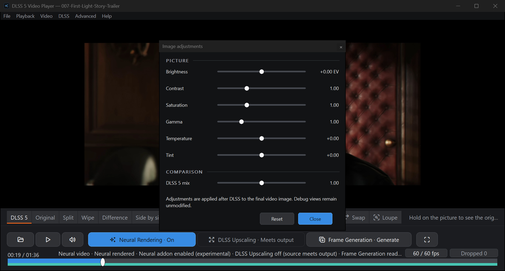

# DLSS 5 Video Player

_Verified against 0.25.0 (1988cac) on 2026-09-22._

Run any video, photo or GIF through NVIDIA's DLSS 5 neural renderer and check
what it did: the original and the render sit on the same frame, one key apart,
while the rest of the video renders behind you. Free and open source, for
Windows with an RTX card.

Other DLSS 5 tools convert files or filter the desktop live. This one renders
the whole video progressively, keeps every frame, and shows the original and
the render on the same frame while it is still rendering.
[How it compares](docs/RELATED_PROJECTS.md).

[Website](https://2600th.github.io/dlss5-video-player/) · [Download](#download) · [First run](#first-run) · [Usage guide](docs/USAGE.md) · [Build it yourself](docs/BUILDING.md) · [Troubleshooting](docs/TROUBLESHOOTING.md)

[](docs/media/neural-comparison-demo.mp4)

**[Watch the full 20-second video](docs/media/neural-comparison-demo.mp4)**
(1080p, no sound). The Matrix and GTA VI Trailer 2: the source on the left, this
player's render of the same frame on the right. Rendered by v0.25.0 on an RTX
4080 SUPER, with Intensity, Local tone and Local structure raised to 2.0 (default
1.0). [How it was made](docs/media/README.md).


> [!IMPORTANT]
> Community project, not an NVIDIA product. The neural runtime is a modified,
> unsigned community build. Checked on an RTX 4080 SUPER (v0.25.0) and an RTX
> 5090 (v0.20.0). Neural rendering needs NVIDIA driver 610.47 or newer.
> Notices: [THIRD_PARTY.md](THIRD_PARTY.md).

## Download

**v0.25.0** (2026-09-22): [release page](https://github.com/2600th/dlss5-video-player/releases/tag/dlss5-video-player-v0.25.0)

| Package | What is in it | Size |
| --- | --- | --- |
| `dlss5-video-player-v0.25.0-win64.zip` | Player plus the pinned neural runtime. This is the one you want. | 312 MB |
| `DLSSVideoPlayer-v0.25.0-core-win64.zip` | Player only, no neural runtime. | 35 MB |

Each zip has a `.sha256` beside it. GitHub's "Source code" zip won't run, since
it has no runtime.

### Check what you downloaded

The checksum proves the file arrived intact; the attestation proves this
repository built it.

```sh
# Intact: the .sha256 sits beside the zip on the release page.
sha256sum -c DLSSVideoPlayer-v0.25.0-core-win64.zip.sha256

# Built here: signed SLSA provenance, verified against this repository.
gh attestation verify DLSSVideoPlayer-v0.25.0-core-win64.zip --repo 2600th/dlss5-video-player
```

After unpacking, and before the first run, `verify_package.ps1` (inside the
zip) checks every file against the allowlist and the hashes in
`PACKAGE_MANIFEST.txt`, and prints each binary's Authenticode state. It detects
core or complete itself. From the unpacked folder:

```powershell
powershell -NoProfile -ExecutionPolicy Bypass -File .\verify_package.ps1
```

> [!NOTE]
> Only the **core** package has a build attestation. CI can't fetch the neural
> runtime, so the full package is assembled on the maintainer's machine and has
> a checksum only. To avoid trusting that step, take the core zip and stage the
> runtime yourself: [docs/BUILDING.md](docs/BUILDING.md).

## First run

1. Unzip into a **new, empty folder**. Keep `neural-runtime/` next to the exe.
2. Run `DLSSVideoPlayer.exe`.
3. Open a file (`Ctrl+O`), paste a public YouTube link (`Ctrl+L`), or pick
   something from **File > Game trailers**.
4. Press `D`. It buffers for a few seconds, then plays the render.
5. **Video > Compare** shows before and after as a split, a wipe or a blend.
6. **DLSS > Convert & export** saves the rendered video to a file.

**File > Recent videos** reopens a video with its render attached, as long as
the render covered the whole video. Press `D` at the start to get one.

## What it does

- **Renders while you watch.** Press `D` and playback moves onto rendered frames
  a few seconds later. The rest of the video fills in behind you, nearest first.
- **Seek anywhere.** Rendered frames play wherever they are on the timeline.
  Elsewhere the original plays at once while the render catches up, and nothing
  already rendered is thrown away.
- **Compares on the same frame.** Switching between original and render never
  moves the playhead. Pause, step frames, or use a split, wipe or blend.
- **Keeps your renders.** A render of the whole video is reused whenever the
  source, runtime and settings still match.
- **Exports.** PNG or JPEG for photos, GIF for animations, MP4 or MKV for video.
  MKV keeps the source audio, subtitles and chapters without re-encoding.
- **Combines the DLSS stages.** **Export with DLSS stages** (`Ctrl+S`) writes one
  file with any mix of Super Resolution, neural rendering and frame generation,
  run in NVIDIA's order.
- **Raises the frame rate.** **DLSS > Generate frames** writes a copy at 2x to 5x
  the original rate, then plays it.
- **Upscales on playback, if you want it.** Optional DLSS Super Resolution to
  1080p, 1440p or 2160p, matched to your monitor by default, with a Temporal or
  Per-frame history. It is off by default. On video it scored below a plain bicubic
  upscale on every clip measured, because it is built for rendered games, not
  decoded footage.
- **Tunes the model.** Neural settings live at `Ctrl+N`. Change one while paused
  and that frame re-renders, so you judge on the picture.
- **Comes with test material.** Six official game trailers under
  **File > Game trailers**, each under three minutes.

## What's new in 0.25.0

- **One export, all three stages.** Tick Super Resolution, neural rendering and
  frame generation in any combination. The dialog shows the size and frame rate
  you will get before it starts, and progress for each pass as it runs.
- **Newer runtime.** RenoDX 6.5.3 and DLSS Super Resolution 310.9.1, plus
  **Neural passes**, which runs the model up to four times per frame.
- **Neural rendering no longer switches itself off.** The startup check misread
  the new runtime and disabled neural rendering for the whole session.
- **Tidier menus and toolbar.** The DLSS menu follows the order the stages run
  in, and each toolbar button has its own icon, a busy state and hover text.

Earlier releases are in [CHANGELOG.md](CHANGELOG.md).

## Controls

| What | Key |
| --- | --- |
| Open a file / a YouTube URL | `Ctrl+O` / `Ctrl+L` |
| Play or pause | `Space` |
| Neural rendering on or off | `D` |
| Compare views | **Video > Compare**; `[` and `]` change the blend, `Z` zooms 2x |
| Seek ten seconds / step one frame | `Left` / `Right`; `.` |
| Mark In / Out; clear; go to time | `I` / `O`; `Shift+I`; `Ctrl+G` |
| Render one frame / four seconds / the marked clip | `F` / `Shift+F` / `Ctrl+R` |
| Generate frames; cancel a conversion | **DLSS > Generate frames**; `Esc` |
| Neural settings | `Ctrl+N` |
| Export with DLSS stages | `Ctrl+S` |
| Image adjustments | `Ctrl+E` |
| Volume, mute | Mouse wheel; `M` |
| Fit or fill; fullscreen | `A`; `F11` |
| Stop | `S` |
| Debug views (final, DLSS input, motion, depth) | `1` `2` `3` `4` |
| Re-hook the runtime | `F6` |

Settings persist between launches. A fresh install starts with neural rendering
on, upscaling off, and upscaling output and YouTube quality on **Auto**. Auto
picks the largest resolution your monitor can show and the best YouTube stream
up to 1440p.

How frame generation chooses a multiplier, how Auto picks an upscaling
resolution, and how the cache works are all in [USAGE.md](docs/USAGE.md). The
trailer list is in [EXAMPLE_VIDEOS.md](docs/EXAMPLE_VIDEOS.md).

## Screenshots

Real captures of the app, all on an RTX 4080 SUPER: the two paused pairs are
v0.25.0, and the menu, DLSS 5 mix and start-screen shots are this branch's UI.
Click any image for full size.


### Same frame, original and neural






Each pair is one paused frame with only the view switched, taken from a live
2560x1440 session with upscaling off. It shows how the toggle works, not a
promise that every source gains detail.



### DLSS 5 mix



`Ctrl+E`, last slider. 0 % is the original, 100 % the model's result, and
200 % pushes the change further. It blends the frame already on screen, so it
never triggers a new render.

### Start screen


[Capture details and footage attribution](docs/screenshots/README.md).

## Limits

- **Speed.** A live session costs about 8.4 ms a frame at 1080p30 and 15.4 ms
  at 1440p30 on an RTX 5090, and 15.3 ms at 1080p30 on an RTX 4080 SUPER. 4K
  depends on the file. After your first session the player knows your GPU and
  warns you before one it expects to fall behind.
- **Driver 610.47 or newer.** Older drivers refuse neural rendering on any card,
  and the player tells you up front. See
  [troubleshooting](docs/TROUBLESHOOTING.md#neural-rendering-is-refused-because-the-driver-is-too-old).
- **RTX 20 and 30 series** lack native FP8 and should be several times slower.
  Nobody has tested one yet.
- **Depth is estimated from the picture**, and so is motion on cards without
  the optical flow engine. Expect some artifacts.
- **Frame generation writes a new file.** It takes time and disk space, and a
  stream has to be copied locally first.
- **Save converted video copies the cached 8-bit render as it is.** It doesn't
  bake in adjustments or upscaling, or restore HDR. Use **Export with DLSS
  stages** to bake in a larger size.
- **DLSS Super Resolution doesn't beat a plain scaler on video.** Measured
  against bicubic on six clips, it scored lower on all of them, with either
  history setting. It is there for its look, not for detail.
- **Not supported:** subtitle display or burn-in, HDR, a render queue, or
  resuming an interrupted render after a restart.
- **YouTube:** public, non-DRM videos only, no login. Age-restricted videos can
  arrive as a 640x360 stream (three of the six bundled trailers do), and the
  status line tells you when that happens. See
  [EXAMPLE_VIDEOS.md](docs/EXAMPLE_VIDEOS.md).
- **Disk space.** The cache keeps renders until the drive falls below 20 GB
  free, then deletes the least recently used first. **Advanced > Clear Neural
  Cache** shows how much it will free before it does.
- **Partial renders aren't joined.** A session started partway into a video
  leaves separate renders of the parts it covered, so reopening that video
  renders it again.
- **Updates.** The menu bar shows `↑ Update <version>` when a new release is
  out. **Advanced > Check for updates** checks now, and `[Updates] Enabled=0` in
  `DLSSVideoPlayer.ini` turns off the daily check.

## Building and contributing

C++20, Win32, Direct3D 12, FFmpeg, NVIDIA NGX. The neural runtime runs in a
separate helper process; playback upscaling runs in the player.

- [Build and test](docs/BUILDING.md)
- [Architecture](docs/ARCHITECTURE.md), [technical overview](TECHNICAL_OVERVIEW.md)
- [Runtime setup](docs/DLSS5_SETUP.md)
- Hardware test records: [index](docs/VERIFICATION-matrix.md), plus dated reports for [2 Sep](docs/VERIFICATION-2026-09-02.md), [9 Sep, 4080 SUPER](docs/VERIFICATION-2026-09-09-RTX4080.md), [9 Sep, 5090](docs/VERIFICATION-2026-09-09-RTX5090.md), [10 Sep](docs/VERIFICATION-2026-09-10-RTX5090.md), [12 Sep](docs/VERIFICATION-2026-09-12-RTX5090.md) and [14 Sep](docs/VERIFICATION-2026-09-14-RTX4080.md)
- [Troubleshooting](docs/TROUBLESHOOTING.md), [issues](https://github.com/2600th/dlss5-video-player/issues)

**Reporting a bug:** include the build or commit, GPU, driver, the source's
size and frame rate, steps to reproduce, and log excerpts. Remove private paths
and signed media URLs from logs first.

**Pull requests:** `ctest -LE gpu` must pass on a clean checkout of `main`.
Renderer changes also need `ctest -L gpu` on an RTX card. Keep the
source-resolution and neural-validation contracts intact.

## Credits and license

Started from [DLSS 5 Video Player by Jessica Natalia Mods](https://gitlab.com/JessicaNataliaMods/dlss-5-video-player/).

Project source is [MIT](LICENSE). Third-party binaries, game footage and
trademarks keep their own terms; see [THIRD_PARTY.md](THIRD_PARTY.md).
