# DLSS 5 Video Player

**Put any video through NVIDIA's DLSS 5 neural renderer, and check every frame
against the original.**

[](docs/media/neural-comparison-demo.mp4)

**[Watch the 25-second video](docs/media/neural-comparison-demo.mp4)** (1080p, no
sound): *007 First Light* and *GTA VI* Trailer 2 rendered at default settings on
an RTX 4080 SUPER, then the Difference, Side by side and loupe views.

A free, open-source player for Windows and RTX cards. Open a video, photo or
GIF and press `D`: within seconds the render plays while the rest of the video
renders behind you, and the original is one key away on the same frame. Other
DLSS 5 tools convert files or filter the desktop live; this one renders the
whole video progressively, keeps every frame, and shows you what the model
changed, and where it didn't help.
[How it compares](docs/RELATED_PROJECTS.md).

[Website](https://2600th.github.io/dlss5-video-player/) · [Download](#download) · [First run](#first-run) · [Usage guide](docs/USAGE.md) · [Troubleshooting](docs/TROUBLESHOOTING.md)

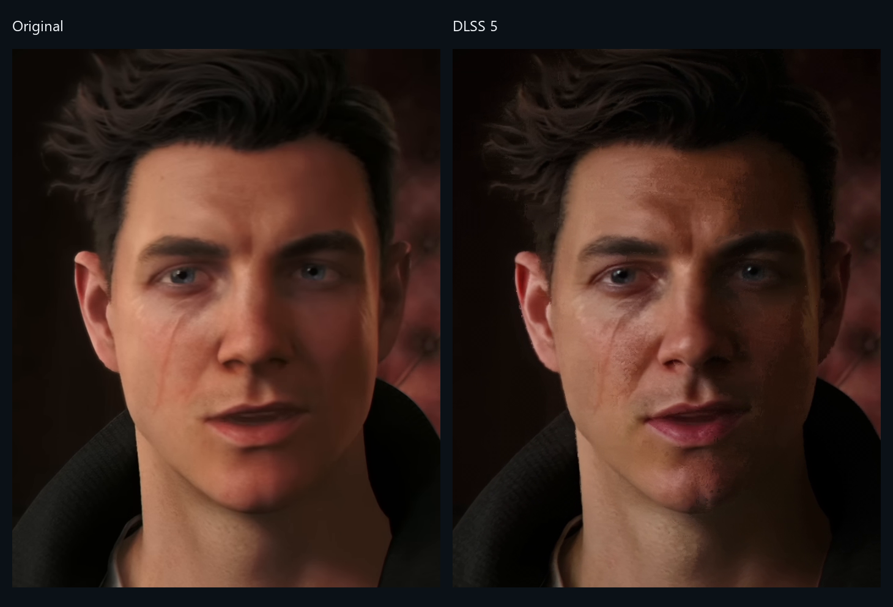

One source frame (left) and the same frame of the player's render (right),
unscaled. [Four more, including one where the model makes the picture worse](docs/media/README.md#comparison-stills).

> [!IMPORTANT]
> Community project, not an NVIDIA product. The neural runtime is a modified,
> unsigned community build. Neural rendering needs an NVIDIA RTX card and driver
> 610.47 or newer. Notices: [THIRD_PARTY.md](THIRD_PARTY.md).

## Download

**v0.27.2** (2026-10-02): [release page](https://github.com/2600th/dlss5-video-player/releases/tag/dlss5-video-player-v0.27.2)

| Package | What is in it | Size |
| --- | --- | --- |
| `dlss5-video-player-v0.27.2-win64.zip` | Player plus the neural runtime and RTX VSR. This is the one you want. | 377 MB |
| `DLSSVideoPlayer-v0.27.2-core-win64.zip` | Player only, no neural runtime or RTX VSR. | 36 MB |

Each zip has a `.sha256` beside it. GitHub's "Source code" zip won't run: it
has no runtime.

### Check what you downloaded

The checksum shows the file arrived intact; the attestation shows this
repository built it.

```sh
sha256sum -c DLSSVideoPlayer-v0.27.2-core-win64.zip.sha256
gh attestation verify DLSSVideoPlayer-v0.27.2-core-win64.zip --repo 2600th/dlss5-video-player
```

Only the core zip has build provenance. CI can't fetch the neural runtime, so
the complete zip is assembled on the maintainer's machine. Once it is uploaded,
the `attest-release-asset` workflow signs its digest, and `gh attestation
verify` on it shows that this repository vouches for those exact bytes, not
that CI built them. Either zip's `PACKAGE_MANIFEST.txt` names the commit it was
built from, and the packager refuses a tree with uncommitted changes or a
release that is not built from its tag. If you would rather not trust the
maintainer's machine, take the core zip and add the runtime yourself:
[docs/BUILDING.md](docs/BUILDING.md).

Before the first run, `verify_package.ps1` (in the zip) checks every unpacked
file against the package manifest and shows which binaries are signed. From the
unpacked folder:

```powershell
powershell -NoProfile -ExecutionPolicy Bypass -File .\verify_package.ps1
```

## First run

1. Unzip into a **new, empty folder**. Keep `neural-runtime/` next to the exe.
2. Run `DLSSVideoPlayer.exe`. The player is not code-signed, so Windows may
   say "Windows protected your PC": choose **More info > Run anyway**, after
   [checking the download](#check-what-you-downloaded) if you want to be sure
   it is this project's.
3. Open a file (`Ctrl+O`), paste a public YouTube link (`Ctrl+L`), or pick
   something from **File > Game trailers**.
4. Press `D`. It buffers for a few seconds, then plays the render.
5. The compare bar under the picture switches between DLSS 5, Original, Split,
   Wipe, Difference, Side by side and 2 × 2.
6. **DLSS > Convert & export** saves the rendered video to a file.

**File > Recent videos** reopens a video with its render, if the render covers
the whole video. Press `D` at the start to get one.

## What it does

- **Renders while you watch.** Playback moves onto rendered frames a few
  seconds after you press `D`, while the rest of the video fills in behind you,
  nearest first.
- **Seeks anywhere.** Rendered frames play wherever they are; elsewhere the
  original plays while the render catches up.
- **Shows you what the model did.** Split, Wipe, **Difference** (the change,
  amplified), **Side by side** and **2 × 2** views, a Mix slider, zoom to 8x, a
  4x **loupe**, a mask that limits DLSS 5 to part of the frame, and
  press-and-hold for the original. Switching views never moves the playhead.
- **Compares against NVIDIA's own upscaler.** `R` shows RTX Video Super
  Resolution of the original as a view of its own and in the 2 × 2; `Shift+R`
  compares the other views against it. In the complete download, or a build
  made with the RTX Video SDK.
- **Saves the evidence.** **File > Save comparison image** writes exactly what
  the picture shows, with a footer recording the video, frame, view, neural
  settings and runtime.
- **Subtitles and HDR.** SRT, ASS, WebVTT, PGS and VobSub are drawn over the
  render, so the model never warps the text. HDR10 and HLG are tone mapped to
  SDR for the model; on an HDR display the original still shows in HDR.
- **Keeps your renders.** A whole-video render is reused while the source,
  runtime and settings still match, at Standard, High (10-bit) or Lossless
  quality. **Advanced > Render report** shows the flicker, grain and colour
  shift a render added.
- **Works on screenshots and GIFs.** A photo renders once and stays on its
  frame; an animated GIF renders frame by frame, keeping its timing. See
  [Screenshots and GIFs too](#screenshots-and-gifs-too).
- **Saves the result as a file.** MP4 or MKV for a video, GIF for an
  animation, PNG or JPEG for a photo, from the player or the command line. See
  [Save the result](#save-the-result).
- **Tunes the model.** Change a neural setting (`Ctrl+N`) while paused and that
  frame re-renders. **DLSS > Processing scale** runs the model at 75% or 50% of
  the source, for speed. Where the window shows a video larger than it is,
  NVIDIA's RTX Video Super Resolution upscales it, on by default: it measured
  well above a plain scaler and DLSS Super Resolution on video
  ([measurement](docs/measurements/vsr-quality-20261002/REPORT.md)). DLSS Super
  Resolution can still upscale playback to 1080p, 1440p or 2160p; it is off by
  default (see [Limits](#limits)).
- **Plays like a player.** AC-3, E-AC-3 and DTS passthrough to a receiver, and
  Windows media controls with taskbar thumbnail buttons.
- **Comes with test material.** Seven official game trailers, chosen for faces,
  skin and light, under **File > Game trailers** and on the start screen.

## Screenshots and GIFs too

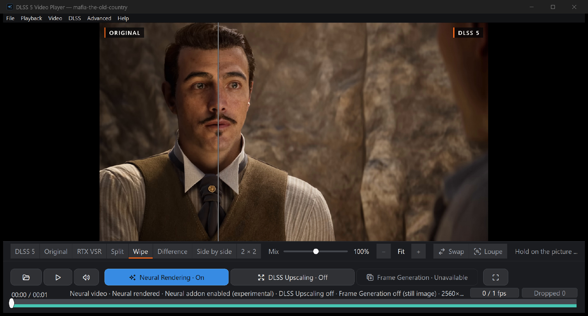

Open a PNG, JPEG, BMP, TIFF or static WebP and press `D`. It renders once, the
compare views work as they do on a video, and it saves back as a PNG or JPEG
at full size. Above, a *Mafia: The Old Country* trailer frame saved as a
2560x1440 PNG, at default settings: the game's smooth orange skin comes back
with texture, a truer tone and light that falls across the face. From the
command line it took 8 seconds on an RTX 4080 SUPER. Animated GIFs render
frame by frame and keep their timing.

## Save the result

Everything you can watch rendered, you can keep as a file.

| Source | Saved as |
| --- | --- |
| Video, local or YouTube | MKV (default) or MP4. MKV keeps the source audio, subtitles and chapters without re-encoding them. |
| Animated GIF | GIF (default), MP4 or MKV |
| Photo: PNG, JPEG, BMP, TIFF or static WebP | PNG (default) or JPEG, at the source size |

Two ways under **DLSS > Convert & export**, and one from the command line:

- **Save converted video** writes the render you already have, without
  rendering again. It needs a render of the whole video, or of the clip you
  marked and converted with `Ctrl+R`.
- **Export with DLSS stages** (`Ctrl+S`) renders a new file with any of Super
  Resolution, neural rendering and frame generation (2x to 5x the frame rate),
  in NVIDIA's order. Super Resolution on its own runs on RTX VSR by default -
  the upscaler that measured best - or on DLSS Super Resolution if you choose
  it under **Upscaler**.
- **From the command line**, `dlss5-convert` runs the same export without
  opening the player, waits for it and shows its progress. Give it files,
  folders or wildcards; this writes `clip-dlss.mkv` beside the input:

  ```bat
  dlss5-convert clip.mp4
  ```

  Every stage and Neural setting is an option. Three stacked neural passes of
  the strong look, frame generation at 3x, a folder upscaled to 4K with RTX VSR
  (the default upscaler; `--sr-engine dlss` picks DLSS), and a folder rendered
  and upscaled together:

  ```bat
  dlss5-convert clip.mp4 --preset strong --passes 3
  dlss5-convert clip.mp4 --stages fg --multiplier 3
  dlss5-convert clips -r --stages sr --height 2160 --out-dir clips-4k
  dlss5-convert clips -r --stages sr,nr --height 2160 --out-dir clips-nr-4k
  ```

  `dlss5-convert probe clip.mp4` says what a file is and which stages this
  machine can run on it. `--range`, `--encode`, `--report` and the rest are in
  the [usage guide](docs/USAGE.md#from-the-command-line).

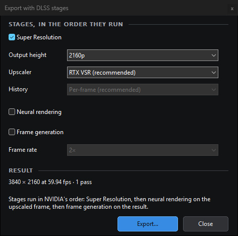

## How it compares

Several open-source projects put DLSS 5's neural pass on video. They do
different jobs, so the right one depends on what you want to do. As of
2026-10-02, from each project's README, releases and issues (details and more
projects in [RELATED_PROJECTS.md](docs/RELATED_PROJECTS.md); corrections
welcome):

| | **DLSS 5 Video Player** (this) | [Visual Enhancer](https://github.com/Merserk/dlss5-visual-enhancer) v14.0 | [NeuralScreen](https://github.com/perseval-BLR/NeuralScreen) v2.1.9 | [Veyra](https://github.com/Likely7/Veyra-NRVideo) 2.0.0 | [DLSS5Tool](https://github.com/banbanzhige/DLSS5Tool) v2.3.3 |
| --- | --- | --- | --- | --- | --- |
| What it is | A player that renders the whole video in the background, plus export | A converter with a stage pipeline, plus a Live mode | An overlay on the whole desktop, plus file conversion | A real-time player for files, capture cards and game streams | A converter with a preview |
| Neural render you can keep, seek and re-watch | Yes: rendered frames are cached and reused | No: Live keeps a 2–30 s buffer | No: real time | No: real time | Export only |
| Compare tools | Split, Wipe, Difference, Side by side, 2×2, loupe, hold for original, against RTX VSR | Split, 2-Up | Before/after wipe | Original/enhanced toggle | Wipe, side by side |
| Upscaling | RTX VSR by default in playback and export, DLSS SR on request; [measured](docs/measurements/vsr-quality-20261002/REPORT.md) | RTX VSR and DLSS SR stages, off by default | None (by design) | DLSS SR, RTX VSR or FSR | RTX VSR 2× or 4× |
| Frame generation | DLSS-G 2–5× as a conversion; RTX 20/30 through an offered, hash-checked add-on | DLSS-G as a conversion | DLSS-G 2–4×, live | DLSS-G, XeSS or FSR up to 6×, live | DLSS-G 2×, export |
| Inputs | Local video, public YouTube, photos, GIFs | Images, video, URLs, YouTube, Twitch | Anything on screen, files | Files, images, capture cards, PS5, PC and Xbox streams | Images, video, image sequences |
| Keeps audio / subtitles / chapters on export | Yes / yes / yes | Yes / no / yes | Audio yes | Audio and subtitles yes | Audio yes |
| HDR | HDR shown on HDR displays; exports are SDR | 10-bit HDR export, SDR→HDR | HDR10 recording (experimental capture) | HDR kept, HEVC Main10 export | HDR10/HLG export |
| Command line | `dlss5-convert`: files, folders, JSON report | `VE_CLI.exe` | No; a GUI queue | Not documented | Not documented |
| Download | 377 MB (36 MB without the neural runtime) | 726 MB | 230 MB | 409 MB | 580 MB lite |
| Verifying the download | SHA-256, GitHub attestations, a file manifest and a verifier script | GitHub's per-file digest | SHA256SUMS and a runtime manifest | SHA-256 files | Runtime hashes |
| Licence | MIT | Source-available, its own terms | PolyForm Strict (non-commercial) | GPL-3.0 (AGPL for its streaming part) | MIT |

Pick this player to watch a video rendered, check exactly what the model
changed against the original, and keep the render. Pick Visual Enhancer for the
widest conversion pipeline (ProRes, AV1, HDR export, grading), NeuralScreen for
games or anything else on screen in real time, Veyra for capture cards,
console streams or live frame generation, and DLSS5Tool for HDR or
image-sequence conversion.

None of these is an NVIDIA product. On most GPUs each runs the neural pass on a
runtime build NVIDIA has not published for this use - community-modified,
leaked or architecture-spoofed - so read what each one ships. Download any of
them from its original repository: re-uploads under other accounts have been
reported carrying malware.

## What's new in 0.27.2

**0.27.2** (2026-10-02). A hotfix for Frame Generation on RTX 20 and 30
cards. The render cache is keyed by the player version, so a video rendered
with 0.27.0 renders again the first time.

- **Frame Generation on RTX 20 and 30, in one click.** When it is refused on
  one of these cards, the player now offers to download the community
  dlssg_sm86 add-on from its author, checks every file before installing it,
  and restarts with it loaded; the start screen says so. The add-on is
  unofficial and not bundled. See
  [troubleshooting](https://github.com/2600th/dlss5-video-player/blob/main/docs/TROUBLESHOOTING.md#rtx-20-and-30-the-dlssg_sm86-add-on).
- **The add-on loads again when you add it yourself.** 0.27.0 kept a
  `version.dll` beside the player from loading at all.
- **A clearer refusal on RTX 20 and 30.** Frame Generation now says it needs
  an RTX 40 or 50 card instead of asking for a driver update that would not
  help.

Earlier releases are in [CHANGELOG.md](CHANGELOG.md); 0.27.0 added
`dlss5-convert`, the command-line converter, 0.26.2 fixed GPU decoding of
untagged HD video, and 0.26.0 added the compare views, RTX VSR beside DLSS 5,
subtitles, HDR, the render quality ladder and `--render`.

## Controls

| What | Key |
| --- | --- |
| Open a file / a YouTube URL | `Ctrl+O` / `Ctrl+L` |
| Play or pause | `Space` |
| Neural rendering on or off | `D` |
| Compare views | `C` / `Shift+C` step the mode; `X` swaps sides; `[` and `]` change the Mix |
| RTX VSR view; compare against it | `R`; `Shift+R` |
| Zoom, loupe | `Z` / `Shift+Z` zoom in and out at the pointer; `L` loupe |
| Save the view as a PNG | `Ctrl+Shift+S` |
| Subtitles; earlier, later | `V`; `H`, `J` |
| Every shortcut | `?` or `F1` |
| Seek ten seconds / step one frame | `Left` / `Right`; `.` |
| Mark In / Out; clear; go to time | `I` / `O`; `Shift+I`; `Ctrl+G` |
| Render one frame / four seconds / the marked clip | `F` / `Shift+F` / `Ctrl+R` |
| Generate frames; cancel a conversion | **DLSS > Generate frames**; `Esc` |
| Neural settings | `Ctrl+N` |
| Export with DLSS stages | `Ctrl+S` |
| Image adjustments | `Ctrl+E` |
| Volume, mute | Mouse wheel; `M` |
| Fit or fill; fullscreen | `A`; `F11` |
| Stop | `S` |

Settings persist between launches. A fresh install starts with neural rendering
on, RTX VSR Upscaling on, DLSS Upscaling off, and DLSS's output and YouTube
quality on **Auto**: the
largest resolution your monitor can show, and the best YouTube stream up to
1440p.

The [usage guide](docs/USAGE.md) covers the rest, including frame generation
and the cache. The trailer list is in [EXAMPLE_VIDEOS.md](docs/EXAMPLE_VIDEOS.md).

## Screenshots

The player paused on one frame of *007 First Light* rendered at default
settings: the first four on an RTX 5090 at 100% display scaling, the next three
on an RTX 4080 SUPER at 150%. Click any image for full size.

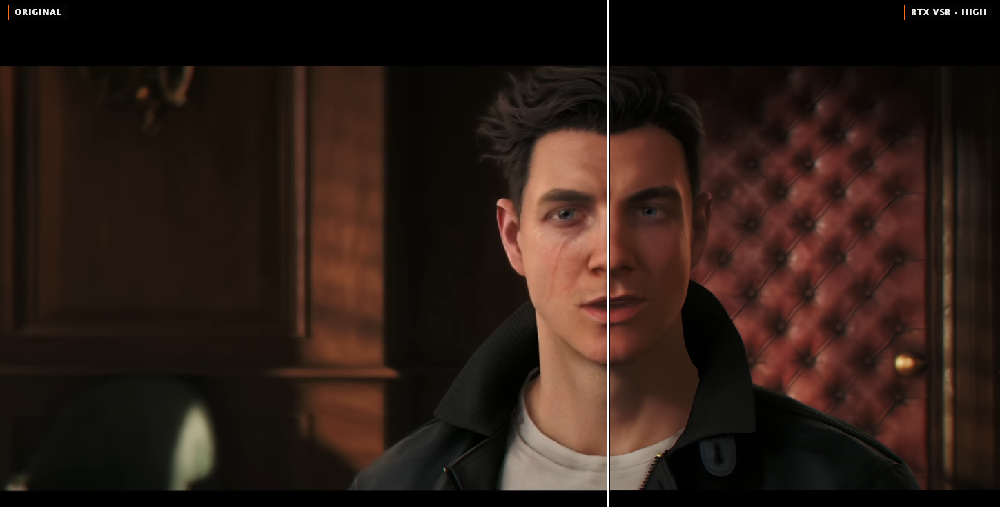

One 720p frame shown at 1.13x: the player's plain scaling left of the divider,
RTX VSR right, unscaled crop ([whole window](docs/screenshots/current/vsr-wipe.jpg)).
The measured comparison is the
[RTX VSR quality report](docs/measurements/vsr-quality-20261002/REPORT.md), not
this frame.

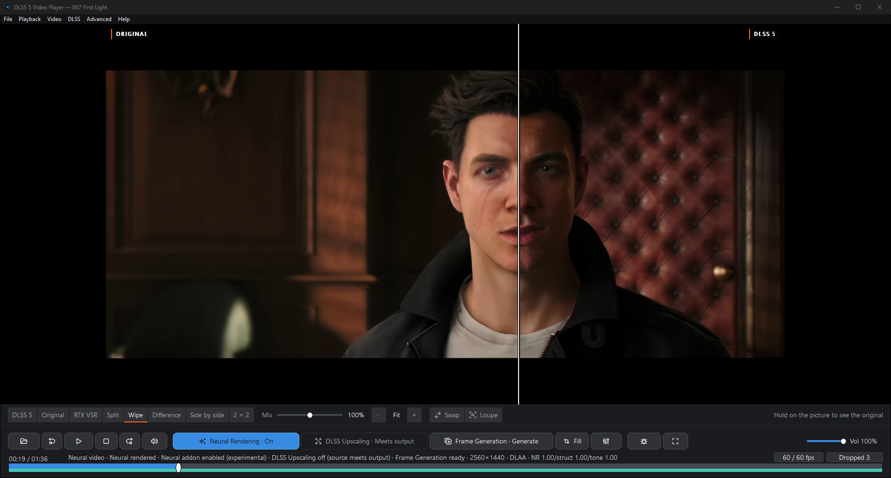

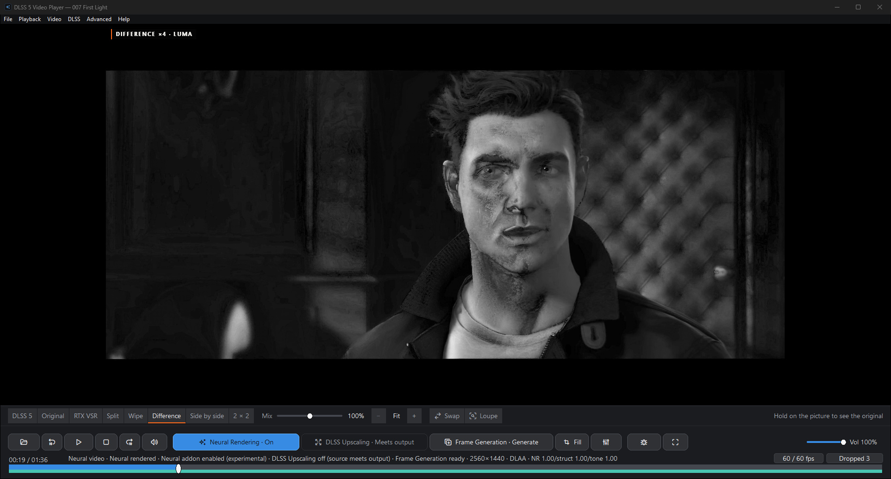

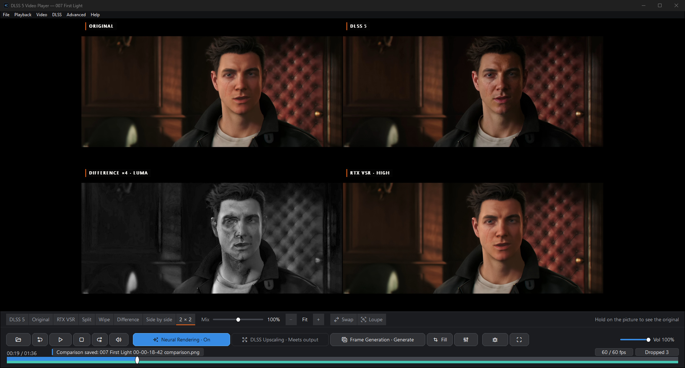

The file that save wrote, footer and all:
[`saved-comparison-2x2.png`](docs/screenshots/current/saved-comparison-2x2.png).

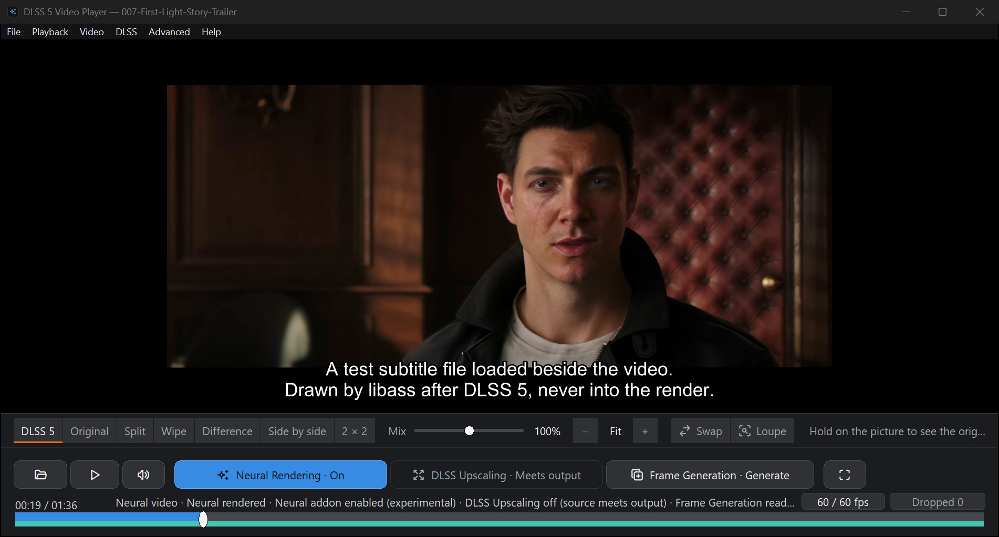

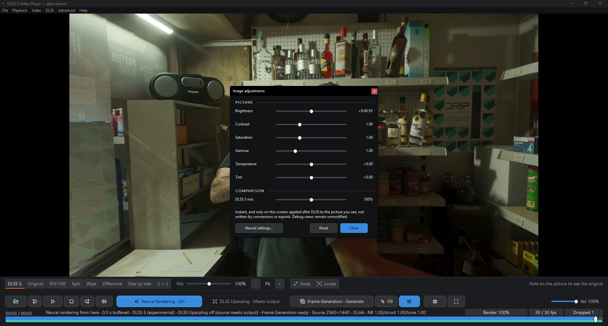

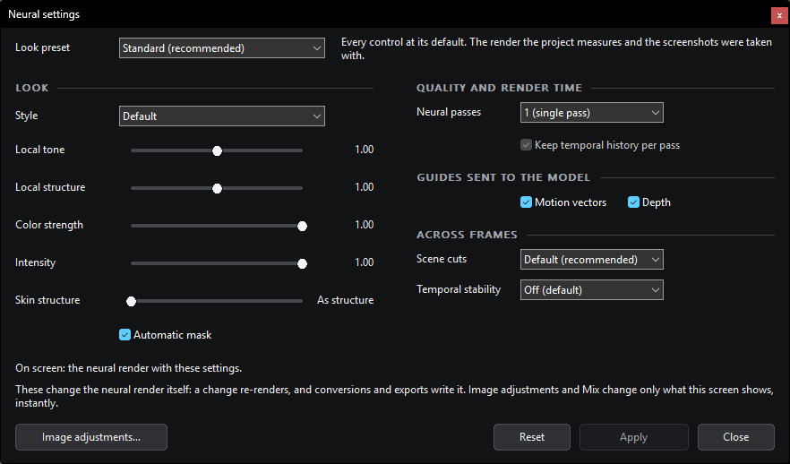

### Start screen

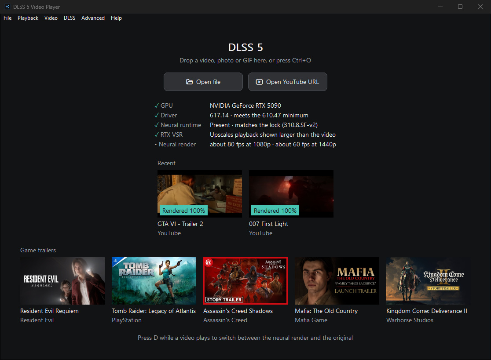

### Neural view on and off

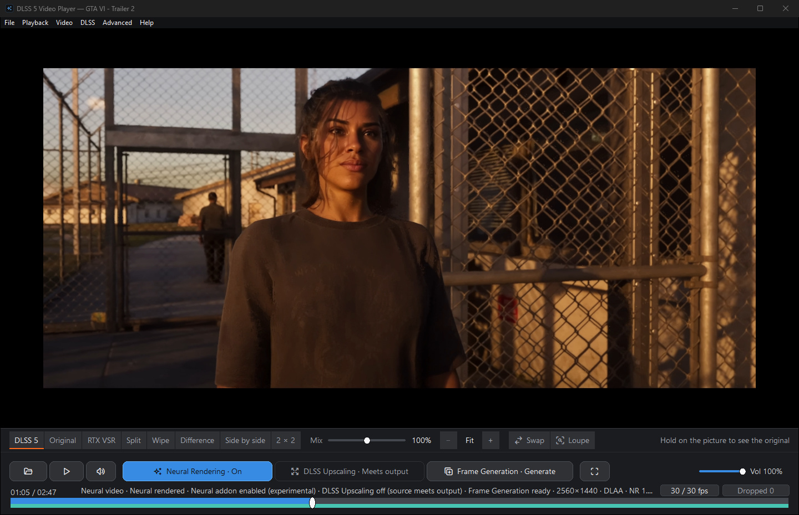

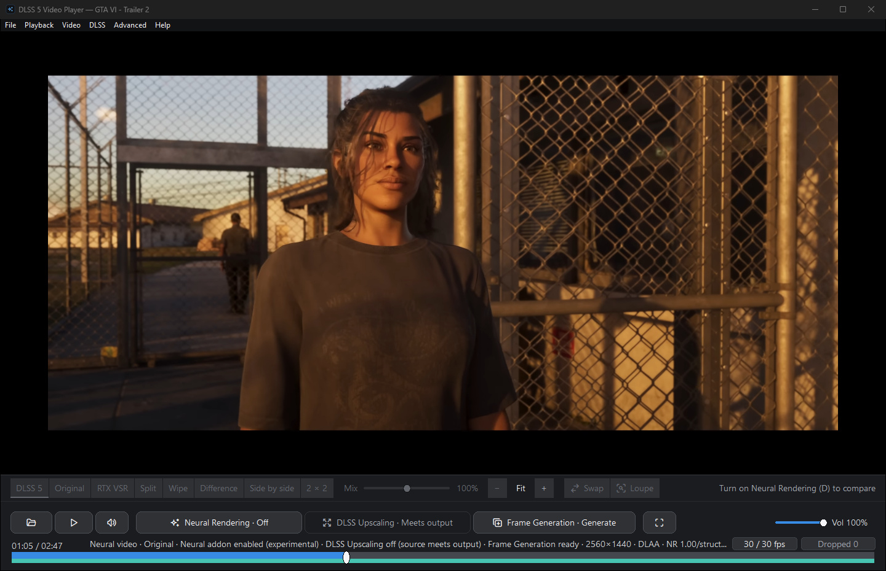

One paused frame with only the view switched, at default settings. It shows
how the toggle works, not what every source will gain.

[Capture details and footage attribution](docs/screenshots/README.md).

## Limits

- **Speed.** On an RTX 5090 a live session costs about 6.8 ms a frame at
  1080p30, 9.9 ms at 1440p30 and 23 ms at 4K30, all faster than the video
  plays. An RTX 4080 SUPER measured 15.3 ms at 1080p30 on 0.16.0 and has not
  been re-measured since. 4K depends on the file. After your first session the
  player knows your GPU and warns you before a video it expects to fall behind
  on.
- **Driver 610.47 or newer.** Older drivers refuse neural rendering on any card,
  and the player tells you up front. See
  [troubleshooting](docs/TROUBLESHOOTING.md#neural-rendering-is-refused-because-the-driver-is-too-old).
- **Which GPU does what:**

  | GPU | Neural rendering | RTX VSR upscaling | DLSS Super Resolution | Frame generation |
  | --- | --- | --- | --- | --- |
  | RTX 50 | Yes; tested on an RTX 5090 | Yes; measured on an RTX 5090 | Yes | Yes, up to 5x here |
  | RTX 40 | Yes; tested on an RTX 4080 SUPER | Yes | Yes | Yes, 2x |
  | RTX 30 | Untested, and expected several times slower without native FP8 | Yes | Yes | Only with the community [dlssg_sm86 add-on](docs/TROUBLESHOOTING.md#rtx-20-and-30-the-dlssg_sm86-add-on); a user ran 4x on an RTX 3060 ([#14](https://github.com/2600th/dlss5-video-player/issues/14)) |
  | RTX 20 | As RTX 30, untested | Yes | Yes | Only with the add-on; untested |

  NVIDIA's own DLSS 5 support is RTX 50 only, and this player runs neural
  rendering on a modified community runtime on every generation, RTX 50
  included. RTX VSR costs about 1.5 ms for a 1080p frame
  and 2.7 ms for a 1440p one at High on an RTX 5090; slower cards pay more, and
  the player lowers its quality for a video it cannot keep up with.
- **Depth is estimated from the picture**, and so is motion on cards without
  the optical flow engine. Expect some artifacts.
- **DLSS Super Resolution doesn't beat a plain scaler on video.** Against
  bicubic on six clips, it scored lower on all of them. It is built for games;
  use it for its look, not for detail. RTX VSR, the default upscaler, is the
  one that adds detail: 87.5 VMAF against bicubic's 80.5 and DLSS's 74.9 over
  the same kind of test.
- **Frame generation writes a new file.** It takes time and disk space, and a
  stream has to be copied locally first. NVIDIA supports it on RTX 40 and 50
  cards; on RTX 20 and 30 the player offers to download the community
  [dlssg_sm86 add-on](docs/TROUBLESHOOTING.md#rtx-20-and-30-the-dlssg_sm86-add-on),
  which is unofficial and not bundled.
- **Save converted video copies the cached render as it is**: 8-bit at the
  default Standard quality, 10-bit at High or Lossless, without adjustments,
  upscaling or HDR. Use **Export with DLSS stages** to bake in a larger size.
- **Not supported:** burning subtitles into an export, a render queue in the
  player (`dlss5-convert` converts a list or a folder in turn), or resuming an
  interrupted render after a restart.
- **YouTube:** public, non-DRM videos only, no login. Age-restricted videos can
  arrive as a 640x360 stream, and the status line tells you when that happens.
- **Disk space.** The cache keeps renders until the drive falls below 20 GB
  free, then deletes the least recently used first. **Advanced > Clear Neural
  Cache** shows how much it will free before it does.
- **Partial renders aren't joined.** A session started partway into a video
  leaves separate renders of the parts it covered, so reopening that video
  renders it again.
- **Network use.** Besides YouTube links, the player checks GitHub once a day
  for a new release (the menu bar then shows `↑ Update <version>`), and the
  start screen fetches the trailers' thumbnails from `i.ytimg.com`, again only
  when a cached one is a month old. `[Updates] Enabled=0` and
  `[Start] ThumbnailFetch=0` in `DLSSVideoPlayer.ini` turn these off. On an
  RTX 20 or 30 card, the dlssg_sm86 add-on is downloaded only if you accept the
  offer.

## Building and contributing

C++20, Win32, Direct3D 12, FFmpeg and NVIDIA NGX.

- [Build and test](docs/BUILDING.md), [runtime setup](docs/DLSS5_SETUP.md)
- [Architecture](docs/ARCHITECTURE.md), [technical overview](TECHNICAL_OVERVIEW.md)
- Hardware test records: the `VERIFICATION-*.md` files in [docs](docs/)
- [Contributing](CONTRIBUTING.md): the checks a pull request must pass

**Reporting a bug:** open an [issue](https://github.com/2600th/dlss5-video-player/issues)
with the version, GPU, driver, the video's size and frame rate, steps to
reproduce, and log excerpts. Remove private paths and signed media URLs from
logs first.

## Credits and license

Started from [DLSS 5 Video Player by Jessica Natalia Mods](https://gitlab.com/JessicaNataliaMods/dlss-5-video-player/).

Project source is [MIT](LICENSE). Third-party binaries, game footage and
trademarks keep their own terms; see [THIRD_PARTY.md](THIRD_PARTY.md).
