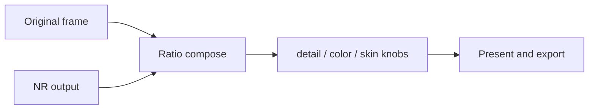

# Ecosystem review — what to take from the other DLSS 5 projects

_Reviewed September 10, 2026, against this tree at v0.17.1. Star counts and
licences were read from the GitHub API the same day. Every `file:line` here was
re-checked against this tree on that date; they drift with the next edit._

A comparison of this player against the community DLSS 5 Neural Rendering
projects, and the resulting prioritized list of what to build, what to fix, and
what to refuse. Every claim carries its source. Measurements from this
repository cite [BENCHMARK.md](BENCHMARK.md), [README.md](../README.md),
[ARCHITECTURE.md](ARCHITECTURE.md) or the file they were read from; claims about
other projects cite that project's own documentation or source. Where a number
below is this project's own measurement it says so, and where it is another
project's claim it is marked as theirs, not reproduced here.

The narrower "what we already adapted" note is
[RELATED_PROJECTS.md](RELATED_PROJECTS.md). This page is the full comparison.

## Summary

1. **Measurement is this project's strongest asset.** The harness under
   `tools/benchmark/` carries PSNR/SSIM, CIE76 ΔE, a rapidocr character ratio, a
   resnet18 face cosine, a temporal-flicker metric and a sealed blind A/B mode
   (`tools/benchmark/analyze.py`, `tools/benchmark/blind.py`). No project
   surveyed here ships reference-based metrics at all. Nothing to import; only
   to publish.
2. **One architectural choice costs the most.** Every capable project composes
   the neural answer against the original itself. This player hands that to
   RenoDX and only ever sees finished pixels. That single gap costs the instant
   strength dial, brightness-flicker control, the working-scale performance knob
   and skin protection.
3. **Biggest single reusable asset** is `video2dlssnr/src/optflow_nvof.cpp` — an
   MIT, D3D12-native NVOFA optical-flow implementation that runs on the
   dedicated OFA engine.

## The repos

Stars as of September 10, 2026.

| Repo | Stars | What it is | Beats us at |
| --- | ---: | --- | --- |
| [jlrouzies-fr/DLSS5-Feeder](https://github.com/jlrouzies-fr/DLSS5-Feeder) | 876 | RenoDX feeder (licence "Other") | HDR PQ↔linear bridge, `work_resolution`, `--test` matrix |
| [Merserk/dlss5-visual-enhancer](https://github.com/Merserk/dlss5-visual-enhancer) | 697 | Gradio UI over an out-of-process NGX worker (MIT) | HDR/10-bit, arbitrary-FPS frame generation, batch queue, GPU picker, settings presets |
| [Kizzuwatnaa/DLSS5-Autopilot](https://github.com/Kizzuwatnaa/DLSS5-Autopilot) | 510 | Route selector (licence "Other") | Fatbin architecture check, `gh attestation verify`, self-update |
| [NIGos/dlss5-bridge](https://github.com/NIGos/dlss5-bridge) | 262 | Private-D3D12 NR bridge (MIT) | `hash_out` output verification, DRED, timing lines |
| [wilsjo2/OptiScaler-DLSSNR-PreSR-Multipass](https://github.com/wilsjo2/OptiScaler-DLSSNR-PreSR-Multipass) | 254 | Game injector fork (GPLv3) | Composition math, multipass, skin filter, exposure anchoring |
| [DaniilSokolyuk/video2dlssnr](https://github.com/DaniilSokolyuk/video2dlssnr) | 138 | C++/D3D12 CLI + ComfyUI (MIT) | NVOFA flow, host-side detail/color composite, 10-bit encode |
| [matiasLombo/neural-upstream](https://github.com/matiasLombo/neural-upstream) | 87 | Pre-SR NR (MIT) | Motion-reprojected residual for skipped frames |
| [DrC0ns0le/RTXVideoProcessor](https://github.com/DrC0ns0le/RTXVideoProcessor) | 31 | RTX Video SDK processor (no licence file) | Only project driving RTX Video Artifact Reduction |
| [HECer/ComfyUI-DLSS5](https://github.com/HECer/ComfyUI-DLSS5) | 21 | ComfyUI nodes (GPLv3) | Only working DLSS-G-for-video; learned depth |
| [Saganaki22/obs-dlss5-nr](https://github.com/Saganaki22/obs-dlss5-nr) | 11 | OBS filter (GPLv2) | Throttle/smooth/reset-history UX |
| [HECer/DLSSG-Stream-Worker](https://github.com/HECer/DLSSG-Stream-Worker) | 1 | DLSS-G worker (MIT) | 2×/3×/4× export interpolation |
| [edgarbatjr/…-THERMOTRON-multipass](https://github.com/edgarbatjr/OptiScaler_DLSSNR-THERMOTRON-multipass) | 0 | 1–4 pass OptiScaler fork (GPLv3) | Fitted multipass cost model; inert-parameter proofs |

## Where this player already leads

- **Quality harness.** All six metrics above are implemented and a sealed blind
  A/B ships with them. No surveyed project has a reference-based metric.
  THERMOTRON documents its own per-block luma-stdev detail metric failing
  ("noise, ringing and enlarged synthetic detail all raise that number the same
  way real texture does").
- **Evidence chain.** Schema-4 manifest, feature-18 receipts, embedded runtime
  hash lock. Merserk log-scrapes runtime banner strings instead.
- **Cache identity and atomic promotion.** Settings digest, YouTube `itag`
  identity, quarantine of invalid metadata.
- **Behind-live playback.** Segment index plus keep-up forecasting from measured
  per-GPU per-geometry pace. No other project forecasts.
- **Confidence-gated flow.** The reverse check and confidence-weighted vector
  median cut false motion from 60.8 % of cells on `cuts-motion` to 3.7 %
  (BENCHMARK.md:109-111).

## Tier 1 — build these

### 1. Own the composition

**Problem.** RenoDX composes the neural answer inside the add-on; we only ever
see finished pixels.

**Consequence.** Changing intensity costs a full cold re-render. The measured
cost is a median of **10.6 s** for a cold single-frame preview, over 16 of them
(BENCHMARK.md:184-185) — a clip is that per distinct settings combination, not
once.

**Fix.** Compose in our own shader. The presentation path already binds the
original beside the neural frame: a source-size BGRA8 reference texture
(`src/D3D12Renderer.cpp:355-357`) bound in the present path
(`src/D3D12Renderer.cpp:614-623`).

Composition rules worth reimplementing (OptiScaler concept level — see
[licensing](#licensing)):

- Compose as a **luminance ratio**, never an additive delta. Additive
  composition "discards the model's behaviour in highlights and makes every
  arrangement look alike".
- **Two-sided guard**: `guard = max(MaxRatio, 1)` (default 2.0),
  `bounded = clamp(ratio, 1/guard, guard)`. The lower bound was added after a
  measured 57 % red collapse in dark scenes.
- **Ratio floor** of `1/512` added to numerator and denominator, so near-black
  pixels cannot produce unbounded ratios (the documented shadow-boiling fix).
- Apply **one scalar from luminance to the whole RGB triple**. Per-channel
  bounding rotates hue.
- Strength above 1 is `pow(lumaRatio, 1 + (strength - 1))`, not an extrapolated
  lerp, so the guard still binds it.
- Peak-channel hue preservation in the encode: `if (peak > 1) display /= peak`.
  A luminance-only knee lets saturated blue clip per channel and rotates hue.

**Wins.** Instant strength dial with no re-render, dark-scene flicker control,
and strength changes that no longer invalidate the cache.

**Honest cost.** The cached export stream-copies on its MKV branch
(`src/MediaPipeline.cpp:554`), so baking composition into that path costs a
re-encode; the MP4 branch already re-encodes
(`src/MediaPipeline.cpp:556-559`). Make it an explicit export choice.

### 2. NVOFA motion vectors

MIT, D3D12-native, directly adaptable to `src/TemporalGuides.cpp`:
`video2dlssnr/src/optflow_nvof.cpp`.

- `nvofapi64.dll` → `NvOFAPICreateInstanceD3D12` → `nvCreateOpticalFlowD3D12`;
  query `NV_OF_CAPS_SUPPORTED_OUTPUT_GRID_SIZES` and pick the **finest** grid
  (lisitskyaa hardcodes 2×2, dlss5-bridge defaults `ofa_grid=2`).
- `R16G16_SINT` output plus an `R8_UINT` **cost** surface; gate with
  `w = saturate((costHi - cost) / (costHi - costLo))` and zero low-confidence
  vectors. Their README credits this gate with removing flicker.
- Registered with explicit input/output fence points — the OFA engine runs
  asynchronously and joins the app queue through two `ID3D12Fence` objects.
- Encoding contract (lisitskyaa `docs/ARCHITECTURE.md`):
  `pixel = (fx, fy) / 32` (S10.5), `MV_uv = pixel / (width, height)`,
  `DLSSNR.MVecScale = (width, height)`, and **no sign flip** when NVOFA is
  called with `input = current, reference = previous`.
- Frame 0 needs `Reset = 1` **and an explicit zero MV texture**, not a null
  binding.
- Estimate flow from **raw decoded frames, never from NR output**, or
  synthesized detail biases the next estimate.

**Why it matters.** OFA is a dedicated engine, so it overlaps the neural pass
instead of competing with it. Our own guide generation is **3.1 ms** per 1080p
frame, down from 6.4 (BENCHMARK.md:122).

Load `nvofapi64.dll` dynamically from the driver install. Never bundle it.

### 3. Reduced-resolution NR with a matched residual

The documented pain: a 6.3 Mbit/s 4K30 re-encode costs **42 ms per frame, 0.78×
real time, and drops nearly every present** (README.md:193-195; ARCHITECTURE.md
corroborates the ratio and the clip at :243, :256-257 without restating the
42 ms).

Neural cost is area, so this is the only real performance dial. Run the carrier
at 50–75 % and compose the residual onto the pristine native frame.

- Use an **exact-area box downsample**. Bilinear minification aliases and makes
  the model's answer change with sub-pixel motion; on video that reads as
  shimmer.
- **Matched residual**: rebuild the frame's own proxy at full resolution (the
  encode is a pure function) and carry up only `model - proxy`. Skipping this
  makes downsample blur read as highlight headroom, and the error scales with
  how small the working resolution is.
- Text, subtitles and UI stay native-sharp — the core NeuralScreen trick.
- Smaller cache entries as a side effect.

Caveats: THERMOTRON reports shimmer below roughly 80 % **on jittered content**
(video has no jitter, so measure it), and their numbers put above 100 % strictly
worse — 200 % costing 4.3× for a 22 % return.

### 4. HDR10 PQ ↔ linear FP16 bridge

Today the pipeline is 8-bit end to end: decode `-pix_fmt bgra`
(`src/VideoDecoder.cpp:579`), capture into a BGRA8 target
(`src/D3D12Renderer.cpp:321-322`, PSO at `:244-246`), carrier `yuv420p`
(`src/MediaPipeline.cpp:515-522`; odd dimensions take the libx264 path and
encode `yuv444p`), swapchain `R8G8B8A8_UNORM` (`src/D3D12Renderer.cpp:140`). An
HDR source is fed to the model as nonsense and its grade is discarded.

Feeder's `hdr_bridge` is a documented algorithm, implementable from spec:

- Decode PQ BT.2020 to **linear light in FP16** on the way in; re-encode PQ on
  the way out.
- `hdr_paper_white = 203` nits (BT.2408) maps to linear 1.0; highlights run
  above, and a 10 000-nit pixel arrives at roughly 49.0.
- Engage only when the colour space is **reported** by the stream, never guessed
  from the pixel format.
- The NGX `IsHDR` create flag alone is not enough; the consumer may ignore it on
  a 10-bit back buffer.

Merserk's export matrix transfers verbatim (`src/core/ffmpeg/codecs.py`):
H.265/AV1/ProRes only, **H.264 is never HDR**, `yuv420p10le` for CPU and
`p010le` for NVENC, and libx265 needs
`-x265-params colorprim=…:transfer=…:colormatrix=…:range=limited` because the
generic flags break VUI.

### 5. Close our own evidence hole

The roadmap already records it
([DLSS5_VIDEO_ROADMAP.md](DLSS5_VIDEO_ROADMAP.md):34-37, P0 item 1): a worker
that stopped presenting after a feature recreate reported
`frames=900/900 verified=900` for output that was **DLAA only** — 0.46 ms neural
GPU time against 5.7 ms, and 34.6 dB from the source instead of 31.7.

Two cheap additions close it:

- `dlss5-bridge`'s `hash_out`: once per feature build, read input and output back
  and log the output hash, per-channel means and the **out/in brightness ratio**.
- A per-geometry **neural GPU-time floor** in the receipt that refuses a run
  whose median falls below it.

DLSS5-NeuralScreen's own strongest check is the same shape and does not depend
on any third party: a pixel comparison asserting `mean |out - input|` clears a
floor for a neural frame and stays under a ceiling for a bypassed one
(`tests/test_bypass.py`).

## Tier 2 — worth it

| # | Item | Why | Source |
| --- | --- | --- | --- |
| 6 | NR cadence throttle plus reprojected residual | Addresses the 4K 0.78× case. p90 down-only frame divisor with hysteresis, and **PTS is never renumbered** — dropped frames leave gaps. Skipped frames reuse `neural - proxy` reprojected **bilinearly** along the motion vectors, rejected where depth says the surface changed, with capture-time depth stashed in the delta's alpha so no extra texture or pass is needed | Merserk `src/live/transport.py` (`AdaptiveRate`); neural-upstream `FINDINGS.md` |
| 7 | Measure RTX Video Artifact Reduction before NR | Nobody in the ecosystem has measured the ordering. Our worst case is exactly a low-bitrate 4K re-encode whose compression artifacts NR amplifies, and we have the only reference-based harness to settle it. The SDK itself is official NVIDIA, the cleanest licensing in this survey | Roadmap item 11; DrC0ns0le/RTXVideoProcessor (no licence file — read-only reference) |
| 8 | Colour-based skin protection | Roughly six lines of YCbCr with published constants; real for talking-head video. Classify on the **untouched** frame, never on NR output. Ship the mask preview — wood, sand and warm light are genuine false positives, and it is not a face detector | OptiScaler `shaders/dlssnr/precompile/dlssnr.hlsl` (GPLv3 — concept only) |
| 9 | Decide Frame Generation | `sl.dlss_g.dll` is in `packaging/runtime-lock.json:72` and the toolbar action is a permanently disabled stub (`src/main.cpp:2058` label, `:3339` handler, `:3564` menu command). Either drive DLSSG for **export** (HECer's MIT worker: 2×/3×/4×, scene-cut history resets, `(N-1)*mult+1` frames) with Merserk's dense-grid plus nearest-timestamp pick and **alternating tie-break** for arbitrary rates, or delete the stub | HECer/DLSSG-Stream-Worker; Merserk `src/frame_interpolation/scheduler.py` |
| 10 | Convert queue | README:202-203 lists "no queue" as a limit. Merserk's model: per-file Queued/Running/Complete/Failed/Cancelled/Skipped, same-directory `.tmp` plus atomic rename that fails if the destination exists, **completed items survive Stop** while the in-flight output is removed | Merserk `src/core/jobs.py`, `src/core/disk_paths.py` |

Items 6 and 9 are **mutually exclusive**: DLSS-G cannot pace through an
alternating rendered interval, so neural cost must be uniform per frame under
frame generation (neural-upstream `FINDINGS.md`).

## Tier 3 — cheap wins

### Bugs and discrepancies found

- **`skinStructure` is clamped to `-1..1`** (`src/NeuralSettings.cpp:102`;
  `src/NeuralSettings.h:18` is its `-1.0f` default and the range is documented at
  `:12-13`, with the UI deriving the same range at `src/main.cpp:1496,1511` and
  a test pinning it at `tests/RenderSettingsTests.cpp:395`). The model clamps
  `-1..2` (OptiScaler `PassProfiles.h`) and Merserk exposes `-1.00..2.00`. We cut
  off half the positive range of a knob our own harness measures as live: a
  +1.00 → −0.40 swing changes 36.50 % of bytes at a mean absolute delta of 0.56
  (BENCHMARK.md:154). It is also the only signed setting — the others are
  `0..2`, `0..1`, `0..3`, `0..2`.
- **`NRColorStrength` measures 0 % effect** (BENCHMARK.md:156, over a
  1.00 → 0.20 swing). In every other project this is a **host-side composite**
  knob, not an NGX parameter — video2dlssnr's `--nr-color` means "0 = NR luma
  only, keep source hue". Either our key name is wrong or RenoDX ignores it in
  uplift mode. Tier 1 item 1 makes it ours and provably working.
- **Remove `NRPreset` from the dialog.** Inert on three independent
  measurements: our four preset pairs decode to 0 differing bytes
  (BENCHMARK.md:156-157, 165-166), THERMOTRON finds 0/1/2/3 identical within
  noise at 6.99–7.16 ms, and neural-upstream reports the same parameter inert. It
  currently costs a full re-render to produce byte-identical output.
- **CFR is forced** (`src/VideoDecoder.cpp:579`,
  `-pix_fmt bgra -fps_mode cfr -r <fps>`), so variable-frame-rate sources are
  resampled. Merserk preserves a rational 90 kHz time base and adds
  `-enc_time_base:v demux` plus an explicit stream time base for non-CFR input,
  noting that otherwise VFR timestamps quantize into duplicate DTS.

### Quick additions

- ~~**Driver floor and known-bad list** in preflight.~~ **Done.** The DXGI
  driver string is parsed and compared against a 610.47 floor
  (`src/RuntimePolicy.h`, `ClassifyNeuralDriver`); a render below it is refused
  with the detected, minimum and verified versions instead of paying for a probe
  that cannot pass, and the preflight receipt classifies the NGX result
  (`src/NeuralPreflight.h`, `DiagnoseNeuralPreflight`). The floor is this
  project's own lowest working driver; OptiScaler publishes 616.56, and Feeder's
  `--test` matrix found 616.64 faulting inside `nvngx_dlssnr.dll` for its own
  consumer. A per-driver blocklist is still not implemented.
- ~~**Fatbin architecture check.**~~ **Answered by measurement.** Parsing the
  locked `310.8.SF-v2` fatbin records gives `sm_75/86/89/120`, so Turing and
  Ampere kernels are present, and its internal architecture gate is patched to
  accept them (its refusal path returns `0xbad00001`). The first Ampere run - an
  RTX 3060 Laptop - was refused by the driver with `0xbad00002` instead, which is
  what the floor above now reports up front. An install-time check would add
  nothing the runtime does not already answer.
- **A delta×20 debug view** beside the existing final/DLSS-input/motion/depth
  views. It is the single best tool for judging whether NR did anything.
- **`SHA256SUMS.txt` plus `gh attestation verify` provenance** on releases.
- **Settings preset export/import**: a versioned JSON document with strict
  per-field coercion, unknown keys dropped, missing keys defaulted, size-capped
  (Merserk `src/settings/presets.py`).
- **GPU picker** for neural work versus encode. We take the first NVIDIA
  high-performance adapter (`src/D3D12Renderer.cpp:119-127`) with no user
  override, and the encoder argv carries no device selector
  (`src/MediaPipeline.cpp:515-518`). Persist the choice by stable GPU identity;
  a missing GPU returns to Automatic rather than silently switching.
- **Export codecs.** MP4 export is `libx264 -preset medium -crf 18`
  (`src/MediaPipeline.cpp:556-559`). Add HEVC/AV1 NVENC with a quality selector.
- **Automatic log redaction** of signed media URLs. We currently only ask users
  to strip them by hand (README.md:220).
- **Debounced feature rebuild.** Load-bearing rule from the feeder projects:
  `DLSSNR.*` tuning is latched at `CreateFeature`, and rebuilding every frame
  exhausts the driver's latches until the process restarts. Any live tuning UI
  needs a settle timer. Our own re-create rule is now the same shape: one
  persistent feature, re-created only on an explicit request
  (`src/NgxSession.h`).

## Refused, with evidence

| Idea | Verdict |
| --- | --- |
| Multipass 2–3× | Our own measurement of a second pass at `NRIntensity=0.75`: 2.8 dB PSNR and 11 OCR points on small text, +0.094 flicker, +0.63 ΔE (BENCHMARK.md:125-128). THERMOTRON's fitted cost is `ms = 0.43 + 0.92·passes + 5.85·Σ(scale²)`, about 7.2 ms per full 4K pass. OptiScaler itself clamps to 3 because "later layers converged while cost and artifacts continued to grow". **Caveat:** our pass 2 renders the lossy pass-1 file (BENCHMARK.md:65-66), which the carrier encodes with NVENC at `-cq 16` (`src/MediaPipeline.cpp:517`), so re-measure with a lossless intermediate before treating this as closed. |
| NR before the upscaler | Measured worse than every after-upscaler configuration in both bright and dark scenes at two render:display ratios (THERMOTRON's measurement, not ours). |
| NVFP4 hybrid kernels | The author's own verdict is "VERY minor improvements on Blackwell". It binds to one exact SHA-256 of NVIDIA's kernel module and ships vendor cubins. No redistribution story. |
| Exposure-buffer scanning | It exists because a *game* hides its exposure behind eye adaptation. We decode our own frames and have real colour metadata. |
| `DLSSNR.UICorrection` / HUD detection | Measured non-viable — a static HUD pixel scored 0.31 on "did not change", separation 2.5:1. Our overlay composites after NR anyway. |
| Learned depth (Video-Depth-Anything, FlashDepth) | Our own measurement puts depth's effect within 0.02 dB (BENCHMARK.md:115), and only one GPLv3 project ships it. Poor cost/benefit for real time. |
| `ControlMask`, `Jitter`, and the whole input/output-size family | Independently confirms our mask deletion. The string "jitter" does not occur in the 165 MB `nvngx_dlssnr.dll` 310.8.0.0, and a 5760×3240 input for a 3840×2160 output was accepted — nothing in that family is read. |
| HLS re-serving to an external player | A full encode plus decode round trip and seconds of latency. We render to our own swapchain. |

## Licensing

| Source | Rule |
| --- | --- |
| All OptiScaler forks (wilsjo2, Dagherbou, THERMOTRON) | **GPLv3.** Copying any file, **including `dlssnr.hlsl`**, makes our binary a GPLv3 derivative. Concept-level adoption only, clean-room, our own naming and structure. Their measurements are facts and freely usable. |
| HECer/ComfyUI-DLSS5 | GPLv3 — same rule. |
| Saganaki22/obs-dlss5-nr | GPLv2 — same rule; the throttle/smooth/reset-history UX is an idea, not code. |
| Merserk, video2dlssnr, dlss5-bridge, neural-upstream, DLSSG-Stream-Worker | **MIT — safe to adapt with attribution.** |
| DLSS5-Feeder, DLSS5-Autopilot | GitHub reports the licence as "Other" for both; treat as read-only reference. The HDR bridge is a documented algorithm implementable from spec. |
| DrC0ns0le/RTXVideoProcessor | **No licence file at all** — no grant, so read-only reference. Drive the official NVIDIA RTX Video SDK directly instead. |
| Extra trap | OptiScaler's composition (two-branch luminance ratio, OkLab hue transfer, gamut compression) is **RenoDX by clshortfuse**, reimplemented there under different names and requiring separate attribution. RenoDX itself is MIT; check it directly rather than laundering the idea through the GPL fork. OkLab matrices and the AP1/sRGB/PQ transforms are public colour science. |
| NVIDIA components | Never redistributed by any well-behaved project: `nvngx_dlssnr.dll`, `nvngx_dlss.dll`, `nvngx_dlssg.dll`, `_nvngx.dll`, NGX headers, `nvofapi64.dll`. Load `nvofapi64.dll` from the driver install. |
| Model weights, if ever used | Video-Depth-Anything and FlashDepth are Apache-2.0; DepthAnythingV2 Small is Apache-2.0, but Base and Large are CC-BY-NC-4.0 and commercially unsafe. |

## Suggested order

1. Own the composition — unlocks items 3, 6 and 8, and delivers the instant
   strength dial.
2. Close the evidence hole — a known live correctness gap, cheap.
3. NVOFA flow — MIT code exists and the work moves to a free GPU engine.
4. Tier 3 cheap wins — skin range, remove `NRPreset`, driver floor, delta view.
5. Reduced-resolution NR with a matched residual — needs item 1; the only real
   performance dial.
6. HDR10 bridge — largest scope, and the clearest signal that the player is
   serious about source fidelity.
7. Measure Artifact Reduction → NR → SR — nobody has published that ordering.

The strategy in one line: stop consuming RenoDX's composition and become the
author of ours, which turns the measurement harness — the one asset no surveyed
project has — into a quality and performance advantage.
