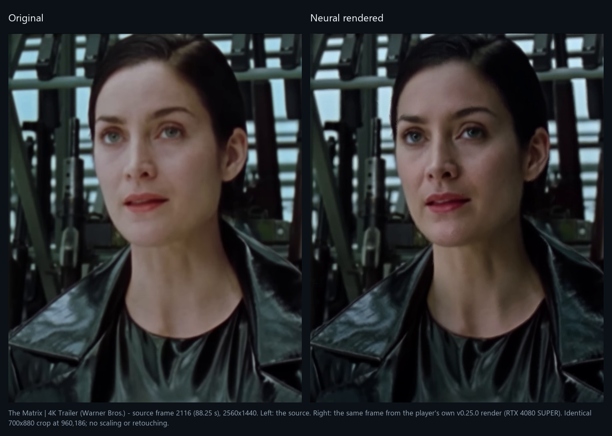

# Focused improvements verification

Verification began 2 September 2026 and continued on 3 September (Asia/Kolkata).

## Released v0.13.0 baseline

The [v0.13.0 release](https://github.com/2600th/dlss5-video-player/releases/tag/dlss5-video-player-v0.13.0)
was built from `7db4364`. Its clean Windows Release build passed all nine CTest
suites in 35.63 seconds. The player and neural-worker binaries in the ZIP match
that tested build. Package verification accepted all 42 allowlisted files;
the published ZIP SHA-256 is
`6e793e0daa323e950eb3f9e6f9386a7671247abac629bd86a42d8d7c209f2760`.

[Windows CI passed on `81abb1c`](https://github.com/2600th/dlss5-video-player/actions/runs/33730634801)
after a CI-only follow-up staged pinned FFmpeg/FFprobe for the real-media export
tests. Application and test sources were unchanged. The real-media observations
below used the final feature implementation before the release version bump.
Earlier intermediate checks are retained here as dated debugging evidence.

Scope: five upcoming-game examples, persistent last-five history and cache retention, neural-settings cache identity, saved playback preferences, and stream-copy MKV export. Renderer, temporal guides, source-resolution contract and feature-18 validation remain unchanged.

## Automated checks

Visual Studio 2022 Release build; nine CTest suites, including new RecentMediaTests, RenderSettingsTests and CachedExportTests. Tests cover persistence, deduplication, sixth-item eviction reporting, owned removal, changed settings, tampered snapshots, export stream maps/content, cancellation, existing-file protection and relative input paths. Native UI regression includes saved preferences and cross-quality cache preservation.

An intermediate build passed all 9/9 suites in 18.45 seconds after the Windows
physical-root fix. The default-root regression failed before that fix and passed
after it; strict ownership checks were retained.

Export fixture: one cached video, two source audio streams, two subtitles, title, language tags and chapters; packet hashes remain unchanged. Unsupported mov_text-to-MKV fails explicitly. Playback does not gain a subtitle renderer from this export feature.

## Hardware checks (RTX 5090)

Input: existing Resident Evil two-second SDR fixture, 1920 x 1080, 59.94005994 fps, 120 frames.

- Direct NeuralWorker: success; 120 native evaluations, 120 verified neural frames, feature 18 created/evaluated, armed before capture, no later failure, source resolution preserved. Render lifecycle reported approximately 8.2 seconds including initialization and validation.
- Runtime SR smoke at 1440p: 120 frames / 120 evaluations; approximately 59.1 fps end-to-end throughput.
- Runtime SR smoke at 2160p: 120 frames / 120 evaluations; approximately 60.1 fps end-to-end throughput.

These are functional smoke measurements, not isolated GPU benchmarks or quality scores. HDR, VFR timing, quantitative guide quality and long-duration reliability remain outside this change.

## Manual UI inspection

Native start screen and File menus inspected: five official game entries, no anime submenu, Recent videos, and export disabled before cached playback. YouTube oEmbed verifies all five configured titles and uploaders; current publisher evidence is in EXAMPLE_VIDEOS.md.

The first full-player smoke found an existing ownership-check failure under
inherited MSIX filesystem redirection: a staging child was redirected away from
the root path. The original-video fallback worked. Resolving the actual writable
root with an owned delete-on-close probe fixed staging without weakening checks.

After the fix, the full player promoted the two-second fixture: 120 frames,
120 native evaluations, 120 verified neural frames, feature 18 armed before
capture and a matching settings snapshot/digest in the completed manifest.

The initial GTA VI example smoke produced 1,543/1,543 verified neural frames
at 1920 x 1080 / 30 fps, approximately 51.43 seconds of cached video. **This was
a truncated download, not the complete trailer.** A subsequent download ended
at approximately 79.88 seconds. YouTube metadata reports 167 seconds. The
original checks validated the renderer against its downloaded input, so they
missed the incomplete acquisition. Those frame counts only establish neural
processing of the partial source.

Reopening GTA VI through **File > Recent videos** logged both
`Recent source cache verified; network resolution skipped` and
`Verified neural cache hit opened without re-rendering`. Original/neural toggling
and paused timeline seeking were exercised during the screenshot capture.

The refreshed gallery uses unedited, consistently sized Windows captures. The
original/neural pair is paused at approximately 01:05 with SR off and default
image adjustments. Release images are retained separately from this development
gallery. All five new images are 1442 x 932 JPEGs, totaling less than 0.8 MiB.
The rendered README lead, controls tables and gallery were inspected in a local
browser preview. Eleven Markdown files and their 58 local links passed parsing,
balanced-code-fence and file-target checks; all five images decoded successfully.

The persistent local recent entry was also visible after a normal close and
relaunch. Different Windows-virtualized cache roots were observed between Codex
and Explorer launches; the subsequent fix saves the resolved root beside the
executable and reuses it. Changed-settings
invalidation and export stream/cancellation cases are covered by the focused
automated suites; this screenshot pass did not change runtime tuning or attempt
a separate live export.

## GTA download and cache regression fix — 3 September

The user report reproduced two separate defects: example-menu opens bypassed
recent-source reuse, and successful FFmpeg exit/file validation could accept an
incomplete source. The previous 51-second smoke was therefore insufficient.

Focused regressions now cover example-menu cache routing, persisted physical
cache location, YouTube duration/VOD metadata, video longer than audio, truncated
video hidden by longer audio, and oversized diagnostic redaction. A temporary
HTTP fixture disconnected at byte 116507 and resumed at that offset, preserving
all 30 frames. Final Release build and all nine CTest suites passed in 22.11 seconds.

The real GTA replacement source contains 5,002 frames at 1920 x 1080 / 30 fps.
Its video track spans 166.733 seconds; audio/container duration is 166.789 seconds,
consistent with the resolver's rounded 167 seconds. Source promotion passed the
decoded-video completeness gate and records `source-complete-v4`.

This full source exposed a separate final-render check that compared video with
the longer audio/container duration. That check rejected the first full render
and correctly fell back to the original. Synchronization had the same assumption.
The decoder now prefers the selected MKV video track's duration for both render
and playback timing; full acquisition validation still measures decoded frames.
The one-frame neural timing tolerance and feature-18 evidence requirements remain
unchanged.

The final build reopened the completed source and neural cache through
**File > Upcoming games > GTA VI - Trailer 2** after restarting. The player log
confirmed both `Recent source cache verified; network resolution skipped` and
`Verified neural cache hit opened without re-rendering`. Synchronized playback,
paused seeking to 01:05 and original/neural toggling all worked. Both files'
hashes and the saved settings digest matched the completed render manifest.

## Default-intensity face verification — 3 September

Checked frame 1950 (zero-based, 01:05 at 30 fps) from the full GTA source and
neural cache. The original and processed files both retain 1920 x 1080 output.
The render's ReShade log reports RenoDX v4.7 with `enabled=ON`,
`intensity=1.000000`, `global_tone=1.000000`, `diffuse_white_nits=203.000000`,
`preset=0`, `style=0`, and `upscaling=OFF`. No intensity/style overrides appear
in its settings snapshot. The same run logged successful inline feature-18
creation/evaluation, and the manifest contains 5,002 native evaluations and
5,002 verified neural frames with interception armed before capture.

The matched face shows visible changes to cheek/nose shading, hair and local
contrast; it is not an unchanged source image. The figure uses identical native
resolution crops and labels only. This is functional and visual evidence of the
current output, not a quality score or an isolated measurement of neural uplift
against a DLAA-only baseline. No settings were changed for this check. The player
was left paused on the face in neural view, with runtime SR off.

## Highest-bitrate YouTube selection — 3 September

The Release build passes all nine CTest suites (34.34 seconds). New tests run
the bundled yt-dlp against offline format catalogs using the production selection
arguments: highest video bitrate at 1080p/1440p/2160p, 1080p-first Auto, highest
resolution fallback, unavailable manual resolution, unknown bitrate and a
higher-bitrate combined audio/video stream. The old selector failed six of these
selection assertions before the change. Native player tests also verify that
`source-complete-v4` caches request fresh resolution, while current-policy sources
pass that gate. Neural rendering, output encoding and source-resolution handling
were not changed.

The live check exposed YouTube HLS format IDs stored as `/itag/270/` in playlist
paths. Cache identity now recognizes that form without retaining expiring
signatures. Regression tests cover stable IDs across renewed signatures and
reject malformed, duplicate, oversized and untrusted-host IDs; both valid HLS
cases failed before the fix.

The live GTA VI Trailer 2 metadata check selected `270+140-drc`: 1080p H.264 with
an advertised video bitrate of 4,604.257 kbps. The earlier cached AV1 source
measured 1,555 kbps. These are different codecs; bitrate is not a quality score.

The player downloaded the selected HLS source and validated all 5,002 frames:
1920 x 1080 at 30 fps, 166.733 seconds of video and 166.789 seconds including
audio. The saved file is 53,495,955 bytes. Summing video packet payloads gives
50,737,331 bytes, or **2.434 Mbps measured average video bitrate**; the advertised
4.604 Mbps is a selection estimate, not the measured file average.

The full neural render completed and opened synchronized playback. Its manifest
records 5,002 native evaluations and verified frames, feature-18 interception
armed before capture, 1920 x 1080 output and no upscaling. The runtime log reports
neural intensity 1.00 and successful feature-18 evaluation. Reopening the same
Upcoming games entry logged `Recent source cache verified; network resolution
skipped` followed by `Verified neural cache hit opened without re-rendering`.
The new original/neural screenshot pair uses the same paused face at 01:05.
The player was left paused in neural view.
