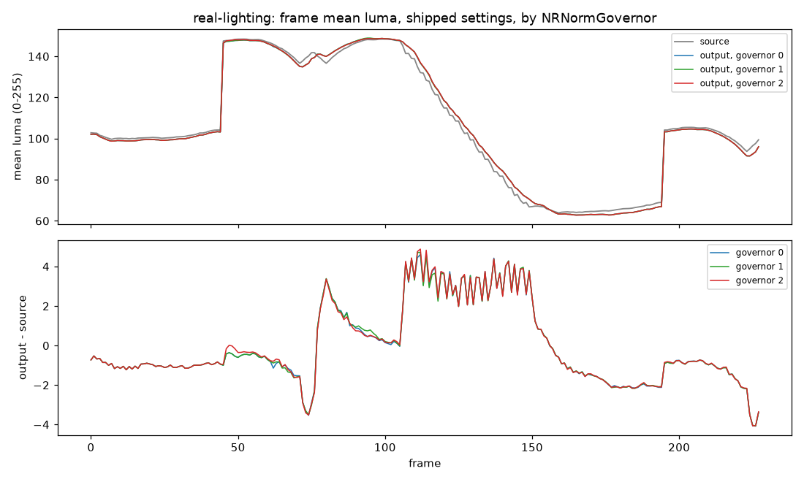
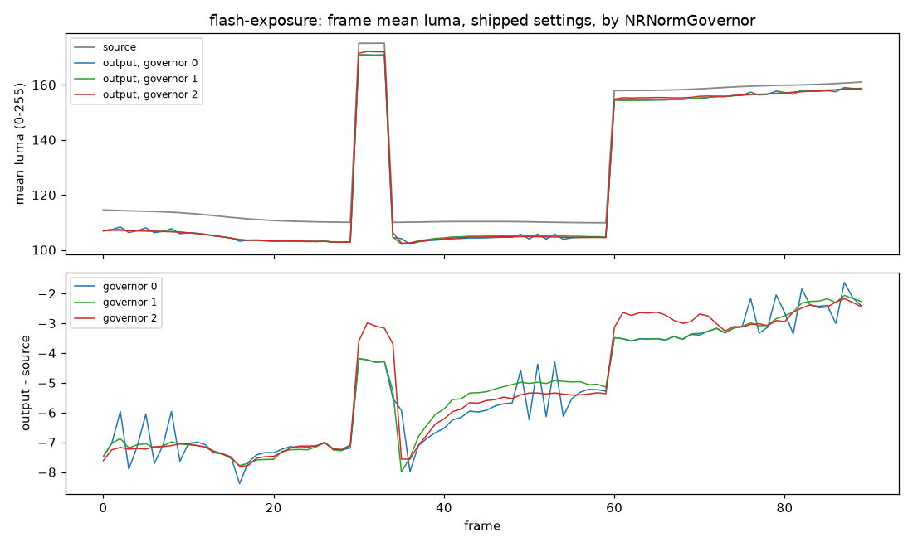
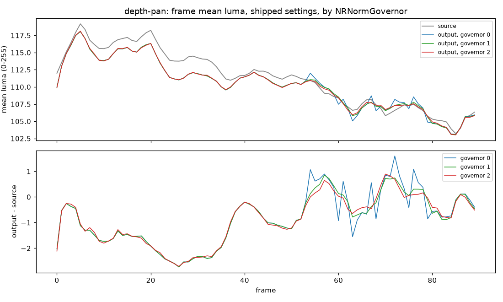

# The normalization governor: off, slew or stable (W4-gov) - 24 September 2026

**Verdict.** The player now writes `NRNormGovernor=1` (slew) on every render instead
of leaving the add-on at its default of 2 (stable). Neither of the two options the
question started with holds up:

- **Stable (2, the add-on default, what the player shipped) is not reproducible**
  wherever the governor moves. Three renders of one configuration gave **three
  different videos on each of five clips**, including real footage: on
  `real-lighting` (a capture with exposure changes) two renders differ in **50.7 %
  of bytes**, mean |Δ| 0.90, from frame 45 - the first exposure step - on. The
  render cache assumes a render is a function of its key; at stable it is not.
- **Off (0) is reproducible but brings the pumping back.** The frame's mean luma
  jitters frame to frame where the governor would have damped it: added mean-luma
  change (pump+) **0.45 against 0.17** on `flash-exposure`, 0.17 against 0.03 on
  `depth-pan`, 0.12 against 0.04 on `depth-subject` - visible in the plots below as
  a sawtooth of up to ±1.5 levels.
- **Slew (1) is both**: byte-identical in every render (five renders of
  `real-lighting`, four of each other sensitive clip, one of them beside a concurrent
  worker render), and within 0.02-0.04 of stable on pump+ everywhere; on flicker+
  and sigma+ it is at or below stable on four of five clips.

On the three NR-processed captures (`real-film-cuts`, `real-game-cuts`,
`real-game-motion`) and on `highlights-gradients` the governor does not move at all:
all three values render the same bytes, as the settings table already found. So for
most footage the pin changes nothing; where it does, it replaces an irreproducible
render with a reproducible one that damps as well.

This goes beyond the brief's two branches ("pin 0 if off is free, else keep the
default and document it"): off is not free, and keeping stable keeps a cache whose
entries are one sample of a random variable. Slew answers the question the brief was
asking. Reverting is one line (`kPinnedNormGovernor`, `src/NeuralSettings.h`).

## Method

`tools/benchmark/governor.py` renders the player's shipped settings
(`knobs.SHIPPED`, i.e. `NeuralAddonOverridesFor(NeuralSettings{})`) with
`NRNormGovernor` 0, 1 and 2, twice each, through `run.py`'s worker driver, on nine
clips, and scores every output in one decode:

| metric | what it is |
|---|---|
| repeat | whether the renders of one configuration are byte-identical (rgb24 `framemd5`) |
| flicker+ | `analyze.py`'s added mean \|dY\| between consecutive frames, cuts excluded |
| sigma+ | `analyze.py`'s added per-pixel temporal standard deviation inside a shot |
| pump+ | added frame-to-frame change of the frame's **mean** luma: mean \|dȲ\| of the output minus the source's. Pumping is a whole-frame swing that per-pixel flicker dilutes into texture noise |
| wander | standard deviation, within shots, of Ȳ(output) − Ȳ(source) |
| step | at a labelled exposure change: output step / source step, and the largest \|dȲ\| of the output in the 12 frames after it against the source's |

flicker+ and sigma+ are computed exactly as `analyze.py` computes them
(`analyze.luma`, `analyze.ShotSigma`); `governor.py` skips `analyze.py`'s motion
field, which is not what a governor moves and which took over ten minutes a run.

`real-lighting` is new, built by `governor.py`: `real-game-motion` played forward,
backward and forward (228 frames, 7.6 s, no cut) under an exposure schedule of +0.15
at 1.5 s, a ramp to −0.12 over 3.5-5.0 s, and back to 0 at 6.5 s - attack, release
and slow drift on real footage. `flash-exposure` is the corpus's four-frame flash and
sustained step.

Then, for the five clips where the governor moves: further renders of slew (rep 3
of `real-lighting`, reps 4 and 5 of all five, rep 5 with a second worker rendering
eight clips at the same time) and of stable (rep 4), and byte distances between
pairs (share of rgb24 bytes that differ, mean |Δ|, worst frame's mean |Δ|).

## Environment

| Item | Value |
|---|---|
| GPU | NVIDIA GeForce RTX 4080 SUPER, driver 32.0.16.1047 (worker preflight) |
| Runtime | ReShade 6.8.0.2155, RenoDX 6.5.3 (add-on 0.2026.917.1432), DLSS-NR 310.8.0: the main checkout's staged, locked files |
| Worker | 0.25.0, built from this branch |
| Corpus | `corpus.py --clips flash-exposure highlights-gradients depth-pan depth-subject dissolve real-film-cuts real-game-cuts real-game-motion` plus `governor.py`'s `real-lighting`; FFmpeg 9.0.1-essentials |
| Renders | 54 in the table, 16 more for the repeat checks; all `ok`, every frame neural |

## The table

First render of each; repeat is over the two renders of the table run.

| clip | governor | repeat | flicker+ | sigma+ | pump+ | wander | step: follow / after (out vs src) |
|---|---|---|---:|---:|---:|---:|---|
| real-lighting | 0 | identical | 0.280 | 1.331 | −0.025 | 1.992 | f45 1.00 / 0.81 vs 0.34; f195 1.03 / 0.35 vs 0.39 |
| real-lighting | 1 | identical | 0.278 | 1.341 | −0.023 | 1.990 | f45 1.00 / 0.81 vs 0.34; f195 1.03 / 0.34 vs 0.39 |
| real-lighting | 2 | **183 of 228 differ from 45** | 0.284 | 1.369 | −0.022 | 1.995 | f45 1.00 / 1.02 vs 0.34; f195 1.04 / 0.37 vs 0.39 |
| flash-exposure | 0 | identical | −0.058 | 2.114 | **0.453** | 1.876 | f30 1.05; f34 1.02 / 2.02 vs 0.06; f60 1.04 / 0.29 vs 0.19 |
| flash-exposure | 1 | identical | −0.149 | 2.049 | 0.160 | 1.845 | f30 1.04; f34 1.02 / 2.68 vs 0.06; f60 1.03 / 0.30 vs 0.19 |
| flash-exposure | 2 | **77 of 90 differ from 13** | −0.139 | 2.277 | 0.168 | 1.980 | f30 1.05; f34 1.01 / 3.83 vs 0.06; f60 1.05 / 0.50 vs 0.19 |
| depth-pan | 0 | identical | −1.891 | −5.030 | **0.171** | 1.035 | - |
| depth-pan | 1 | identical | −1.934 | −4.981 | 0.043 | 0.957 | - |
| depth-pan | 2 | **21 of 90 differ from 69** | −1.895 | −4.896 | 0.028 | 0.932 | - |
| depth-subject | 0 | identical | −0.809 | −1.665 | **0.124** | 0.368 | - |
| depth-subject | 1 | identical | −0.891 | −1.676 | 0.038 | 0.322 | - |
| depth-subject | 2 | **53 of 90 differ from 37** | −0.885 | −1.696 | 0.040 | 0.333 | - |
| dissolve | 0 | identical | −0.829 | −3.934 | 0.257 | 3.083 | - |
| dissolve | 1 | identical | −0.814 | −3.913 | 0.249 | 3.145 | - |
| dissolve | 2 | **52 of 81 differ from 29** | −0.871 | −4.000 | 0.211 | 3.465 | - |
| highlights-gradients | 0 / 1 / 2 | identical, the same metrics | −0.112 | −1.648 | 0.008 | 0.539 | - |
| real-film-cuts | 0 / 1 / 2 | identical, the same metrics | −0.015 | 0.059 | −0.003 | 0.156 | - |
| real-game-cuts | 0 / 1 / 2 | identical, the same metrics | −0.363 | −0.339 | −0.112 | 0.273 | - |
| real-game-motion | 0 / 1 / 2 | identical, the same metrics | 0.306 | 1.271 | 0.005 | 0.673 | - |

## Repeats and distances

| clip | stable vs stable (two renders) | slew renders | slew vs stable | off vs stable |
|---|---|---|---|---|
| real-lighting | 50.74 % of bytes, mean 0.90, worst frame 1.33 | 5 of 5 identical | 51.02 %, 0.91 | 51.13 %, 0.91 |
| flash-exposure | 55.34 %, 1.28, 1.86 | 4 of 4 identical | 69.37 %, 1.86 | 68.85 %, 1.81 |
| depth-pan | 12.43 %, 0.40, 2.18 | 4 of 4 identical | 60.54 %, 2.19 | 61.69 %, 2.27 |
| depth-subject | 27.97 %, 0.51, 1.12 | 4 of 4 identical | 29.95 %, 0.57 | 30.02 %, 0.58 |
| dissolve | 38.80 %, 0.90, 2.03 | 4 of 4 identical | 72.97 %, 1.77 | 76.98 %, 2.28 |

Stable's third render (rep 4) was a third distinct video on all five clips. Off was
identical across 3 renders of each (11 of `real-lighting`). "Slew vs stable" is of
the order of stable against itself: on these clips there is no one stable render to
be close to.

The concurrent render did not in fact slow the measured one (both ran at ~100 fps
processing on this card), so it is one more repeat rather than a stress on pacing;
that slew does not depend on pacing is inferred from its being identical in every
render while stable, rendered the same way, never was.

## What the plots show



On real footage the three curves lie on each other; the output follows every step
(follow 1.00-1.04) and ramps with the source. The governor's work is invisible here,
and yet stable's two renders differ in half their bytes.



Off (blue) jitters about ±1 level frame to frame on a static exposure, before the
flash and after the step; slew and stable are smooth. After the four-frame flash
both governors recover over ~20 frames (the lower panel's slope from frame 36), which
off does not - the one respect in which off tracks the source more closely.



From frame 53, where the pan's saturated posts take over the frame, off's mean luma
swings up to ±1.5 levels between neighbouring frames; slew and stable stay within
±0.4 of each other.

## Decision

| value | reproducible | pumping (pump+) | chosen |
|---|---|---|---|
| 0 off | yes | 2.7-6× the governed values on three clips | no |
| 1 slew | yes, every render | within 0.02-0.04 of stable | **pinned** |
| 2 stable (add-on default) | no, on five of nine clips, including real footage with lighting changes | reference | no |

`NeuralAddonOverridesFor` appends `NRNormGovernor=1`; the settings snapshot the
render cache key hashes carries it, so every existing cache entry (rendered at the
add-on's stable default, which the add-on writes back into `ReShade.ini`) is keyed
differently and renders once more. Not a user control: it is a property of how a
render is made, like the managed resolution keys, and the harness can still
override it per profile (`governor.py`, `knobs.py`'s reference).

## Reproduce

```
set DLSS_BENCHMARK_BUILD=C:\t\bb
set DLSS_BENCHMARK_FFMPEG=<directory with ffmpeg.exe and ffprobe.exe>
python tools/benchmark/corpus.py --corpus C:\t\bb\benchmark-corpus --clips flash-exposure highlights-gradients depth-pan depth-subject dissolve real-film-cuts real-game-cuts real-game-motion
python tools/benchmark/governor.py --corpus C:\t\bb\benchmark-corpus --clips real-lighting flash-exposure depth-pan depth-subject highlights-gradients dissolve real-film-cuts real-game-cuts real-game-motion --out <dir>
```

`governor.py --compare-only` rescores existing renders; `--repeats` sets how many
renders per value.
