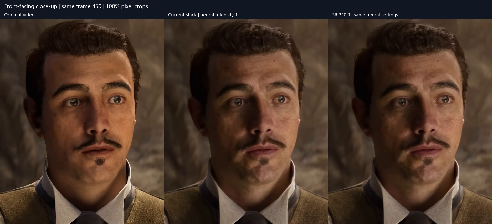

# Runtime comparison — 7 September 2026

**Recommendation: keep the currently pinned neural runtime stack.** None of the downloaded updates demonstrated a useful visual or performance improvement in this player's tested 1080p SDR path. Two alternatives failed compatibility checks.

Test machine: RTX 5090, driver **616.64**, Ryzen 7 9800X3D, approximately 31 GiB usable system RAM. Executable: the packaged **v0.14.1 NeuralWorker.exe**. All candidates ran in isolated copies of the packaged directory layout. Production binaries and the runtime lock were preserved.

| Priority | Component | Decision | Measured reason |
|---|---|---|---|
| **1 — KEEP** | ReShade **6.8.0.2155** + RenoDX **4.70** + patched NR **310.8** + SR **310.8** | Continue using the current pinned stack | Passed short, repeated 20-second and 60-second runs. |
| **2 — HOLD** | SR **310.9.0** | Downloaded and compatible; no reason to promote it for this path yet | Every compared decoded frame matched the baseline exactly. Median 20-second render time differed by only 0.007 seconds. |
| **3 — HOLD** | NR **310.8.SF-v2** | Keep as an experimental candidate | All compared frames matched baseline. Less than 1% difference in end-to-end time; steady processing throughput was effectively unchanged. |
| **4 — DEFER** | Streamline bundle **2.14.0.0** | No useful update for the current direct-NGX renderer | Two short runs passed and matched baseline. No `sl.*` DLLs appeared in the captured process module inventory during rendering. |
| **5 — REQUIRES INTEGRATION** | RenoDX SF **0.53** + SF-v2 NR | Do not replace RenoDX 4.70 with this file | One compatibility run failed: `Feature 18 inline interception was not armed before frame capture.` Its addon/configuration/evidence contract differs. No valid output to grade. |
| **6 — REJECT HERE** | NVIDIA-signed stock NR **310.8.0** | Do not use with this tested setup | 0/4 successful attempts: three access violations and one feature-18 priming failure. Windows recorded `D3D12Core.dll`, exception `0xc0000005`. This establishes incompatibility here, not the underlying defect or failure on every driver. |

The current pinned NR file is the community-modified `nvngx_dlssnr_ada_v51_async.dll`, staged as `nvngx_dlssnr.dll`. Its SHA-256 is `4B8D19BC3EFF58A084F5ECA7489C921501C203450169FB82FF4F649A4482BA05`. The baseline is **not** the stock signed NR file with the same numerical version. Use the exact [runtime lock](../../../packaging/runtime-lock.json).

The [official ReShade release listing](https://reshade.me/releases) still identifies 6.8 as the latest release series checked today. A new ReShade download was unnecessary.

## Performance reference

Same 600-frame, 1920×1080, 30 fps Mafia trailer segment; **three runs per working candidate**. Timings include process startup, neural priming, decoding, guide generation, rendering, readback, encoding and teardown. Lower time is better.

| Stack | Median total time | Observed range | End-to-end throughput | Processing throughput after first captured frame |
|---|---:|---:|---:|---:|
| Current baseline | **26.041 s** | 25.934–29.671 s | **23.040 fps** | **31.882 fps** |
| Only SR → 310.9 | 26.034 s | 26.034–26.448 s | 23.047 fps | 31.930 fps |
| Only NR → SF-v2 | 25.833 s | 25.730–26.045 s | 23.226 fps | 31.894 fps |

The small differences do not justify a runtime change. This is a workstation benchmark with three repetitions, not a statistically powered GPU microbenchmark. Caches were not purged. The first 20-second baseline run overlapped a CPU-only smoke-output hash check; its slower result is retained above. The later baseline runs and one-minute comparison support the same conclusion.

One-minute stability/reference run, 1,800 frames each:

| Stack | Total time | End-to-end throughput | Processing throughput | 95th percentile processing interval | Peak total GPU memory used |
|---|---:|---:|---:|---:|---:|
| Current baseline | **63.707 s** | **28.254 fps** | 32.004 fps | 34 ms | 3,448 MiB |
| SR 310.9 | 63.389 s | 28.396 fps | 32.037 fps | 33 ms | 3,446 MiB |

These are offline render/encode rates, **not playback FPS or isolated neural GPU timings**. The interval includes the worker's full per-frame pipeline. GPU memory comes from NVML at 500 ms intervals and includes the desktop and other GPU allocations. Initial short/20-second GPU CSVs were empty due to buffered `nvidia-smi` output; no memory conclusions use those files. The one-minute runs used direct NVML sampling.

## Visual reference

The main reference is now a **large front-facing face**, with the same 640×800 crop shown at 100% pixel scale for all three outputs. It is frame 450 of the tested one-minute sequence (15 seconds; 29 seconds into the original trailer). The neural output visibly changes skin texture, shading and facial features. The updated SR output remains identical to the current stack.

[Open the face comparison at full resolution](face-comparison.png). The video
and full-frame stills this run also produced (a 4x slow-motion face close-up, a
labeled 60-second comparison, matched full-size frames and the intensity-control
difference image) were 750 MB of render fixtures and are not kept in the
repository; the numbers below stand on the decoded-frame hashes, not on them.

**SR 310.9 produced pixel-identical decoded video to the baseline across all compared short, 20-second and 60-second outputs.** SF-v2 NR was likewise identical across the short and repeated 20-second runs. Repeats also matched. Thus neither candidate improved detail, faces, motion or temporal artifacts in the tested output.

I inspected the matched night/reflection, moving foliage and face/architecture images. Baseline and updated SR are visually identical, consistent with the full decoded-frame hashes. The original-to-rendered difference is content-dependent; this test does not establish that neural processing is preferable for every scene.

An **intensity 0 versus intensity 1 control** produced different output. Logs confirmed both requested settings. At Resident Evil frame 60, mean absolute RGB difference was 3.594/255 and maximum channel difference was 88/255. This establishes that the intensity control affects captured output, rather than relying solely on a startup success log. It is not a perceptual quality score or an addon-disabled control.

_(image not kept: Intensity control and amplified absolute difference)_

**17 successful runs; 9,720 output frames decoded and checked.** All successful outputs matched their expected frame counts and had monotonically increasing decoded timestamps. Feature-18 creation/evaluation evidence and the unchanged worker's acceptance checks were preserved. Runtime receipts are sparse; the worker's `verified_neural_frames` counter is not an independent per-frame GPU trace.

Scope: two existing video sources, Resident Evil's 120-frame night segment and Mafia: The Old Country's 20/60-second trailer segments. Source and output are 1080p SDR, DLAA carrier at 1:1 resolution, spatial NR upscaling disabled, default guide generation and neutral color settings, HEVC NVENC p7/CQ16. This does not validate 4K, HDR, live 60 fps neural rendering, other GPUs/drivers, learned depth/normal/flow models, or the separate root-level player SR DLL.

## Downloads and reproducibility

All five archives were downloaded, extracted, and verified against the SHA-256 digests published with their GitHub assets. This verifies the downloaded bytes against that distributor; it does not make modified community binaries NVIDIA-signed. Individual signatures and hashes are recorded in the inventory.

| Download | Source | Local extracted files |
|---|---|---|
| SR 310.9 | [Release](https://github.com/RankFTW/rhi-repo/releases/tag/dlss-310.9.0) | nvngx_dlss.dll (local artifact, not kept) |
| NR SF-v2 | [Release](https://github.com/RankFTW/rhi-repo/releases/tag/dlssnr-310.8.SF-v2) | nvngx_dlssnr.dll (local artifact, not kept) |
| RenoDX SF 0.53 | [Release](https://github.com/RankFTW/rhi-repo/releases/tag/renodx-dlss-SF-0.53) | renodx-dlss.addon64 (local artifact, not kept) |
| Streamline 2.14 bundle | [Release](https://github.com/RankFTW/rhi-repo/releases/tag/streamline-2.14.0.0) | Extracted bundle (local artifact, not kept) |
| Stock NR 310.8 | [Release](https://github.com/RankFTW/rhi-repo/releases/tag/dlssnr-310.8.0) | nvngx_dlssnr.dll (local artifact, not kept) |

The Streamline archive contains component versions 2.12, 2.13 and 2.14; its release label does not mean every bundled DLL is version 2.14. Only counterparts already present in the neural runtime were swapped for the compatibility test.

- Download provenance and archive checksums (local artifact, not kept)
- Binary versions, signatures and SHA-256 (local artifact, not kept)
- Full results, loaded modules and aggregate metrics (local artifact, not kept)
- Windows crash evidence (local artifact, not kept)
- Packaged runtime preservation check — all 12 payloads unchanged (local artifact, not kept)
- Reproducible benchmark harness (local artifact, not kept) and frame validation/visual analysis (local artifact, not kept)

Each run folder contains metadata, the worker result, ReShade configuration/logs, video when successful, and decoded frame hashes. The initial baseline attempt used an incorrect helper-directory name and could not find FFmpeg; that harness failure was corrected before comparisons and excluded from all success/performance aggregates. No runtime acceptance checks were weakened.

## Next engineering priorities

1. **Keep exact runtime pins and add a startup compatibility probe** before promoting any new binary. This test found that signature validity and version number alone do not establish runtime compatibility. Relevant files: RuntimePolicy.cpp (local artifact, not kept), [runtime-lock.json](../../../packaging/runtime-lock.json), stage_runtime.ps1 (local artifact, not kept).
2. **Profile the per-frame pipeline and run guide ablations.** DLL swaps did not change the approximately 32 fps processing rate. Measure decode, guide generation, GPU evaluation, synchronization/readback and encode separately before selecting an optimization. Relevant files: TemporalGuides.cpp (local artifact, not kept), OfflineNeuralRenderer.cpp (local artifact, not kept), D3D12Renderer.cpp (local artifact, not kept), MediaPipeline.cpp (local artifact, not kept).
3. **Treat SF 0.53 as a separate integration experiment** if its additional capabilities are needed. It needs an explicit configuration and capture/evidence adapter, followed by equivalent visual controls; renaming its addon or relaxing the existing checks would not validate it. Relevant files: ReShadeConfig.cpp (local artifact, not kept), OfflineNeuralRenderer.cpp (local artifact, not kept).
