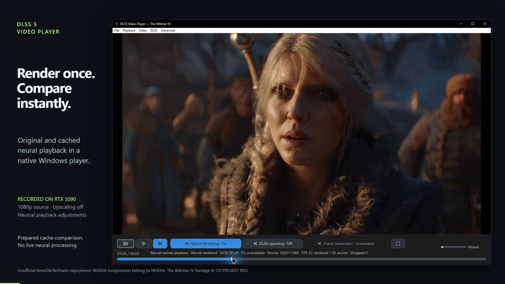

# Player demonstration

[Watch the 30-second MP4](neural-comparison-demo.mp4) ·
[Full-size poster](neural-comparison-poster.jpg) ·
[Remotion source](../../tools/demo-video/README.md)

The video is **1920 × 1080, 30 fps, exactly 900 frames / 30 seconds**, encoded as
H.264 with `yuv420p` pixels. It is intentionally silent: the application was
muted and no music, narration or substitute audio was added.

| Time | Content |
| --- | --- |
| 00:00–00:03 | Title and actual player screenshot |
| 00:03–00:12 | Recorded paused face comparison; click switches Neural Rendering from Off to On |
| 00:12–00:27 | 15 seconds of uninterrupted moving player footage with Neural Rendering On throughout |
| 00:27–00:30 | Closing card and actual player screenshot |

The application recording stays at its captured 1442 × 932 size. Only the
surrounding titles, explanatory text, border and progress line are added in
Remotion. There are straight cuts between takes, with no speed changes or
fabricated intermediate states. The recorded pointer indicator remains visible.
The face take is held by the actual paused player, not assembled from stills.
It holds the source at 112.611 seconds; the moving take covers approximately
113–128 seconds. Every included shot was inspected for sexual content.
After the paused comparison switches Neural Rendering On, it remains On for
the rest of the video, including the closing card.

Captured on September 3, 2026 with the existing v0.13.0 Windows build and an RTX
5090. Neural Rendering compares the original video with a previously prepared
cache. Playback upscaling was off and playback adjustments were neutral. The
source retains native 1920 × 1080 resolution at 30000/1001 fps; the screen recording
and delivery are 30 fps. [Screenshot and cache provenance](../screenshots/README.md).

Source footage: The Witcher / CD PROJEKT RED,
[The Witcher IV — Cinematic Reveal Trailer](https://www.youtube.com/watch?v=54dabgZJ5YA).
The selected daylight village sequence and poster show fully clothed characters;
the exported clip contains no nudity, sexual activity or sexualized imagery.
The video demonstrates this unofficial RenoDX/ReShade experiment, not an
official NVIDIA DLSS 5 integration. Rights to NVIDIA components belong to NVIDIA.
Game footage, third-party components and trademarks retain their owners' rights.

Only the compact delivery MP4, poster and reusable edit source are maintained
in Git. Untrimmed recordings, contact sheets, extracted source frames and
dependencies remain in ignored working directories. The composition can recover
its two app recordings from the delivered MP4; the local originals avoid an
extra lossy encoding generation.

The accompanying source fix honors YouTube's advertised stream-availability
time before opening a freshly resolved URL, including fractional timestamps.
The video itself was captured from the existing v0.13.0 build using the downloaded
local source; it does not claim to demonstrate that network-loading fix.
